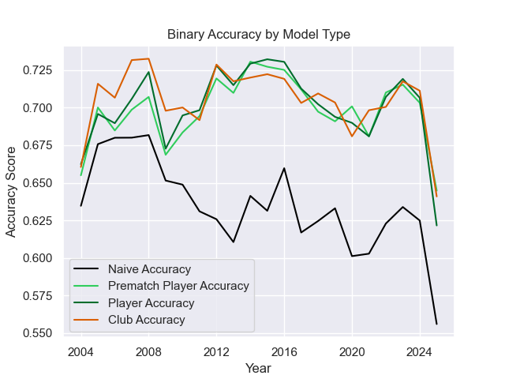
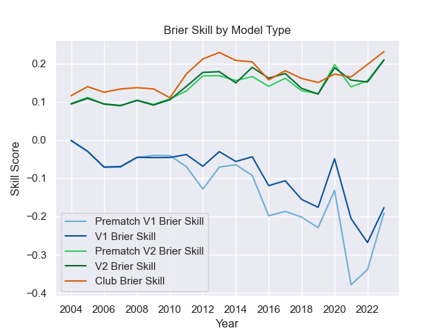
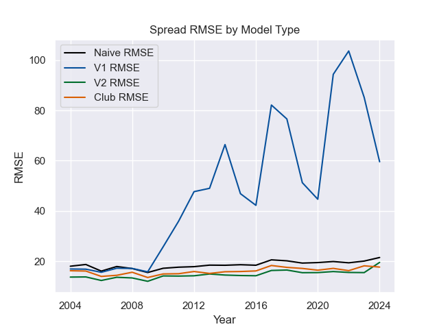
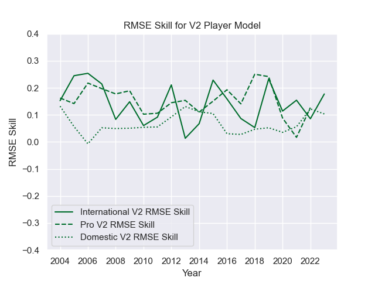
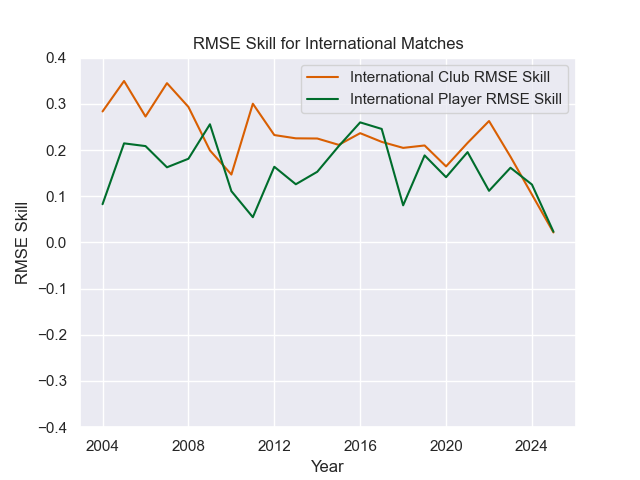
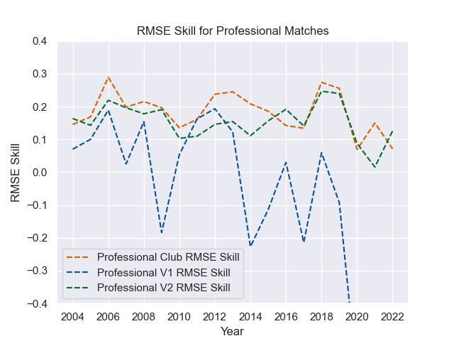
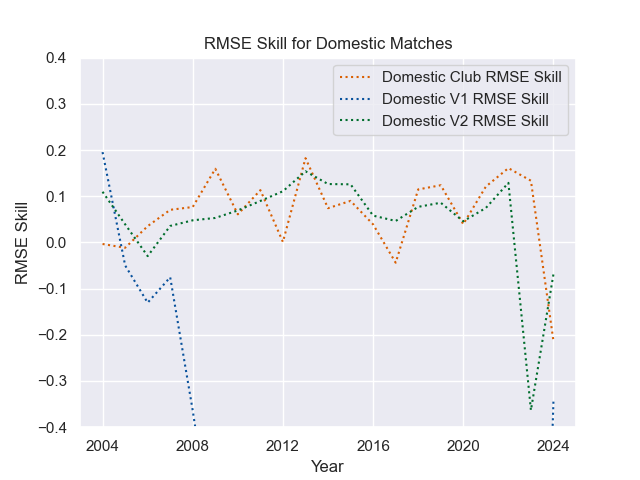

---  
layout: page  
title: Model Accuracies  
date: 2025-06-16 6:00:00 -0500  
categories: model  
---

This project involves many models, retrained many times and then making new projections each week. In an attempt to compare performances across competitions, time, and models, this page seeks to showcase some accuracy metrics.
I have two distinct predictions for each match - a prediction of which team wins, and a prediction of the winning margin. This is essentially a classification problem to predict the winner, and a regression problem to predict the margin (with negative predictions favoring the away team).
As such, I can use some different measures for each task. For the binary prediction, I can use accuracy and Brier scores, and for the score prediction I can use metrics like RMSE and MAE.

Currently I have two different models that generate predictions on this site. Each of these three generates predictions for winners and margins of each match where enough data is available.
The first model, which requires the least amount of information to make a prediction, assigns glicko-style scores to each named club and uses those to predict outcomes for each match. This allows for predictions far into the future, but also cannot differentiate between a side named by a club to play in a competition's playoff (likely a side full strength) and a side named by that same club to play the week previous in a tune up match with no playoff repercussions (that likely excludes some strong players to rest them).
The other model seeks to address that issue by assigning glicko-style scores to each player, then combining these player scores together to generate scores for any named side. This can be weighted by minutes played by the players after the match is completed, but to predict a match these minutes would need to be predicted as well, adding in some extra uncertainty. However, these models cannot predict matches until clubs name sides. Theoretically, they could be fed likely lineups for each club, but predicting lineups is another issue altogether and I don't want to try to guess what team Eddie Jones might name each week.
    
# Binary Prediction: Match Winners

There are two metrics I use to evaluate the binary predictions. The first is the simpler and more commonly used - an accuracy rate. It's a simple calculation of the number of correct predictions divided by the number of predictions made.
This can succinctly and clearly describe a model's performance, and give a sense of usefulness - if a model is less than 50% accurate, you may not want to trust it.
For comparison purposes, I've included the accuruacy score of a naive model, one that just predicts the home team to win if the home team wins the most in the time period under consideration, and predicts the away team otherwise.
    

## Brier Scores

However, with smaller sample sizes accuracy rates can be hard to compare. For example, in a full year the Rugby Championship has twelve matches, and in some years (often world cup years) it has only six matches. If all three models were correct for 5 of those 6 games, they'd all have the same accuracy rate. 
While a correct summary of the models, this makes them difficult to actually compare. The [Brier score](https://en.wikipedia.org/wiki/Brier_score) avoids this issue, as it measures a distance between the prediction and the observed outcome. In the case where the home team wins, which I assign the positive case value of 1.0, an accuracy rate would score predictions of 0.7 and 0.8 equally, but a Brier score would favor the prediction of 0.8.
For visualization purposes, I use a Brier Skill Score, which is equal to 1 - (Brier Score / Naive Brier Score), where the Naive Brier Score is calculated using the predictions from a simple reference model, with each prediction equal to the win rate of the home teams in the sample being evaluated.
A Skill Score greater than 0 indicates that the forecast is better than the reference model, while a score less than 0 indicates that the forecast is worse than the reference model.
    

# Regression Models: Winning Margin

Our second sort of prediction is of the winning margin, with positive margins favoring the home team and negative margins favoring the away team. The margins are generated using the predicted probability from the binary models, with a bit of translation to assign a score to the probability. This allows us to speak in terms of spreads and expected differences, and may eventually feed into a prediction of full match outcomes, with final scores, types of scores, and perhaps even who scored and when.
It is a bit more difficult to compare regression models though and the metrics I use have to be a bit more complex. The ones shown here are commonly used in regression analysis, but none are as straightforward as the binary accuracy metric.

The first metric is the [Root Mean Squared Error (RMSE)](https://en.wikipedia.org/wiki/Root-mean-square_deviation). I use the RMSE rather than the simpler Mean Absolute Error (MAE) to further penalize very bad predictions - I want to be able to predict a blowout accurately, and want to ensure I learn from those matches when they happen. The observed spreads also follows a roughly normal distibution, so I'd expect to see normally distributed errors and thus RMSE may give us a better summary of these errors in one number. Ultimately though, the desicion is likely arbitrary and I decided to use RMSE.
The naive model here just takes the average margin of victory for the period under consideration.
    

# Accuracy by Match Type

I'm making predictions for a few different levels of competition, ranging from domestic contests like the Currie Cup all the way to the World Cup. The matches in different competitions can be played at very different speeds, styles, and complexities, but players often compete in more than one competition each year. 
The club based model mostly ignores this issue, as clubs at different levels of competition rarely play eachother. But the player models assign a score to each athlete, and then those athletes can compete against anyone else. 
This drastically increases the complexity, but also allows the chance to forecast the consequences of player signings and call-ups. Naturally, then, these models may vary in accuracy across competition type.
    

