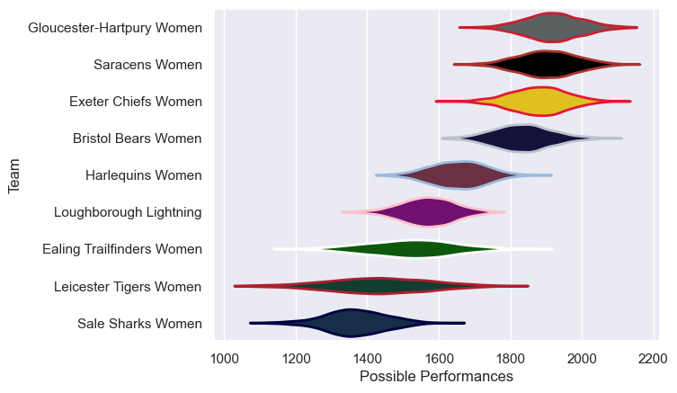
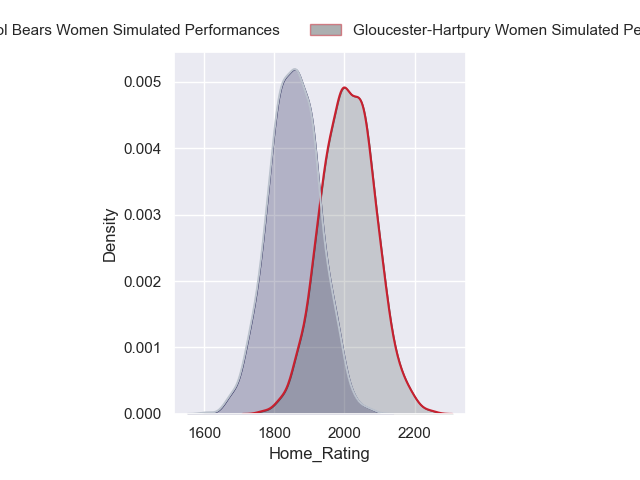
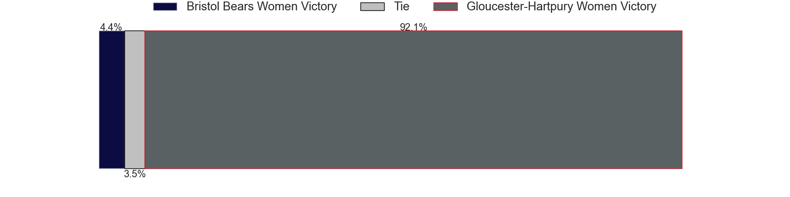
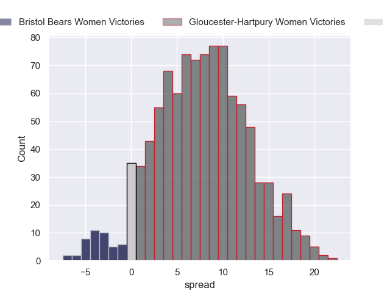

---  
title: "Allianz Premier 15s 2023 Status"  
date: 2024-06-21 6:00:00 -0500  
categories: model review projection  
layout: article  
aside:  
    toc: true  
---
# Current Team Rankings

# Standings

## Current Standings

| Club                      |   Played |   Wins |   Point Differential |   Losing Bonus Points |   Try Bonus Points |   Competition Points |
|:--------------------------|---------:|-------:|---------------------:|----------------------:|-------------------:|---------------------:|
| Gloucester-Hartpury Women |       16 |     15 |                  288 |                     1 |                nan |                   61 |
| Saracens Women            |       17 |     14 |                  373 |                     0 |                nan |                   56 |
| Bristol Bears Women       |       17 |     12 |                  243 |                     2 |                nan |                   50 |
| Exeter Chiefs Women       |       17 |     10 |                  177 |                     2 |                nan |                   44 |
| Loughborough Lightning    |       16 |      7 |                 -103 |                     1 |                nan |                   29 |
| Ealing Trailfinders Women |       16 |      5 |                 -160 |                     3 |                nan |                   23 |
| Harlequins Women          |       16 |      4 |                 -110 |                     3 |                nan |                   21 |
| Sale Sharks Women         |       15 |      3 |                 -353 |                     2 |                nan |                   14 |
| Leicester Tigers Women    |       16 |      2 |                 -355 |                     1 |                nan |                    9 |

## Projected Remaining Table

| Club                      |   Matches Remaining |   Wins |   Point Differential |   Losing Bonus Points |   Try Bonus Points |   Competition Points |
|:--------------------------|--------------------:|-------:|---------------------:|----------------------:|-------------------:|---------------------:|
| Gloucester-Hartpury Women |                   1 |    0.9 |              7.75482 |                   0.1 |                0.4 |                  4.1 |
| Bristol Bears Women       |                   1 |    0.1 |             -7.75482 |                   0.4 |                0.2 |                  0.8 |

## Projected Total Table

| Club                      |   Total Matches |   Wins |   Point Differential |   Losing Bonus Points |   Try Bonus Points |   Competition Points |
|:--------------------------|----------------:|-------:|---------------------:|----------------------:|-------------------:|---------------------:|
| Gloucester-Hartpury Women |              17 |   15.9 |              295.755 |                   1.1 |                0.4 |                 65.1 |
| Saracens Women            |              17 |   14   |              373     |                   0   |                0   |                 56   |
| Bristol Bears Women       |              18 |   12.1 |              235.245 |                   2.4 |                0.2 |                 50.8 |
| Exeter Chiefs Women       |              17 |   10   |              177     |                   2   |                0   |                 44   |
| Loughborough Lightning    |              16 |    7   |             -103     |                   1   |                0   |                 29   |
| Ealing Trailfinders Women |              16 |    5   |             -160     |                   3   |                0   |                 23   |
| Harlequins Women          |              16 |    4   |             -110     |                   3   |                0   |                 21   |
| Sale Sharks Women         |              15 |    3   |             -353     |                   2   |                0   |                 14   |
| Leicester Tigers Women    |              16 |    2   |             -355     |                   1   |                0   |                  9   |

# Completed Match Review

| Model | Percent Correct Predictions | Spread Error |
| ------ | ------ | ------ |
| Club Level | 80.8% | 14.8 |
| Player Level: Lineup | nan% | nan |
| Player Level: Minutes | nan% | nan |

# Future Predictions

## Week 18

### Gloucester-Hartpury Women V Bristol Bears Women on 2024/06/22

Average Margin: Gloucester-Hartpury Women by 7.8

Average Scoreline: 35-27

