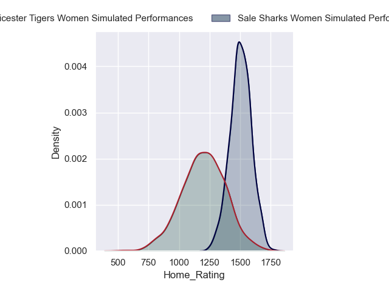
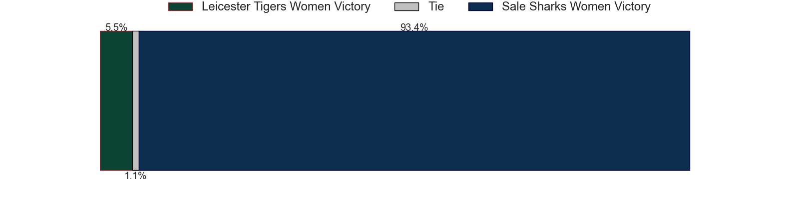
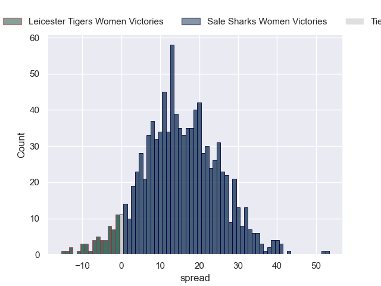

---  
title: "Allianz Premier 15s 2023 Status"  
date: 2024-01-15 6:00:00 -0500  
categories: model review projection  
layout: article  
aside:  
    toc: true  
---
# Current Team Rankings

# Standings

## Current Standings

| Club                      |   Played |   Wins |   Point Differential |   Losing Bonus Points |   Try Bonus Points |   Competition Points |
|:--------------------------|---------:|-------:|---------------------:|----------------------:|-------------------:|---------------------:|
| Saracens Women            |        7 |      7 |                  250 |                     0 |                nan |                   28 |
| Gloucester-Hartpury Women |        6 |      6 |                   90 |                     0 |                nan |                   24 |
| Exeter Chiefs Women       |        7 |      5 |                   67 |                     1 |                nan |                   21 |
| Bristol Bears Women       |        7 |      4 |                   85 |                     0 |                nan |                   16 |
| Loughborough Lightning    |        7 |      3 |                  -69 |                     0 |                nan |                   12 |
| Ealing Trailfinders Women |        7 |      2 |                  -57 |                     2 |                nan |                   10 |
| Harlequins Women          |        7 |      2 |                  -61 |                     2 |                nan |                   10 |
| Sale Sharks Women         |        5 |      1 |                 -119 |                     1 |                nan |                    5 |
| Leicester Tigers Women    |        7 |      0 |                 -186 |                     0 |                nan |                    0 |

## Projected Remaining Table

| Club                      |   Matches Remaining |   Wins |   Point Differential |   Losing Bonus Points |   Try Bonus Points |   Competition Points |
|:--------------------------|--------------------:|-------:|---------------------:|----------------------:|-------------------:|---------------------:|
| Saracens Women            |                   9 |    7.7 |             140.387  |                   1   |                5.2 |                 37.1 |
| Gloucester-Hartpury Women |                   9 |    7.4 |             111.671  |                   1.1 |                4.6 |                 35.2 |
| Exeter Chiefs Women       |                   8 |    6.5 |             111.155  |                   1.2 |                4.4 |                 31.3 |
| Bristol Bears Women       |                   9 |    5.7 |              46.9681 |                   1.5 |                3.6 |                 28.1 |
| Loughborough Lightning    |                   9 |    3.8 |             -16.0026 |                   1.3 |                2.7 |                 19.3 |
| Harlequins Women          |                   9 |    3.3 |             -36.8761 |                   1.4 |                2.4 |                 16.9 |
| Sale Sharks Women         |                  10 |    3   |             -77.9174 |                   1.2 |                3.1 |                 16.3 |
| Ealing Trailfinders Women |                   9 |    3.1 |             -48.5126 |                   1.7 |                1.8 |                 16.1 |
| Leicester Tigers Women    |                  10 |    0.5 |            -230.872  |                   0.8 |                0.9 |                  3.7 |

## Projected Total Table

| Club                      |   Total Matches |   Wins |   Point Differential |   Losing Bonus Points |   Try Bonus Points |   Competition Points |
|:--------------------------|----------------:|-------:|---------------------:|----------------------:|-------------------:|---------------------:|
| Saracens Women            |              16 |   14.7 |             390.387  |                   1   |                5.2 |                 65.1 |
| Gloucester-Hartpury Women |              15 |   13.4 |             201.671  |                   1.1 |                4.6 |                 59.2 |
| Exeter Chiefs Women       |              15 |   11.5 |             178.155  |                   2.2 |                4.4 |                 52.3 |
| Bristol Bears Women       |              16 |    9.7 |             131.968  |                   1.5 |                3.6 |                 44.1 |
| Loughborough Lightning    |              16 |    6.8 |             -85.0026 |                   1.3 |                2.7 |                 31.3 |
| Harlequins Women          |              16 |    5.3 |             -97.8761 |                   3.4 |                2.4 |                 26.9 |
| Ealing Trailfinders Women |              16 |    5.1 |            -105.513  |                   3.7 |                1.8 |                 26.1 |
| Sale Sharks Women         |              15 |    4   |            -196.917  |                   2.2 |                3.1 |                 21.3 |
| Leicester Tigers Women    |              17 |    0.5 |            -416.872  |                   0.8 |                0.9 |                  3.7 |

# Completed Match Review

| Model | Percent Correct Predictions | Spread Error |
| ------ | ------ | ------ |
| Club Level | 90.0% | 12.7 |
| Player Level: Lineup | nan% | nan |
| Player Level: Minutes | nan% | nan |

# Future Predictions

## Week 8

### Sale Sharks Women V Leicester Tigers Women on 2024/01/20

Average Margin: Sale Sharks Women by 15.4

Average Scoreline: 33-18

### Gloucester-Hartpury Women V Saracens Women on 2024/01/20

Average Margin: Gloucester-Hartpury Women by 0.5

Average Scoreline: 28-27

### Bristol Bears Women V Harlequins Women on 2024/01/20

Average Margin: Bristol Bears Women by 10.6

Average Scoreline: 32-22

### Loughborough Lightning V Ealing Trailfinders Women on 2024/01/20

Average Margin: Loughborough Lightning by 4.6

Average Scoreline: 25-21

### Sale Sharks Women V Leicester Tigers Women on 2024/01/21

Average Margin: Sale Sharks Women by 15.2

Average Scoreline: 33-18

## Week 9

### Bristol Bears Women V Exeter Chiefs Women on 2024/02/03

Average Margin: Exeter Chiefs Women by 4.1

Average Scoreline: 24-20

### Harlequins Women V Sale Sharks Women on 2024/02/03

Average Margin: Harlequins Women by 12.0

Average Scoreline: 36-24

### Leicester Tigers Women V Gloucester-Hartpury Women on 2024/02/03

Average Margin: Gloucester-Hartpury Women by 31.2

Average Scoreline: 40-9

### Saracens Women V Ealing Trailfinders Women on 2024/02/03

Average Margin: Saracens Women by 22.9

Average Scoreline: 44-21

## Week 10

### Gloucester-Hartpury Women V Bristol Bears Women on 2024/02/10

Average Margin: Gloucester-Hartpury Women by 11.7

Average Scoreline: 29-17

### Saracens Women V Harlequins Women on 2024/02/10

Average Margin: Saracens Women by 21.3

Average Scoreline: 40-19

### Loughborough Lightning V Leicester Tigers Women on 2024/02/10

Average Margin: Loughborough Lightning by 22.4

Average Scoreline: 43-20

### Exeter Chiefs Women V Sale Sharks Women on 2024/02/10

Average Margin: Exeter Chiefs Women by 26.5

Average Scoreline: 45-19

## Week 11

### Exeter Chiefs Women V Harlequins Women on 2024/02/24

Average Margin: Exeter Chiefs Women by 18.0

Average Scoreline: 33-15

### Sale Sharks Women V Gloucester-Hartpury Women on 2024/02/24

Average Margin: Gloucester-Hartpury Women by 20.5

Average Scoreline: 39-18

### Leicester Tigers Women V Ealing Trailfinders Women on 2024/02/24

Average Margin: Ealing Trailfinders Women by 14.5

Average Scoreline: 32-17

### Bristol Bears Women V Loughborough Lightning on 2024/02/24

Average Margin: Bristol Bears Women by 10.3

Average Scoreline: 33-22

## Week 12

### Loughborough Lightning V Sale Sharks Women on 2024/03/02

Average Margin: Loughborough Lightning by 11.2

Average Scoreline: 31-19

### Saracens Women V Leicester Tigers Women on 2024/03/02

Average Margin: Saracens Women by 39.4

Average Scoreline: 61-22

### Ealing Trailfinders Women V Bristol Bears Women on 2024/03/02

Average Margin: Bristol Bears Women by 5.2

Average Scoreline: 26-21

### Gloucester-Hartpury Women V Exeter Chiefs Women on 2024/03/02

Average Margin: Gloucester-Hartpury Women by 3.6

Average Scoreline: 31-28

## Week 13

### Sale Sharks Women V Ealing Trailfinders Women on 2024/03/09

Average Margin: Ealing Trailfinders Women by 3.8

Average Scoreline: 30-27

### Exeter Chiefs Women V Loughborough Lightning on 2024/03/09

Average Margin: Exeter Chiefs Women by 18.0

Average Scoreline: 37-19

### Gloucester-Hartpury Women V Harlequins Women on 2024/03/09

Average Margin: Gloucester-Hartpury Women by 18.6

Average Scoreline: 41-22

### Bristol Bears Women V Saracens Women on 2024/03/09

Average Margin: Saracens Women by 7.4

Average Scoreline: 24-17

## Week 14

### Harlequins Women V Leicester Tigers Women on 2024/05/11

Average Margin: Harlequins Women by 21.8

Average Scoreline: 43-21

### Saracens Women V Sale Sharks Women on 2024/05/11

Average Margin: Saracens Women by 29.3

Average Scoreline: 48-19

### Ealing Trailfinders Women V Exeter Chiefs Women on 2024/05/11

Average Margin: Exeter Chiefs Women by 12.5

Average Scoreline: 31-19

### Loughborough Lightning V Gloucester-Hartpury Women on 2024/05/11

Average Margin: Gloucester-Hartpury Women by 12.0

Average Scoreline: 26-14

## Week 15

### Loughborough Lightning V Harlequins Women on 2024/05/18

Average Margin: Loughborough Lightning by 2.9

Average Scoreline: 30-27

### Gloucester-Hartpury Women V Ealing Trailfinders Women on 2024/05/18

Average Margin: Gloucester-Hartpury Women by 19.6

Average Scoreline: 40-20

### Exeter Chiefs Women V Saracens Women on 2024/05/18

Average Margin: Exeter Chiefs Women by 0.1

Average Scoreline: 26-26

### Bristol Bears Women V Leicester Tigers Women on 2024/05/18

Average Margin: Bristol Bears Women by 28.8

Average Scoreline: 47-18

## Week 16

### Ealing Trailfinders Women V Loughborough Lightning on 2024/05/25

Average Margin: Ealing Trailfinders Women by 2.3

Average Scoreline: 24-22

### Leicester Tigers Women V Sale Sharks Women on 2024/05/25

Average Margin: Sale Sharks Women by 6.7

Average Scoreline: 29-22

### Saracens Women V Gloucester-Hartpury Women on 2024/05/25

Average Margin: Saracens Women by 6.1

Average Scoreline: 36-30

### Harlequins Women V Bristol Bears Women on 2024/05/25

Average Margin: Bristol Bears Women by 3.5

Average Scoreline: 26-22

## Week 17

### Harlequins Women V Ealing Trailfinders Women on 2024/06/01

Average Margin: Harlequins Women by 4.3

Average Scoreline: 28-24

### Sale Sharks Women V Bristol Bears Women on 2024/06/01

Average Margin: Bristol Bears Women by 11.8

Average Scoreline: 34-22

### Loughborough Lightning V Saracens Women on 2024/06/01

Average Margin: Saracens Women by 14.5

Average Scoreline: 34-19

### Exeter Chiefs Women V Leicester Tigers Women on 2024/06/01

Average Margin: Exeter Chiefs Women by 35.5

Average Scoreline: 52-17

## Week 18
