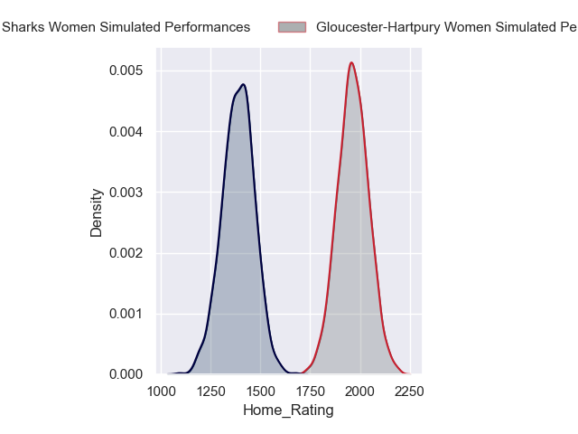
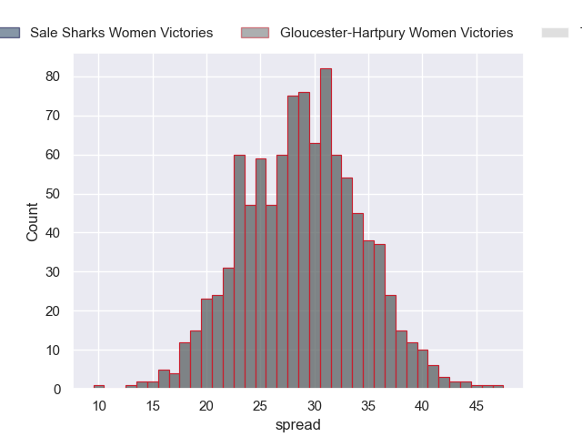

---  
title: "Allianz Premier 15s 2023 Status"  
date: 2024-02-13 6:00:00 -0500  
categories: model review projection  
layout: article  
aside:  
    toc: true  
---
# Current Team Rankings

# Standings

## Current Standings

| Club                      |   Played |   Wins |   Point Differential |   Losing Bonus Points |   Try Bonus Points |   Competition Points |
|:--------------------------|---------:|-------:|---------------------:|----------------------:|-------------------:|---------------------:|
| Saracens Women            |       11 |     10 |                  282 |                     0 |                nan |                   40 |
| Gloucester-Hartpury Women |        9 |      9 |                  111 |                     0 |                nan |                   36 |
| Exeter Chiefs Women       |       10 |      7 |                  167 |                     1 |                nan |                   29 |
| Bristol Bears Women       |       10 |      6 |                  109 |                     1 |                nan |                   25 |
| Loughborough Lightning    |        9 |      4 |                  -50 |                     1 |                nan |                   17 |
| Harlequins Women          |       11 |      3 |                  -49 |                     4 |                nan |                   16 |
| Ealing Trailfinders Women |        9 |      2 |                 -112 |                     2 |                nan |                   10 |
| Leicester Tigers Women    |       10 |      2 |                 -185 |                     1 |                nan |                    9 |
| Sale Sharks Women         |        9 |      1 |                 -273 |                     2 |                nan |                    6 |

## Projected Remaining Table

| Club                      |   Matches Remaining |   Wins |   Point Differential |   Losing Bonus Points |   Try Bonus Points |   Competition Points |
|:--------------------------|--------------------:|-------:|---------------------:|----------------------:|-------------------:|---------------------:|
| Gloucester-Hartpury Women |                   7 |    6   |             101.586  |                   0.7 |                4.4 |                 29   |
| Saracens Women            |                   6 |    4.9 |              69.1679 |                   0.9 |                3.3 |                 23.8 |
| Bristol Bears Women       |                   6 |    4.9 |              54.4742 |                   0.9 |                3.2 |                 23.4 |
| Exeter Chiefs Women       |                   6 |    4.8 |              66.3241 |                   0.8 |                3.1 |                 23.3 |
| Harlequins Women          |                   6 |    2.4 |             -18.9191 |                   1.2 |                1.6 |                 12.5 |
| Loughborough Lightning    |                   7 |    2.1 |             -42.6588 |                   1.1 |                1.7 |                 11   |
| Leicester Tigers Women    |                   6 |    1.9 |             -41.5025 |                   0.8 |                0.9 |                  9.4 |
| Ealing Trailfinders Women |                   7 |    1.6 |             -63.1436 |                   1.4 |                1   |                  8.7 |
| Sale Sharks Women         |                   7 |    0.5 |            -125.328  |                   0.7 |                0.9 |                  3.4 |

## Projected Total Table

| Club                      |   Total Matches |   Wins |   Point Differential |   Losing Bonus Points |   Try Bonus Points |   Competition Points |
|:--------------------------|----------------:|-------:|---------------------:|----------------------:|-------------------:|---------------------:|
| Gloucester-Hartpury Women |              16 |   15   |             212.586  |                   0.7 |                4.4 |                 65   |
| Saracens Women            |              17 |   14.9 |             351.168  |                   0.9 |                3.3 |                 63.8 |
| Exeter Chiefs Women       |              16 |   11.8 |             233.324  |                   1.8 |                3.1 |                 52.3 |
| Bristol Bears Women       |              16 |   10.9 |             163.474  |                   1.9 |                3.2 |                 48.4 |
| Harlequins Women          |              17 |    5.4 |             -67.9191 |                   5.2 |                1.6 |                 28.5 |
| Loughborough Lightning    |              16 |    6.1 |             -92.6588 |                   2.1 |                1.7 |                 28   |
| Ealing Trailfinders Women |              16 |    3.6 |            -175.144  |                   3.4 |                1   |                 18.7 |
| Leicester Tigers Women    |              16 |    3.9 |            -226.503  |                   1.8 |                0.9 |                 18.4 |
| Sale Sharks Women         |              16 |    1.5 |            -398.328  |                   2.7 |                0.9 |                  9.4 |

# Completed Match Review

| Model | Percent Correct Predictions | Spread Error |
| ------ | ------ | ------ |
| Club Level | 86.0% | 14.1 |
| Player Level: Lineup | nan% | nan |
| Player Level: Minutes | nan% | nan |

# Future Predictions

## Week 12

### Gloucester-Hartpury Women V Sale Sharks Women on 2024/02/17

Average Margin: Gloucester-Hartpury Women by 28.8

Average Scoreline: 51-22

## Week 13

### Exeter Chiefs Women V Harlequins Women on 2024/02/24

Average Margin: Exeter Chiefs Women by 15.6

Average Scoreline: 33-18

### Leicester Tigers Women V Ealing Trailfinders Women on 2024/02/24

Average Margin: Leicester Tigers Women by 7.0

Average Scoreline: 23-16

### Sale Sharks Women V Gloucester-Hartpury Women on 2024/02/24

Average Margin: Gloucester-Hartpury Women by 22.0

Average Scoreline: 34-12

### Bristol Bears Women V Loughborough Lightning on 2024/02/24

Average Margin: Bristol Bears Women by 13.3

Average Scoreline: 31-18

## Week 14

### Gloucester-Hartpury Women V Exeter Chiefs Women on 2024/03/02

Average Margin: Gloucester-Hartpury Women by 3.7

Average Scoreline: 25-22

### Ealing Trailfinders Women V Bristol Bears Women on 2024/03/02

Average Margin: Bristol Bears Women by 10.7

Average Scoreline: 24-13

### Loughborough Lightning V Sale Sharks Women on 2024/03/02

Average Margin: Loughborough Lightning by 13.4

Average Scoreline: 31-17

### Saracens Women V Leicester Tigers Women on 2024/03/02

Average Margin: Saracens Women by 20.7

Average Scoreline: 37-17

## Week 15

### Bristol Bears Women V Saracens Women on 2024/03/09

Average Margin: Saracens Women by 3.4

Average Scoreline: 26-23

### Exeter Chiefs Women V Loughborough Lightning on 2024/03/09

Average Margin: Exeter Chiefs Women by 18.1

Average Scoreline: 35-17

### Gloucester-Hartpury Women V Harlequins Women on 2024/03/09

Average Margin: Gloucester-Hartpury Women by 16.0

Average Scoreline: 31-15

### Sale Sharks Women V Ealing Trailfinders Women on 2024/03/09

Average Margin: Ealing Trailfinders Women by 2.5

Average Scoreline: 29-26

## Week 16

### Saracens Women V Sale Sharks Women on 2024/05/11

Average Margin: Saracens Women by 29.9

Average Scoreline: 51-21

### Ealing Trailfinders Women V Exeter Chiefs Women on 2024/05/11

Average Margin: Exeter Chiefs Women by 15.3

Average Scoreline: 28-13

### Harlequins Women V Leicester Tigers Women on 2024/05/11

Average Margin: Harlequins Women by 7.2

Average Scoreline: 27-20

### Loughborough Lightning V Gloucester-Hartpury Women on 2024/05/11

Average Margin: Gloucester-Hartpury Women by 12.2

Average Scoreline: 27-15

## Week 17

### Gloucester-Hartpury Women V Ealing Trailfinders Women on 2024/05/18

Average Margin: Gloucester-Hartpury Women by 22.7

Average Scoreline: 38-16

### Loughborough Lightning V Harlequins Women on 2024/05/18

Average Margin: Loughborough Lightning by 0.3

Average Scoreline: 25-25

### Bristol Bears Women V Leicester Tigers Women on 2024/05/18

Average Margin: Bristol Bears Women by 13.9

Average Scoreline: 31-18

### Exeter Chiefs Women V Saracens Women on 2024/05/18

Average Margin: Exeter Chiefs Women by 1.9

Average Scoreline: 28-26

## Week 18

### Leicester Tigers Women V Sale Sharks Women on 2024/05/25

Average Margin: Leicester Tigers Women by 12.4

Average Scoreline: 28-15

### Ealing Trailfinders Women V Loughborough Lightning on 2024/05/25

Average Margin: Loughborough Lightning by 0.3

Average Scoreline: 22-22

### Harlequins Women V Bristol Bears Women on 2024/05/25

Average Margin: Bristol Bears Women by 3.8

Average Scoreline: 26-22

### Saracens Women V Gloucester-Hartpury Women on 2024/05/25

Average Margin: Saracens Women by 4.0

Average Scoreline: 28-24

## Week 19

### Sale Sharks Women V Bristol Bears Women on 2024/06/01

Average Margin: Bristol Bears Women by 16.2

Average Scoreline: 24-8

### Loughborough Lightning V Saracens Women on 2024/06/01

Average Margin: Saracens Women by 13.1

Average Scoreline: 32-19

### Harlequins Women V Ealing Trailfinders Women on 2024/06/01

Average Margin: Harlequins Women by 9.6

Average Scoreline: 29-19

### Exeter Chiefs Women V Leicester Tigers Women on 2024/06/01

Average Margin: Exeter Chiefs Women by 19.1

Average Scoreline: 35-15

## Week 20
