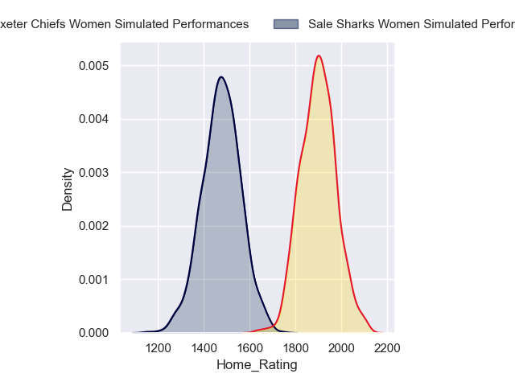
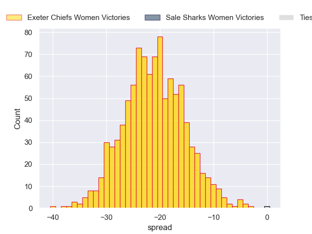

---  
title: "Allianz Premier 15s 2023 Status"  
date: 2024-01-22 6:00:00 -0500  
categories: model review projection  
layout: article  
aside:  
    toc: true  
---
# Current Team Rankings

# Standings

## Current Standings

| Club                      |   Played |   Wins |   Point Differential |   Losing Bonus Points |   Try Bonus Points |   Competition Points |
|:--------------------------|---------:|-------:|---------------------:|----------------------:|-------------------:|---------------------:|
| Saracens Women            |        8 |      7 |                  241 |                     0 |                nan |                   28 |
| Gloucester-Hartpury Women |        7 |      7 |                   99 |                     0 |                nan |                   28 |
| Exeter Chiefs Women       |        7 |      5 |                   67 |                     1 |                nan |                   21 |
| Bristol Bears Women       |        8 |      5 |                  104 |                     0 |                nan |                   20 |
| Loughborough Lightning    |        8 |      4 |                  -45 |                     0 |                nan |                   16 |
| Harlequins Women          |        8 |      2 |                  -80 |                     2 |                nan |                   10 |
| Ealing Trailfinders Women |        8 |      2 |                  -81 |                     2 |                nan |                   10 |
| Sale Sharks Women         |        6 |      1 |                 -122 |                     2 |                nan |                    6 |
| Leicester Tigers Women    |        8 |      1 |                 -183 |                     0 |                nan |                    4 |

## Projected Remaining Table

| Club                      |   Matches Remaining |   Wins |   Point Differential |   Losing Bonus Points |   Try Bonus Points |   Competition Points |
|:--------------------------|--------------------:|-------:|---------------------:|----------------------:|-------------------:|---------------------:|
| Exeter Chiefs Women       |                   9 |    7.5 |             130.143  |                   1.1 |                5.1 |                 36.2 |
| Saracens Women            |                   8 |    7.2 |             134.632  |                   0.7 |                5   |                 34.4 |
| Gloucester-Hartpury Women |                   8 |    6.9 |             115.501  |                   0.7 |                4.5 |                 33   |
| Bristol Bears Women       |                   8 |    5   |              37.5123 |                   1.4 |                3.5 |                 24.7 |
| Loughborough Lightning    |                   8 |    3.4 |             -15.8218 |                   1.1 |                2.4 |                 17.1 |
| Harlequins Women          |                   8 |    3.2 |             -32.9643 |                   1.2 |                2.4 |                 16.3 |
| Ealing Trailfinders Women |                   8 |    2   |             -77.9833 |                   1.5 |                1.3 |                 10.8 |
| Sale Sharks Women         |                   9 |    0.9 |            -144.001  |                   1   |                1.7 |                  6.3 |
| Leicester Tigers Women    |                   8 |    1   |            -147.017  |                   0.8 |                0.8 |                  5.4 |

## Projected Total Table

| Club                      |   Total Matches |   Wins |   Point Differential |   Losing Bonus Points |   Try Bonus Points |   Competition Points |
|:--------------------------|----------------:|-------:|---------------------:|----------------------:|-------------------:|---------------------:|
| Saracens Women            |              16 |   14.2 |             375.632  |                   0.7 |                5   |                 62.4 |
| Gloucester-Hartpury Women |              15 |   13.9 |             214.501  |                   0.7 |                4.5 |                 61   |
| Exeter Chiefs Women       |              16 |   12.5 |             197.143  |                   2.1 |                5.1 |                 57.2 |
| Bristol Bears Women       |              16 |   10   |             141.512  |                   1.4 |                3.5 |                 44.7 |
| Loughborough Lightning    |              16 |    7.4 |             -60.8218 |                   1.1 |                2.4 |                 33.1 |
| Harlequins Women          |              16 |    5.2 |            -112.964  |                   3.2 |                2.4 |                 26.3 |
| Ealing Trailfinders Women |              16 |    4   |            -158.983  |                   3.5 |                1.3 |                 20.8 |
| Sale Sharks Women         |              15 |    1.9 |            -266.001  |                   3   |                1.7 |                 12.3 |
| Leicester Tigers Women    |              16 |    2   |            -330.017  |                   0.8 |                0.8 |                  9.4 |

# Completed Match Review

| Model | Percent Correct Predictions | Spread Error |
| ------ | ------ | ------ |
| Club Level | 88.2% | 12.7 |
| Player Level: Lineup | nan% | nan |
| Player Level: Minutes | nan% | nan |

# Future Predictions

## Week 9

### Sale Sharks Women V Exeter Chiefs Women on 2024/01/28

Average Margin: Exeter Chiefs Women by 21.1

Average Scoreline: 35-14

## Week 10

### Saracens Women V Ealing Trailfinders Women on 2024/02/03

Average Margin: Saracens Women by 25.9

Average Scoreline: 42-16

### Harlequins Women V Sale Sharks Women on 2024/02/03

Average Margin: Harlequins Women by 12.9

Average Scoreline: 34-21

### Leicester Tigers Women V Gloucester-Hartpury Women on 2024/02/03

Average Margin: Gloucester-Hartpury Women by 25.8

Average Scoreline: 34-8

### Bristol Bears Women V Exeter Chiefs Women on 2024/02/03

Average Margin: Exeter Chiefs Women by 4.2

Average Scoreline: 30-26

## Week 11

### Gloucester-Hartpury Women V Bristol Bears Women on 2024/02/10

Average Margin: Gloucester-Hartpury Women by 11.8

Average Scoreline: 27-16

### Saracens Women V Harlequins Women on 2024/02/10

Average Margin: Saracens Women by 21.3

Average Scoreline: 40-19

### Loughborough Lightning V Leicester Tigers Women on 2024/02/10

Average Margin: Loughborough Lightning by 17.0

Average Scoreline: 37-20

### Exeter Chiefs Women V Sale Sharks Women on 2024/02/10

Average Margin: Exeter Chiefs Women by 27.7

Average Scoreline: 43-16

## Week 12

### Bristol Bears Women V Loughborough Lightning on 2024/02/24

Average Margin: Bristol Bears Women by 10.2

Average Scoreline: 31-20

### Exeter Chiefs Women V Harlequins Women on 2024/02/24

Average Margin: Exeter Chiefs Women by 18.4

Average Scoreline: 38-20

### Leicester Tigers Women V Ealing Trailfinders Women on 2024/02/24

Average Margin: Ealing Trailfinders Women by 5.0

Average Scoreline: 26-21

### Sale Sharks Women V Gloucester-Hartpury Women on 2024/02/24

Average Margin: Gloucester-Hartpury Women by 22.5

Average Scoreline: 34-11

## Week 13

### Saracens Women V Leicester Tigers Women on 2024/03/02

Average Margin: Saracens Women by 32.8

Average Scoreline: 49-17

### Ealing Trailfinders Women V Bristol Bears Women on 2024/03/02

Average Margin: Bristol Bears Women by 9.2

Average Scoreline: 30-21

### Gloucester-Hartpury Women V Exeter Chiefs Women on 2024/03/02

Average Margin: Gloucester-Hartpury Women by 4.5

Average Scoreline: 30-25

### Loughborough Lightning V Sale Sharks Women on 2024/03/02

Average Margin: Loughborough Lightning by 13.5

Average Scoreline: 33-19

## Week 14

### Gloucester-Hartpury Women V Harlequins Women on 2024/03/09

Average Margin: Gloucester-Hartpury Women by 19.8

Average Scoreline: 39-19

### Bristol Bears Women V Saracens Women on 2024/03/09

Average Margin: Saracens Women by 6.8

Average Scoreline: 27-20

### Exeter Chiefs Women V Loughborough Lightning on 2024/03/09

Average Margin: Exeter Chiefs Women by 17.2

Average Scoreline: 37-20

### Sale Sharks Women V Ealing Trailfinders Women on 2024/03/09

Average Margin: Ealing Trailfinders Women by 1.6

Average Scoreline: 25-24

## Week 15

### Loughborough Lightning V Gloucester-Hartpury Women on 2024/05/11

Average Margin: Gloucester-Hartpury Women by 11.9

Average Scoreline: 30-18

### Ealing Trailfinders Women V Exeter Chiefs Women on 2024/05/11

Average Margin: Exeter Chiefs Women by 15.7

Average Scoreline: 35-19

### Saracens Women V Sale Sharks Women on 2024/05/11

Average Margin: Saracens Women by 30.1

Average Scoreline: 49-19

### Harlequins Women V Leicester Tigers Women on 2024/05/11

Average Margin: Harlequins Women by 15.2

Average Scoreline: 37-22

## Week 16

### Gloucester-Hartpury Women V Ealing Trailfinders Women on 2024/05/18

Average Margin: Gloucester-Hartpury Women by 24.2

Average Scoreline: 42-18

### Bristol Bears Women V Leicester Tigers Women on 2024/05/18

Average Margin: Bristol Bears Women by 22.6

Average Scoreline: 41-19

### Loughborough Lightning V Harlequins Women on 2024/05/18

Average Margin: Loughborough Lightning by 4.3

Average Scoreline: 29-25

### Exeter Chiefs Women V Saracens Women on 2024/05/18

Average Margin: Exeter Chiefs Women by 0.9

Average Scoreline: 30-29

## Week 17

### Ealing Trailfinders Women V Loughborough Lightning on 2024/05/25

Average Margin: Loughborough Lightning by 2.3

Average Scoreline: 28-25

### Saracens Women V Gloucester-Hartpury Women on 2024/05/25

Average Margin: Saracens Women by 5.0

Average Scoreline: 29-24

### Leicester Tigers Women V Sale Sharks Women on 2024/05/25

Average Margin: Leicester Tigers Women by 0.9

Average Scoreline: 21-20

### Harlequins Women V Bristol Bears Women on 2024/05/25

Average Margin: Bristol Bears Women by 4.6

Average Scoreline: 26-21

## Week 18

### Harlequins Women V Ealing Trailfinders Women on 2024/06/01

Average Margin: Harlequins Women by 7.3

Average Scoreline: 29-22

### Sale Sharks Women V Bristol Bears Women on 2024/06/01

Average Margin: Bristol Bears Women by 13.6

Average Scoreline: 29-15

### Exeter Chiefs Women V Leicester Tigers Women on 2024/06/01

Average Margin: Exeter Chiefs Women by 29.5

Average Scoreline: 47-18

### Loughborough Lightning V Saracens Women on 2024/06/01

Average Margin: Saracens Women by 13.5

Average Scoreline: 28-14

## Week 19
