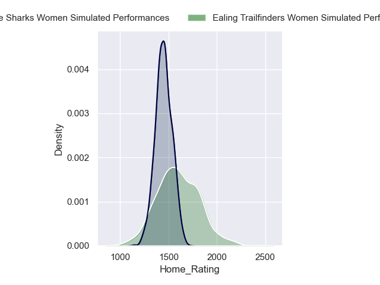
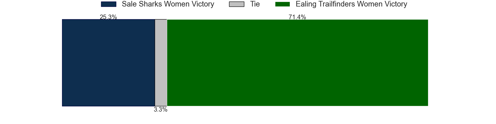
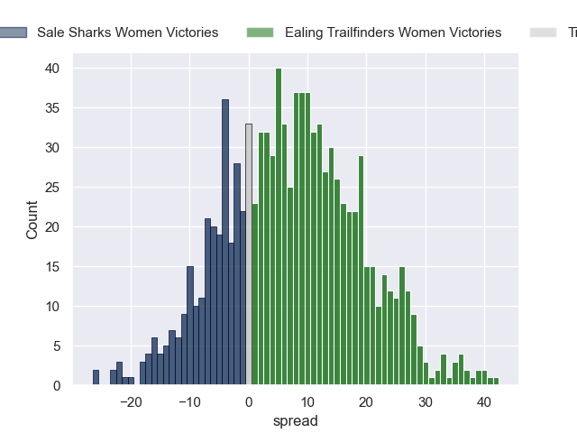

---  
title: "Allianz Premier 15s 2023 Status"  
date: 2023-12-18 6:00:00 -0500  
categories: model review projection  
layout: article  
aside:  
    toc: true  
---
# Current Team Rankings

# Standings

## Current Standings

| Club                      |   Played |   Wins |   Point Differential |   Losing Bonus Points |   Try Bonus Points |   Competition Points |
|:--------------------------|---------:|-------:|---------------------:|----------------------:|-------------------:|---------------------:|
| Saracens Women            |        4 |      4 |                  149 |                     0 |                nan |                   16 |
| Exeter Chiefs Women       |        4 |      3 |                   53 |                     1 |                nan |                   13 |
| Bristol Bears Women       |        5 |      3 |                   69 |                     0 |                nan |                   12 |
| Gloucester-Hartpury Women |        3 |      3 |                   54 |                     0 |                nan |                   12 |
| Loughborough Lightning    |        4 |      2 |                  -46 |                     0 |                nan |                    8 |
| Ealing Trailfinders Women |        4 |      1 |                  -34 |                     1 |                nan |                    5 |
| Harlequins Women          |        4 |      1 |                  -55 |                     1 |                nan |                    5 |
| Sale Sharks Women         |        3 |      1 |                  -51 |                     0 |                nan |                    4 |
| Leicester Tigers Women    |        5 |      0 |                 -139 |                     0 |                nan |                    0 |

## Projected Remaining Table

| Club                      |   Matches Remaining |   Wins |   Point Differential |   Losing Bonus Points |   Try Bonus Points |   Competition Points |
|:--------------------------|--------------------:|-------:|---------------------:|----------------------:|-------------------:|---------------------:|
| Gloucester-Hartpury Women |                  12 |   10.4 |           163.891    |                   1.1 |               10.2 |                 53   |
| Saracens Women            |                  12 |   10.1 |           167.02     |                   1.4 |                9.8 |                 51.8 |
| Exeter Chiefs Women       |                  11 |    8.9 |           153.201    |                   1.5 |                8.7 |                 45.8 |
| Bristol Bears Women       |                  11 |    6.7 |            63.4916   |                   1.8 |                6.5 |                 35   |
| Harlequins Women          |                  12 |    5.6 |            -0.229572 |                   1.8 |                5.4 |                 29.6 |
| Ealing Trailfinders Women |                  13 |    4.1 |          -100.189    |                   2   |                3.9 |                 22.3 |
| Loughborough Lightning    |                  12 |    3.8 |           -61.9722   |                   1.7 |                3.7 |                 20.9 |
| Sale Sharks Women         |                  12 |    2.8 |          -117.523    |                   1.5 |                2.8 |                 15.5 |
| Leicester Tigers Women    |                  11 |    0.5 |          -267.69     |                   0.7 |                0.5 |                  3.3 |

## Projected Total Table

| Club                      |   Total Matches |   Wins |   Point Differential |   Losing Bonus Points |   Try Bonus Points |   Competition Points |
|:--------------------------|----------------:|-------:|---------------------:|----------------------:|-------------------:|---------------------:|
| Saracens Women            |              16 |   14.1 |             316.02   |                   1.4 |                9.8 |                 67.8 |
| Gloucester-Hartpury Women |              15 |   13.4 |             217.891  |                   1.1 |               10.2 |                 65   |
| Exeter Chiefs Women       |              15 |   11.9 |             206.201  |                   2.5 |                8.7 |                 58.8 |
| Bristol Bears Women       |              16 |    9.7 |             132.492  |                   1.8 |                6.5 |                 47   |
| Harlequins Women          |              16 |    6.6 |             -55.2296 |                   2.8 |                5.4 |                 34.6 |
| Loughborough Lightning    |              16 |    5.8 |            -107.972  |                   1.7 |                3.7 |                 28.9 |
| Ealing Trailfinders Women |              17 |    5.1 |            -134.189  |                   3   |                3.9 |                 27.3 |
| Sale Sharks Women         |              15 |    3.8 |            -168.523  |                   1.5 |                2.8 |                 19.5 |
| Leicester Tigers Women    |              16 |    0.5 |            -406.69   |                   0.7 |                0.5 |                  3.3 |

# Completed Match Review

| Model | Percent Correct Predictions | Spread Error |
| ------ | ------ | ------ |
| Club Level | 88.9% | 14.1 |
| Player Level: Lineup | nan% | nan |
| Player Level: Minutes | nan% | nan |

# Future Predictions

## Week 6

### Ealing Trailfinders Women V Sale Sharks Women on 2023/12/22

Average Margin: Ealing Trailfinders Women by 7.5

### Saracens Women V Bristol Bears Women on 2023/12/23

Average Margin: Saracens Women by 12.5

### Ealing Trailfinders Women V Sale Sharks Women on 2023/12/23

Average Margin: Ealing Trailfinders Women by 7.2

### Loughborough Lightning V Exeter Chiefs Women on 2023/12/23

Average Margin: Exeter Chiefs Women by 13.5

## Week 7

### Harlequins Women V Gloucester-Hartpury Women on 2023/12/30

Average Margin: Gloucester-Hartpury Women by 10.1

## Week 8

### Gloucester-Hartpury Women V Loughborough Lightning on 2024/01/06

Average Margin: Gloucester-Hartpury Women by 20.2

### Exeter Chiefs Women V Ealing Trailfinders Women on 2024/01/06

Average Margin: Exeter Chiefs Women by 23.8

### Sale Sharks Women V Saracens Women on 2024/01/06

Average Margin: Saracens Women by 21.1

### Leicester Tigers Women V Harlequins Women on 2024/01/06

Average Margin: Harlequins Women by 20.1

## Week 9

### Harlequins Women V Loughborough Lightning on 2024/01/13

Average Margin: Harlequins Women by 6.4

### Ealing Trailfinders Women V Gloucester-Hartpury Women on 2024/01/13

Average Margin: Gloucester-Hartpury Women by 17.1

### Leicester Tigers Women V Bristol Bears Women on 2024/01/13

Average Margin: Bristol Bears Women by 26.1

### Saracens Women V Exeter Chiefs Women on 2024/01/13

Average Margin: Saracens Women by 4.6

## Week 10

### Sale Sharks Women V Leicester Tigers Women on 2024/01/20

Average Margin: Sale Sharks Women by 17.9

### Gloucester-Hartpury Women V Saracens Women on 2024/01/20

Average Margin: Gloucester-Hartpury Women by 2.0

### Loughborough Lightning V Ealing Trailfinders Women on 2024/01/20

Average Margin: Loughborough Lightning by 7.3

### Bristol Bears Women V Harlequins Women on 2024/01/20

Average Margin: Bristol Bears Women by 8.8

## Week 11

### Saracens Women V Ealing Trailfinders Women on 2024/02/03

Average Margin: Saracens Women by 24.1

### Harlequins Women V Sale Sharks Women on 2024/02/03

Average Margin: Harlequins Women by 12.9

### Leicester Tigers Women V Gloucester-Hartpury Women on 2024/02/03

Average Margin: Gloucester-Hartpury Women by 32.4

### Bristol Bears Women V Exeter Chiefs Women on 2024/02/03

Average Margin: Exeter Chiefs Women by 5.2

## Week 12

### Saracens Women V Harlequins Women on 2024/02/10

Average Margin: Saracens Women by 17.7

### Gloucester-Hartpury Women V Bristol Bears Women on 2024/02/10

Average Margin: Gloucester-Hartpury Women by 11.5

### Exeter Chiefs Women V Sale Sharks Women on 2024/02/10

Average Margin: Exeter Chiefs Women by 26.4

### Loughborough Lightning V Leicester Tigers Women on 2024/02/10

Average Margin: Loughborough Lightning by 21.8

## Week 13

### Sale Sharks Women V Gloucester-Hartpury Women on 2024/02/24

Average Margin: Gloucester-Hartpury Women by 19.1

### Leicester Tigers Women V Ealing Trailfinders Women on 2024/02/24

Average Margin: Ealing Trailfinders Women by 11.9

### Bristol Bears Women V Loughborough Lightning on 2024/02/24

Average Margin: Bristol Bears Women by 12.1

### Exeter Chiefs Women V Harlequins Women on 2024/02/24

Average Margin: Exeter Chiefs Women by 17.0

## Week 14

### Gloucester-Hartpury Women V Exeter Chiefs Women on 2024/03/02

Average Margin: Gloucester-Hartpury Women by 3.1

### Ealing Trailfinders Women V Bristol Bears Women on 2024/03/02

Average Margin: Bristol Bears Women by 8.4

### Saracens Women V Leicester Tigers Women on 2024/03/02

Average Margin: Saracens Women by 38.6

### Loughborough Lightning V Sale Sharks Women on 2024/03/02

Average Margin: Loughborough Lightning by 9.7

## Week 15

### Bristol Bears Women V Saracens Women on 2024/03/09

Average Margin: Saracens Women by 6.0

### Sale Sharks Women V Ealing Trailfinders Women on 2024/03/09

Average Margin: Ealing Trailfinders Women by 0.4

### Gloucester-Hartpury Women V Harlequins Women on 2024/03/09

Average Margin: Gloucester-Hartpury Women by 17.1

### Exeter Chiefs Women V Loughborough Lightning on 2024/03/09

Average Margin: Exeter Chiefs Women by 19.9

## Week 16

### Harlequins Women V Leicester Tigers Women on 2024/05/11

Average Margin: Harlequins Women by 24.4

### Loughborough Lightning V Gloucester-Hartpury Women on 2024/05/11

Average Margin: Gloucester-Hartpury Women by 13.3

### Saracens Women V Sale Sharks Women on 2024/05/11

Average Margin: Saracens Women by 27.5

### Ealing Trailfinders Women V Exeter Chiefs Women on 2024/05/11

Average Margin: Exeter Chiefs Women by 15.8

## Week 17

### Loughborough Lightning V Harlequins Women on 2024/05/18

Average Margin: Harlequins Women by 0.0

### Gloucester-Hartpury Women V Ealing Trailfinders Women on 2024/05/18

Average Margin: Gloucester-Hartpury Women by 22.8

### Exeter Chiefs Women V Saracens Women on 2024/05/18

Average Margin: Exeter Chiefs Women by 2.5

### Bristol Bears Women V Leicester Tigers Women on 2024/05/18

Average Margin: Bristol Bears Women by 29.7

## Week 18

### Leicester Tigers Women V Sale Sharks Women on 2024/05/25

Average Margin: Sale Sharks Women by 7.9

### Ealing Trailfinders Women V Loughborough Lightning on 2024/05/25

Average Margin: Ealing Trailfinders Women by 0.9

### Harlequins Women V Bristol Bears Women on 2024/05/25

Average Margin: Bristol Bears Women by 2.1

### Saracens Women V Gloucester-Hartpury Women on 2024/05/25

Average Margin: Saracens Women by 4.8

## Week 19

### Loughborough Lightning V Saracens Women on 2024/06/01

Average Margin: Saracens Women by 14.5

### Exeter Chiefs Women V Leicester Tigers Women on 2024/06/01

Average Margin: Exeter Chiefs Women by 36.9

### Harlequins Women V Ealing Trailfinders Women on 2024/06/01

Average Margin: Harlequins Women by 8.8

### Sale Sharks Women V Bristol Bears Women on 2024/06/01

Average Margin: Bristol Bears Women by 11.5

## Week 20
