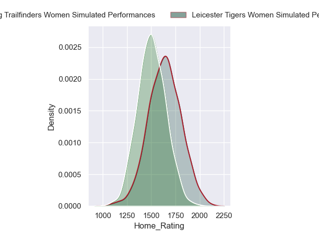
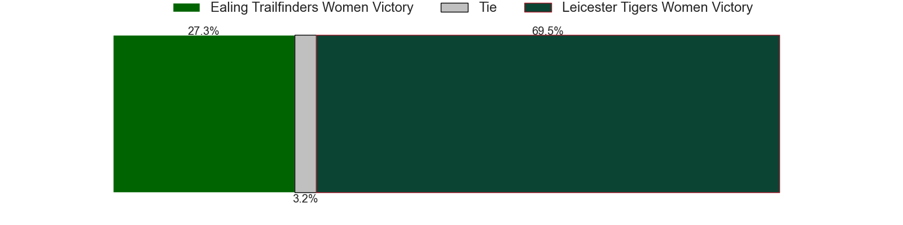
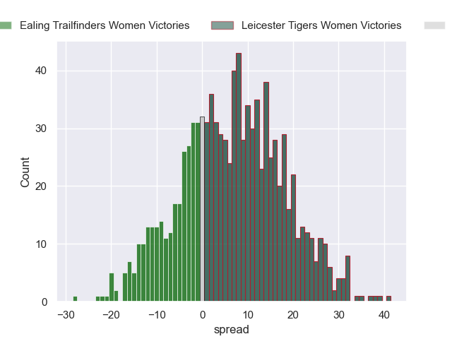
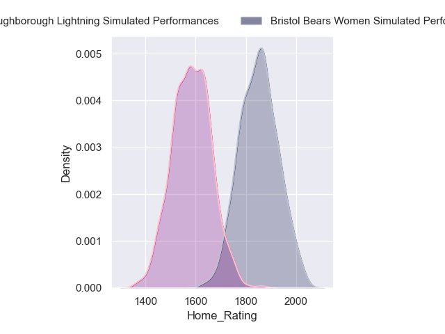
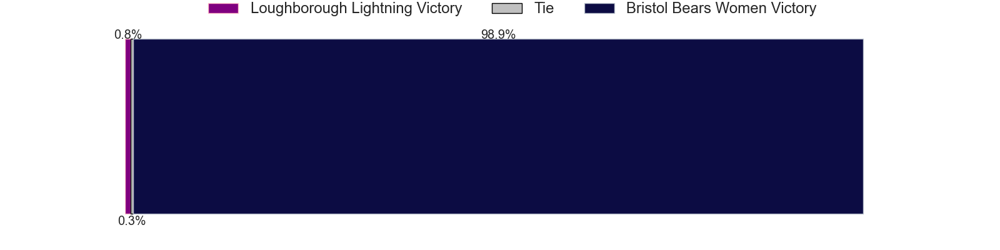
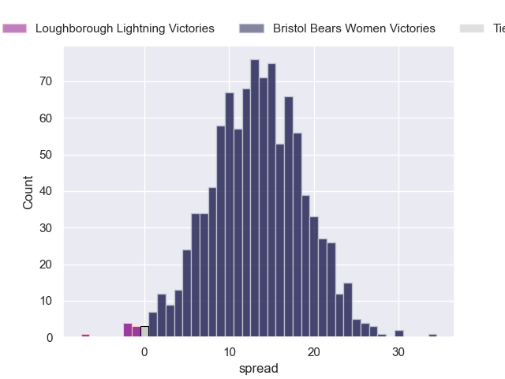

---  
title: "Allianz Premier 15s 2023 Status"  
date: 2024-02-20 6:00:00 -0500  
categories: model review projection  
layout: article  
aside:  
    toc: true  
---
# Current Team Rankings

# Standings

## Current Standings

| Club                      |   Played |   Wins |   Point Differential |   Losing Bonus Points |   Try Bonus Points |   Competition Points |
|:--------------------------|---------:|-------:|---------------------:|----------------------:|-------------------:|---------------------:|
| Gloucester-Hartpury Women |       11 |     11 |                  163 |                     0 |                nan |                   44 |
| Saracens Women            |       10 |      9 |                  277 |                     0 |                nan |                   36 |
| Exeter Chiefs Women       |       10 |      7 |                  167 |                     1 |                nan |                   29 |
| Bristol Bears Women       |       10 |      6 |                  109 |                     1 |                nan |                   25 |
| Loughborough Lightning    |        9 |      4 |                  -50 |                     1 |                nan |                   17 |
| Harlequins Women          |       10 |      3 |                  -44 |                     3 |                nan |                   15 |
| Ealing Trailfinders Women |        9 |      2 |                 -112 |                     2 |                nan |                   10 |
| Leicester Tigers Women    |       10 |      2 |                 -185 |                     1 |                nan |                    9 |
| Sale Sharks Women         |       11 |      1 |                 -325 |                     2 |                nan |                    6 |

## Projected Remaining Table

| Club                      |   Matches Remaining |   Wins |   Point Differential |   Losing Bonus Points |   Try Bonus Points |   Competition Points |
|:--------------------------|--------------------:|-------:|---------------------:|----------------------:|-------------------:|---------------------:|
| Saracens Women            |                   6 |    5.1 |              76.5971 |                   0.7 |                3.2 |                 24.5 |
| Gloucester-Hartpury Women |                   6 |    4.9 |              71.202  |                   0.7 |                3.2 |                 23.5 |
| Bristol Bears Women       |                   6 |    4.8 |              53.876  |                   0.8 |                3.1 |                 23.2 |
| Exeter Chiefs Women       |                   6 |    4.7 |              66.0759 |                   0.9 |                3   |                 22.8 |
| Harlequins Women          |                   6 |    2.2 |             -23.6322 |                   1.3 |                1.4 |                 11.7 |
| Loughborough Lightning    |                   7 |    2.1 |             -43.0843 |                   1   |                1.7 |                 11.2 |
| Leicester Tigers Women    |                   6 |    1.9 |             -43.9454 |                   0.8 |                1   |                  9.4 |
| Ealing Trailfinders Women |                   7 |    1.7 |             -61.3502 |                   1.5 |                1.1 |                  9.2 |
| Sale Sharks Women         |                   6 |    0.5 |             -95.7388 |                   0.7 |                1.1 |                  3.8 |

## Projected Total Table

| Club                      |   Total Matches |   Wins |   Point Differential |   Losing Bonus Points |   Try Bonus Points |   Competition Points |
|:--------------------------|----------------:|-------:|---------------------:|----------------------:|-------------------:|---------------------:|
| Gloucester-Hartpury Women |              17 |   15.9 |             234.202  |                   0.7 |                3.2 |                 67.5 |
| Saracens Women            |              16 |   14.1 |             353.597  |                   0.7 |                3.2 |                 60.5 |
| Exeter Chiefs Women       |              16 |   11.7 |             233.076  |                   1.9 |                3   |                 51.8 |
| Bristol Bears Women       |              16 |   10.8 |             162.876  |                   1.8 |                3.1 |                 48.2 |
| Loughborough Lightning    |              16 |    6.1 |             -93.0843 |                   2   |                1.7 |                 28.2 |
| Harlequins Women          |              16 |    5.2 |             -67.6322 |                   4.3 |                1.4 |                 26.7 |
| Ealing Trailfinders Women |              16 |    3.7 |            -173.35   |                   3.5 |                1.1 |                 19.2 |
| Leicester Tigers Women    |              16 |    3.9 |            -228.945  |                   1.8 |                1   |                 18.4 |
| Sale Sharks Women         |              17 |    1.5 |            -420.739  |                   2.7 |                1.1 |                  9.8 |

# Completed Match Review

| Model | Percent Correct Predictions | Spread Error |
| ------ | ------ | ------ |
| Club Level | 86.4% | 13.8 |
| Player Level: Lineup | nan% | nan |
| Player Level: Minutes | nan% | nan |

# Future Predictions

## Week 12

### Leicester Tigers Women V Ealing Trailfinders Women on 2024/02/23

Average Margin: Leicester Tigers Women by 6.6

Average Scoreline: 21-15

### Bristol Bears Women V Loughborough Lightning on 2024/02/23

Average Margin: Bristol Bears Women by 13.3

Average Scoreline: 31-18

### Exeter Chiefs Women V Harlequins Women on 2024/02/24

Average Margin: Exeter Chiefs Women by 16.5

Average Scoreline: 34-17

### Sale Sharks Women V Gloucester-Hartpury Women on 2024/02/24

Average Margin: Gloucester-Hartpury Women by 22.0

Average Scoreline: 27-5

## Week 13

### Gloucester-Hartpury Women V Exeter Chiefs Women on 2024/03/02

Average Margin: Gloucester-Hartpury Women by 3.9

Average Scoreline: 25-21

### Loughborough Lightning V Sale Sharks Women on 2024/03/02

Average Margin: Loughborough Lightning by 13.3

Average Scoreline: 31-17

### Saracens Women V Leicester Tigers Women on 2024/03/02

Average Margin: Saracens Women by 22.0

Average Scoreline: 42-20

### Ealing Trailfinders Women V Bristol Bears Women on 2024/03/02

Average Margin: Bristol Bears Women by 10.4

Average Scoreline: 26-15

## Week 14

### Bristol Bears Women V Saracens Women on 2024/03/09

Average Margin: Saracens Women by 4.5

Average Scoreline: 27-22

### Exeter Chiefs Women V Loughborough Lightning on 2024/03/09

Average Margin: Exeter Chiefs Women by 18.1

Average Scoreline: 34-16

### Sale Sharks Women V Ealing Trailfinders Women on 2024/03/09

Average Margin: Ealing Trailfinders Women by 2.2

Average Scoreline: 29-26

### Gloucester-Hartpury Women V Harlequins Women on 2024/03/09

Average Margin: Gloucester-Hartpury Women by 16.7

Average Scoreline: 34-17

## Week 15

### Harlequins Women V Leicester Tigers Women on 2024/05/11

Average Margin: Harlequins Women by 6.5

Average Scoreline: 29-22

### Loughborough Lightning V Gloucester-Hartpury Women on 2024/05/11

Average Margin: Gloucester-Hartpury Women by 12.1

Average Scoreline: 31-19

### Saracens Women V Sale Sharks Women on 2024/05/11

Average Margin: Saracens Women by 30.7

Average Scoreline: 46-15

### Ealing Trailfinders Women V Exeter Chiefs Women on 2024/05/11

Average Margin: Exeter Chiefs Women by 15.3

Average Scoreline: 32-16

## Week 16

### Loughborough Lightning V Harlequins Women on 2024/05/18

Average Margin: Loughborough Lightning by 1.4

Average Scoreline: 30-29

### Exeter Chiefs Women V Saracens Women on 2024/05/18

Average Margin: Exeter Chiefs Women by 0.7

Average Scoreline: 32-31

### Bristol Bears Women V Leicester Tigers Women on 2024/05/18

Average Margin: Bristol Bears Women by 14.2

Average Scoreline: 33-19

### Gloucester-Hartpury Women V Ealing Trailfinders Women on 2024/05/18

Average Margin: Gloucester-Hartpury Women by 22.2

Average Scoreline: 38-16

## Week 17

### Harlequins Women V Bristol Bears Women on 2024/05/25

Average Margin: Bristol Bears Women by 4.5

Average Scoreline: 27-23

### Ealing Trailfinders Women V Loughborough Lightning on 2024/05/25

Average Margin: Loughborough Lightning by 0.1

Average Scoreline: 22-22

### Leicester Tigers Women V Sale Sharks Women on 2024/05/25

Average Margin: Leicester Tigers Women by 11.6

Average Scoreline: 26-14

### Saracens Women V Gloucester-Hartpury Women on 2024/05/25

Average Margin: Saracens Women by 5.7

Average Scoreline: 28-22

## Week 18

### Sale Sharks Women V Bristol Bears Women on 2024/06/01

Average Margin: Bristol Bears Women by 16.1

Average Scoreline: 27-10

### Exeter Chiefs Women V Leicester Tigers Women on 2024/06/01

Average Margin: Exeter Chiefs Women by 19.4

Average Scoreline: 37-18

### Loughborough Lightning V Saracens Women on 2024/06/01

Average Margin: Saracens Women by 14.4

Average Scoreline: 30-15

### Harlequins Women V Ealing Trailfinders Women on 2024/06/01

Average Margin: Harlequins Women by 8.9

Average Scoreline: 29-20

## Week 19
