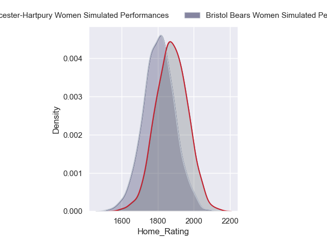
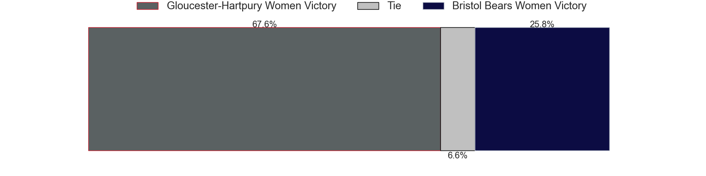
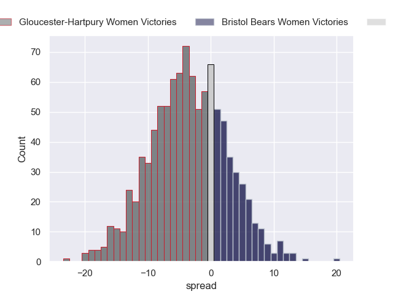

---  
title: "Allianz Premier 15s 2023 Status"  
date: 2023-11-29 6:00:00 -0500  
categories: model review projection  
layout: article  
aside:  
    toc: true  
---
# Current Team Rankings

# Standings

## Current Standings

| Club                      |   Played |   Wins |   Point Differential |   Losing Bonus Points |   Try Bonus Points |   Competition Points |
|:--------------------------|---------:|-------:|---------------------:|----------------------:|-------------------:|---------------------:|
| Saracens Women            |        2 |      2 |                   75 |                     0 |                nan |                    8 |
| Exeter Chiefs Women       |        2 |      2 |                   32 |                     0 |                nan |                    8 |
| Harlequins Women          |        2 |      1 |                    1 |                     1 |                nan |                    5 |
| Gloucester-Hartpury Women |        1 |      1 |                   38 |                     0 |                nan |                    4 |
| Bristol Bears Women       |        2 |      1 |                   28 |                     0 |                nan |                    4 |
| Sale Sharks Women         |        2 |      1 |                  -39 |                     0 |                nan |                    4 |
| Ealing Trailfinders Women |        2 |      0 |                  -39 |                     1 |                nan |                    1 |
| Loughborough Lightning    |        1 |      0 |                  -41 |                     0 |                nan |                    0 |
| Leicester Tigers Women    |        2 |      0 |                  -55 |                     0 |                nan |                    0 |

## Projected Remaining Table

| Club                      |   Matches Remaining |   Wins |   Point Differential |   Losing Bonus Points |   Try Bonus Points |   Competition Points |
|:--------------------------|--------------------:|-------:|---------------------:|----------------------:|-------------------:|---------------------:|
| Gloucester-Hartpury Women |                  16 |   12.6 |             157.039  |                   2.3 |               12.1 |                 65   |
| Exeter Chiefs Women       |                  14 |   12   |             183.004  |                   1.6 |               11.6 |                 61.1 |
| Saracens Women            |                  14 |   11.6 |             165.303  |                   1.8 |               11.2 |                 59.5 |
| Bristol Bears Women       |                  15 |    8.4 |              46.9881 |                   3.4 |                8   |                 45.1 |
| Harlequins Women          |                  14 |    6   |             -11.3395 |                   2.9 |                5.8 |                 32.8 |
| Loughborough Lightning    |                  15 |    4.7 |             -75.6311 |                   2.9 |                4.6 |                 26.5 |
| Leicester Tigers Women    |                  14 |    3.9 |            -138.445  |                   2   |                3.7 |                 21.1 |
| Ealing Trailfinders Women |                  14 |    3.1 |            -169.061  |                   2   |                2.9 |                 17.3 |
| Sale Sharks Women         |                  14 |    2.6 |            -157.857  |                   2   |                2.5 |                 15.1 |

## Projected Total Table

| Club                      |   Total Matches |   Wins |   Point Differential |   Losing Bonus Points |   Try Bonus Points |   Competition Points |
|:--------------------------|----------------:|-------:|---------------------:|----------------------:|-------------------:|---------------------:|
| Exeter Chiefs Women       |              16 |   14   |             215.004  |                   1.6 |               11.6 |                 69.1 |
| Gloucester-Hartpury Women |              17 |   13.6 |             195.039  |                   2.3 |               12.1 |                 69   |
| Saracens Women            |              16 |   13.6 |             240.303  |                   1.8 |               11.2 |                 67.5 |
| Bristol Bears Women       |              17 |    9.4 |              74.9881 |                   3.4 |                8   |                 49.1 |
| Harlequins Women          |              16 |    7   |             -10.3395 |                   3.9 |                5.8 |                 37.8 |
| Loughborough Lightning    |              16 |    4.7 |            -116.631  |                   2.9 |                4.6 |                 26.5 |
| Leicester Tigers Women    |              16 |    3.9 |            -193.445  |                   2   |                3.7 |                 21.1 |
| Sale Sharks Women         |              16 |    3.6 |            -196.857  |                   2   |                2.5 |                 19.1 |
| Ealing Trailfinders Women |              16 |    3.1 |            -208.061  |                   3   |                2.9 |                 18.3 |

# Completed Match Review

| Model | Percent Correct Predictions | Spread Error |
| ------ | ------ | ------ |
| Club Level | 87.5% | 11.9 |
| Player Level: Lineup | nan% | nan |
| Player Level: Minutes | nan% | nan |

# Future Predictions

## Week 3

### Bristol Bears Women V Gloucester-Hartpury Women on 2023/12/01

Average Margin: Gloucester-Hartpury Women by 3.5

### Sale Sharks Women V Exeter Chiefs Women on 2023/12/02

Average Margin: Exeter Chiefs Women by 18.7

### Bristol Bears Women V Gloucester-Hartpury Women on 2023/12/02

Average Margin: Gloucester-Hartpury Women by 3.7

### Harlequins Women V Saracens Women on 2023/12/02

Average Margin: Saracens Women by 7.9

### Leicester Tigers Women V Loughborough Lightning on 2023/12/03

Average Margin: Loughborough Lightning by 4.1

## Week 4

### Harlequins Women V Exeter Chiefs Women on 2023/12/09

Average Margin: Exeter Chiefs Women by 8.5

### Ealing Trailfinders Women V Leicester Tigers Women on 2023/12/09

Average Margin: Ealing Trailfinders Women by 4.8

### Gloucester-Hartpury Women V Sale Sharks Women on 2023/12/09

Average Margin: Gloucester-Hartpury Women by 23.5

### Loughborough Lightning V Bristol Bears Women on 2023/12/09

Average Margin: Bristol Bears Women by 5.0

## Week 5

### Leicester Tigers Women V Saracens Women on 2023/12/16

Average Margin: Saracens Women by 21.3

### Sale Sharks Women V Loughborough Lightning on 2023/12/16

Average Margin: Loughborough Lightning by 1.0

### Exeter Chiefs Women V Gloucester-Hartpury Women on 2023/12/16

Average Margin: Exeter Chiefs Women by 5.5

### Bristol Bears Women V Ealing Trailfinders Women on 2023/12/16

Average Margin: Bristol Bears Women by 19.8

## Week 6

### Ealing Trailfinders Women V Sale Sharks Women on 2023/12/23

Average Margin: Ealing Trailfinders Women by 1.0

### Saracens Women V Bristol Bears Women on 2023/12/23

Average Margin: Saracens Women by 11.6

### Loughborough Lightning V Exeter Chiefs Women on 2023/12/23

Average Margin: Exeter Chiefs Women by 14.4

## Week 7

### Harlequins Women V Gloucester-Hartpury Women on 2023/12/30

Average Margin: Gloucester-Hartpury Women by 6.4

## Week 8

### Gloucester-Hartpury Women V Loughborough Lightning on 2024/01/06

Average Margin: Gloucester-Hartpury Women by 19.0

### Sale Sharks Women V Saracens Women on 2024/01/06

Average Margin: Saracens Women by 18.2

### Exeter Chiefs Women V Ealing Trailfinders Women on 2024/01/06

Average Margin: Exeter Chiefs Women by 27.8

### Leicester Tigers Women V Harlequins Women on 2024/01/06

Average Margin: Harlequins Women by 7.5

## Week 9

### Ealing Trailfinders Women V Gloucester-Hartpury Women on 2024/01/13

Average Margin: Gloucester-Hartpury Women by 18.4

### Saracens Women V Exeter Chiefs Women on 2024/01/13

Average Margin: Saracens Women by 2.7

### Leicester Tigers Women V Bristol Bears Women on 2024/01/13

Average Margin: Bristol Bears Women by 9.8

### Harlequins Women V Loughborough Lightning on 2024/01/13

Average Margin: Harlequins Women by 9.3

## Week 10

### Bristol Bears Women V Harlequins Women on 2024/01/20

Average Margin: Bristol Bears Women by 6.0

### Sale Sharks Women V Leicester Tigers Women on 2024/01/20

Average Margin: Sale Sharks Women by 3.4

### Loughborough Lightning V Ealing Trailfinders Women on 2024/01/20

Average Margin: Loughborough Lightning by 9.7

### Gloucester-Hartpury Women V Saracens Women on 2024/01/20

Average Margin: Gloucester-Hartpury Women by 1.9

## Week 11

### Bristol Bears Women V Exeter Chiefs Women on 2024/02/03

Average Margin: Exeter Chiefs Women by 5.7

### Saracens Women V Ealing Trailfinders Women on 2024/02/03

Average Margin: Saracens Women by 24.5

### Harlequins Women V Sale Sharks Women on 2024/02/03

Average Margin: Harlequins Women by 13.7

### Leicester Tigers Women V Gloucester-Hartpury Women on 2024/02/03

Average Margin: Gloucester-Hartpury Women by 15.6

## Week 12

### Exeter Chiefs Women V Sale Sharks Women on 2024/02/10

Average Margin: Exeter Chiefs Women by 25.4

### Loughborough Lightning V Leicester Tigers Women on 2024/02/10

Average Margin: Loughborough Lightning by 7.6

### Saracens Women V Harlequins Women on 2024/02/10

Average Margin: Saracens Women by 14.4

### Gloucester-Hartpury Women V Bristol Bears Women on 2024/02/10

Average Margin: Gloucester-Hartpury Women by 10.0

## Week 13

### Exeter Chiefs Women V Harlequins Women on 2024/02/24

Average Margin: Exeter Chiefs Women by 14.6

### Bristol Bears Women V Loughborough Lightning on 2024/02/24

Average Margin: Bristol Bears Women by 11.6

### Leicester Tigers Women V Ealing Trailfinders Women on 2024/02/24

Average Margin: Leicester Tigers Women by 5.0

### Sale Sharks Women V Gloucester-Hartpury Women on 2024/02/24

Average Margin: Gloucester-Hartpury Women by 16.6

## Week 14

### Loughborough Lightning V Sale Sharks Women on 2024/03/02

Average Margin: Loughborough Lightning by 8.1

### Saracens Women V Leicester Tigers Women on 2024/03/02

Average Margin: Saracens Women by 23.5

### Gloucester-Hartpury Women V Exeter Chiefs Women on 2024/03/02

Average Margin: Gloucester-Hartpury Women by 1.3

### Ealing Trailfinders Women V Bristol Bears Women on 2024/03/02

Average Margin: Bristol Bears Women by 10.2

## Week 15

### Bristol Bears Women V Saracens Women on 2024/03/09

Average Margin: Saracens Women by 4.7

### Exeter Chiefs Women V Loughborough Lightning on 2024/03/09

Average Margin: Exeter Chiefs Women by 20.5

### Sale Sharks Women V Ealing Trailfinders Women on 2024/03/09

Average Margin: Sale Sharks Women by 3.8

### Gloucester-Hartpury Women V Harlequins Women on 2024/03/09

Average Margin: Gloucester-Hartpury Women by 12.8

## Week 16

### Harlequins Women V Leicester Tigers Women on 2024/05/11

Average Margin: Harlequins Women by 12.6

### Ealing Trailfinders Women V Exeter Chiefs Women on 2024/05/11

Average Margin: Exeter Chiefs Women by 18.6

### Loughborough Lightning V Gloucester-Hartpury Women on 2024/05/11

Average Margin: Gloucester-Hartpury Women by 11.9

### Saracens Women V Sale Sharks Women on 2024/05/11

Average Margin: Saracens Women by 24.2

## Week 17

### Bristol Bears Women V Leicester Tigers Women on 2024/05/18

Average Margin: Bristol Bears Women by 14.9

### Exeter Chiefs Women V Saracens Women on 2024/05/18

Average Margin: Exeter Chiefs Women by 3.9

### Gloucester-Hartpury Women V Ealing Trailfinders Women on 2024/05/18

Average Margin: Gloucester-Hartpury Women by 22.9

### Loughborough Lightning V Harlequins Women on 2024/05/18

Average Margin: Harlequins Women by 2.4

## Week 18

### Leicester Tigers Women V Sale Sharks Women on 2024/05/25

Average Margin: Leicester Tigers Women by 4.9

### Ealing Trailfinders Women V Loughborough Lightning on 2024/05/25

Average Margin: Loughborough Lightning by 1.2

### Saracens Women V Gloucester-Hartpury Women on 2024/05/25

Average Margin: Saracens Women by 4.8

### Harlequins Women V Bristol Bears Women on 2024/05/25

Average Margin: Harlequins Women by 0.6

## Week 19

### Harlequins Women V Ealing Trailfinders Women on 2024/06/01

Average Margin: Harlequins Women by 13.1

### Exeter Chiefs Women V Leicester Tigers Women on 2024/06/01

Average Margin: Exeter Chiefs Women by 23.3

### Loughborough Lightning V Saracens Women on 2024/06/01

Average Margin: Saracens Women by 13.1

### Sale Sharks Women V Bristol Bears Women on 2024/06/01

Average Margin: Bristol Bears Women by 9.6

## Week 20
