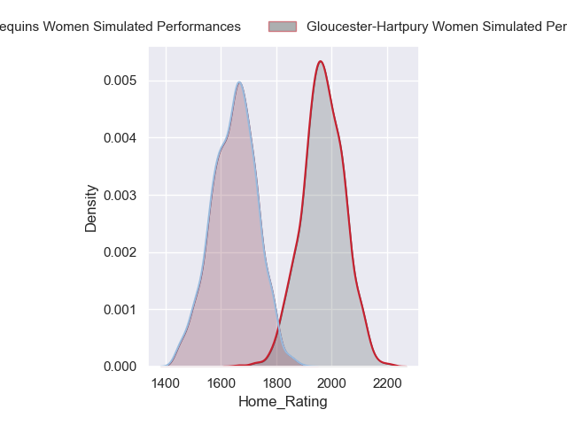
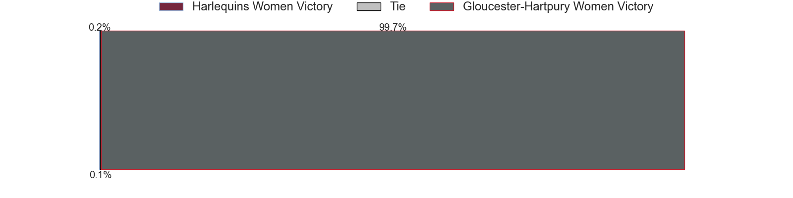
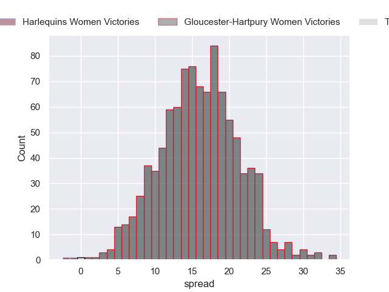

---  
title: "Allianz Premier 15s 2023 Status"  
date: 2024-03-07 6:00:00 -0500  
categories: model review projection  
layout: article  
aside:  
    toc: true  
---
# Current Team Rankings

# Standings

## Current Standings

| Club                      |   Played |   Wins |   Point Differential |   Losing Bonus Points |   Try Bonus Points |   Competition Points |
|:--------------------------|---------:|-------:|---------------------:|----------------------:|-------------------:|---------------------:|
| Gloucester-Hartpury Women |       12 |     12 |                  151 |                     0 |                nan |                   48 |
| Saracens Women            |       12 |     11 |                  347 |                     0 |                nan |                   44 |
| Bristol Bears Women       |       13 |      9 |                  181 |                     1 |                nan |                   37 |
| Exeter Chiefs Women       |       13 |      7 |                  153 |                     3 |                nan |                   33 |
| Loughborough Lightning    |       12 |      6 |                  -20 |                     1 |                nan |                   25 |
| Harlequins Women          |       11 |      3 |                  -44 |                     3 |                nan |                   17 |
| Ealing Trailfinders Women |       12 |      3 |                 -153 |                     2 |                nan |                   14 |
| Leicester Tigers Women    |       13 |      2 |                 -270 |                     1 |                nan |                    9 |
| Sale Sharks Women         |       12 |      1 |                 -345 |                     2 |                nan |                    6 |

## Projected Remaining Table

| Club                      |   Matches Remaining |   Wins |   Point Differential |   Losing Bonus Points |   Try Bonus Points |   Competition Points |
|:--------------------------|--------------------:|-------:|---------------------:|----------------------:|-------------------:|---------------------:|
| Saracens Women            |                   5 |    4.1 |             54.325   |                   0.8 |                2.5 |                 19.7 |
| Exeter Chiefs Women       |                   4 |    3.4 |             55.4478  |                   0.5 |                2.2 |                 16.4 |
| Bristol Bears Women       |                   4 |    3.2 |             42.9324  |                   0.6 |                2.1 |                 15.4 |
| Gloucester-Hartpury Women |                   4 |    3.1 |             47.1963  |                   0.5 |                2.3 |                 15.3 |
| Harlequins Women          |                   5 |    2.5 |              2.71501 |                   1   |                1.7 |                 12.7 |
| Loughborough Lightning    |                   5 |    1.2 |            -38.8143  |                   0.9 |                1   |                  6.8 |
| Ealing Trailfinders Women |                   5 |    1   |            -55.6799  |                   1   |                0.6 |                  5.4 |
| Leicester Tigers Women    |                   4 |    0.9 |            -48.6142  |                   0.4 |                0.5 |                  4.5 |
| Sale Sharks Women         |                   4 |    0.6 |            -59.5081  |                   0.7 |                0.8 |                  3.8 |

## Projected Total Table

| Club                      |   Total Matches |   Wins |   Point Differential |   Losing Bonus Points |   Try Bonus Points |   Competition Points |
|:--------------------------|----------------:|-------:|---------------------:|----------------------:|-------------------:|---------------------:|
| Saracens Women            |              17 |   15.1 |             401.325  |                   0.8 |                2.5 |                 63.7 |
| Gloucester-Hartpury Women |              16 |   15.1 |             198.196  |                   0.5 |                2.3 |                 63.3 |
| Bristol Bears Women       |              17 |   12.2 |             223.932  |                   1.6 |                2.1 |                 52.4 |
| Exeter Chiefs Women       |              17 |   10.4 |             208.448  |                   3.5 |                2.2 |                 49.4 |
| Loughborough Lightning    |              17 |    7.2 |             -58.8143 |                   1.9 |                1   |                 31.8 |
| Harlequins Women          |              16 |    5.5 |             -41.285  |                   4   |                1.7 |                 29.7 |
| Ealing Trailfinders Women |              17 |    4   |            -208.68   |                   3   |                0.6 |                 19.4 |
| Leicester Tigers Women    |              17 |    2.9 |            -318.614  |                   1.4 |                0.5 |                 13.5 |
| Sale Sharks Women         |              16 |    1.6 |            -404.508  |                   2.7 |                0.8 |                  9.8 |

# Completed Match Review

| Model | Percent Correct Predictions | Spread Error |
| ------ | ------ | ------ |
| Club Level | 86.3% | 13.4 |
| Player Level: Lineup | nan% | nan |
| Player Level: Minutes | nan% | nan |

# Future Predictions

## Week 14

### Gloucester-Hartpury Women V Harlequins Women on 2024/03/07

Average Margin: Gloucester-Hartpury Women by 16.0

Average Scoreline: 34-18

### Bristol Bears Women V Saracens Women on 2024/03/09

Average Margin: Saracens Women by 2.6

Average Scoreline: 35-32

### Exeter Chiefs Women V Loughborough Lightning on 2024/03/09

Average Margin: Exeter Chiefs Women by 16.8

Average Scoreline: 33-17

### Sale Sharks Women V Ealing Trailfinders Women on 2024/03/09

Average Margin: Ealing Trailfinders Women by 1.1

Average Scoreline: 24-23

## Week 15

### Harlequins Women V Leicester Tigers Women on 2024/05/11

Average Margin: Harlequins Women by 12.3

Average Scoreline: 29-16

### Ealing Trailfinders Women V Exeter Chiefs Women on 2024/05/11

Average Margin: Exeter Chiefs Women by 16.3

Average Scoreline: 36-20

### Loughborough Lightning V Gloucester-Hartpury Women on 2024/05/11

Average Margin: Gloucester-Hartpury Women by 11.8

Average Scoreline: 38-26

### Saracens Women V Sale Sharks Women on 2024/05/11

Average Margin: Saracens Women by 31.6

Average Scoreline: 40-9

## Week 16

### Bristol Bears Women V Leicester Tigers Women on 2024/05/18

Average Margin: Bristol Bears Women by 21.4

Average Scoreline: 40-19

### Loughborough Lightning V Harlequins Women on 2024/05/18

Average Margin: Loughborough Lightning by 0.5

Average Scoreline: 29-28

### Gloucester-Hartpury Women V Ealing Trailfinders Women on 2024/05/18

Average Margin: Gloucester-Hartpury Women by 25.0

Average Scoreline: 44-19

### Exeter Chiefs Women V Saracens Women on 2024/05/18

Average Margin: Saracens Women by 0.5

Average Scoreline: 33-32

## Week 17

### Leicester Tigers Women V Sale Sharks Women on 2024/05/25

Average Margin: Leicester Tigers Women by 8.0

Average Scoreline: 21-13

### Saracens Women V Gloucester-Hartpury Women on 2024/05/25

Average Margin: Saracens Women by 5.6

Average Scoreline: 27-22

### Ealing Trailfinders Women V Loughborough Lightning on 2024/05/25

Average Margin: Loughborough Lightning by 3.2

Average Scoreline: 21-18

### Harlequins Women V Bristol Bears Women on 2024/05/25

Average Margin: Bristol Bears Women by 5.3

Average Scoreline: 33-27

## Week 18

### Exeter Chiefs Women V Leicester Tigers Women on 2024/06/01

Average Margin: Exeter Chiefs Women by 22.9

Average Scoreline: 37-14

### Harlequins Women V Ealing Trailfinders Women on 2024/06/01

Average Margin: Harlequins Women by 12.2

Average Scoreline: 34-22

### Loughborough Lightning V Saracens Women on 2024/06/01

Average Margin: Saracens Women by 14.0

Average Scoreline: 37-23

### Sale Sharks Women V Bristol Bears Women on 2024/06/01

Average Margin: Bristol Bears Women by 18.8

Average Scoreline: 37-18

## Week 19
