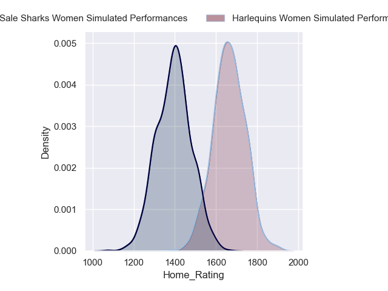
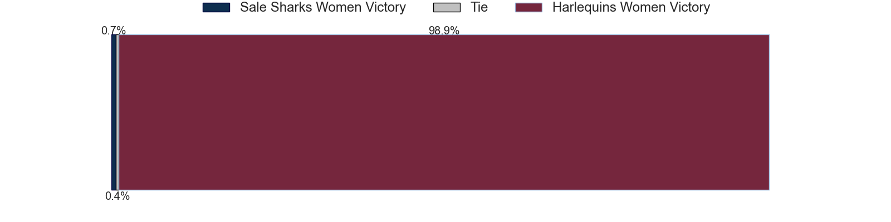
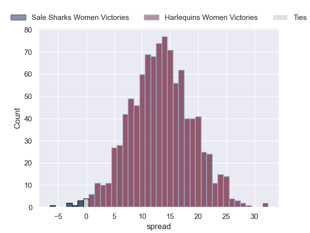

---  
title: "Allianz Premier 15s 2023 Status"  
date: 2024-01-29 6:00:00 -0500  
categories: model review projection  
layout: article  
aside:  
    toc: true  
---
# Current Team Rankings

# Standings

## Current Standings

| Club                      |   Played |   Wins |   Point Differential |   Losing Bonus Points |   Try Bonus Points |   Competition Points |
|:--------------------------|---------:|-------:|---------------------:|----------------------:|-------------------:|---------------------:|
| Saracens Women            |        8 |      7 |                  241 |                     0 |                nan |                   28 |
| Gloucester-Hartpury Women |        7 |      7 |                   99 |                     0 |                nan |                   28 |
| Exeter Chiefs Women       |        8 |      6 |                  118 |                     1 |                nan |                   25 |
| Bristol Bears Women       |        8 |      5 |                  104 |                     0 |                nan |                   20 |
| Loughborough Lightning    |        8 |      4 |                  -45 |                     0 |                nan |                   16 |
| Harlequins Women          |        8 |      2 |                  -80 |                     2 |                nan |                   10 |
| Ealing Trailfinders Women |        8 |      2 |                  -81 |                     2 |                nan |                   10 |
| Sale Sharks Women         |        7 |      1 |                 -173 |                     2 |                nan |                    6 |
| Leicester Tigers Women    |        8 |      1 |                 -183 |                     0 |                nan |                    4 |

## Projected Remaining Table

| Club                      |   Matches Remaining |   Wins |   Point Differential |   Losing Bonus Points |   Try Bonus Points |   Competition Points |
|:--------------------------|--------------------:|-------:|---------------------:|----------------------:|-------------------:|---------------------:|
| Saracens Women            |                   8 |    7.1 |             133.823  |                   0.8 |                5.1 |                 34.2 |
| Gloucester-Hartpury Women |                   8 |    6.9 |             113.922  |                   0.7 |                4.7 |                 33.1 |
| Exeter Chiefs Women       |                   8 |    6.6 |             111.974  |                   1.1 |                4.5 |                 31.9 |
| Bristol Bears Women       |                   8 |    5   |              38.192  |                   1.4 |                3.3 |                 24.6 |
| Harlequins Women          |                   9 |    4.1 |             -20.2219 |                   1.2 |                2.7 |                 20.5 |
| Loughborough Lightning    |                   8 |    3.4 |             -15.9199 |                   1   |                2.3 |                 17   |
| Ealing Trailfinders Women |                   8 |    2   |             -76.8494 |                   1.5 |                1.3 |                 10.7 |
| Sale Sharks Women         |                   9 |    0.9 |            -140.865  |                   1   |                1.6 |                  6   |
| Leicester Tigers Women    |                   8 |    1   |            -144.054  |                   0.8 |                0.7 |                  5.6 |

## Projected Total Table

| Club                      |   Total Matches |   Wins |   Point Differential |   Losing Bonus Points |   Try Bonus Points |   Competition Points |
|:--------------------------|----------------:|-------:|---------------------:|----------------------:|-------------------:|---------------------:|
| Saracens Women            |              16 |   14.1 |             374.823  |                   0.8 |                5.1 |                 62.2 |
| Gloucester-Hartpury Women |              15 |   13.9 |             212.922  |                   0.7 |                4.7 |                 61.1 |
| Exeter Chiefs Women       |              16 |   12.6 |             229.974  |                   2.1 |                4.5 |                 56.9 |
| Bristol Bears Women       |              16 |   10   |             142.192  |                   1.4 |                3.3 |                 44.6 |
| Loughborough Lightning    |              16 |    7.4 |             -60.9199 |                   1   |                2.3 |                 33   |
| Harlequins Women          |              17 |    6.1 |            -100.222  |                   3.2 |                2.7 |                 30.5 |
| Ealing Trailfinders Women |              16 |    4   |            -157.849  |                   3.5 |                1.3 |                 20.7 |
| Sale Sharks Women         |              16 |    1.9 |            -313.865  |                   3   |                1.6 |                 12   |
| Leicester Tigers Women    |              16 |    2   |            -327.054  |                   0.8 |                0.7 |                  9.6 |

# Completed Match Review

| Model | Percent Correct Predictions | Spread Error |
| ------ | ------ | ------ |
| Club Level | 88.6% | 13.3 |
| Player Level: Lineup | nan% | nan |
| Player Level: Minutes | nan% | nan |

# Future Predictions

## Week 9

### Saracens Women V Ealing Trailfinders Women on 2024/02/03

Average Margin: Saracens Women by 25.8

Average Scoreline: 43-17

### Harlequins Women V Sale Sharks Women on 2024/02/03

Average Margin: Harlequins Women by 13.5

Average Scoreline: 33-19

### Bristol Bears Women V Exeter Chiefs Women on 2024/02/03

Average Margin: Exeter Chiefs Women by 4.1

Average Scoreline: 29-25

### Leicester Tigers Women V Gloucester-Hartpury Women on 2024/02/03

Average Margin: Gloucester-Hartpury Women by 25.4

Average Scoreline: 39-14

### Harlequins Women V Sale Sharks Women on 2024/02/04

Average Margin: Harlequins Women by 13.4

Average Scoreline: 33-19

## Week 10

### Saracens Women V Harlequins Women on 2024/02/10

Average Margin: Saracens Women by 21.2

Average Scoreline: 37-15

### Gloucester-Hartpury Women V Bristol Bears Women on 2024/02/10

Average Margin: Gloucester-Hartpury Women by 11.7

Average Scoreline: 31-19

### Exeter Chiefs Women V Sale Sharks Women on 2024/02/10

Average Margin: Exeter Chiefs Women by 28.4

Average Scoreline: 42-14

### Loughborough Lightning V Leicester Tigers Women on 2024/02/10

Average Margin: Loughborough Lightning by 17.0

Average Scoreline: 37-20

## Week 11

### Sale Sharks Women V Gloucester-Hartpury Women on 2024/02/24

Average Margin: Gloucester-Hartpury Women by 22.7

Average Scoreline: 38-15

### Exeter Chiefs Women V Harlequins Women on 2024/02/24

Average Margin: Exeter Chiefs Women by 18.9

Average Scoreline: 36-17

### Bristol Bears Women V Loughborough Lightning on 2024/02/24

Average Margin: Bristol Bears Women by 10.3

Average Scoreline: 29-19

### Leicester Tigers Women V Ealing Trailfinders Women on 2024/02/24

Average Margin: Ealing Trailfinders Women by 4.4

Average Scoreline: 29-24

## Week 12

### Saracens Women V Leicester Tigers Women on 2024/03/02

Average Margin: Saracens Women by 32.6

Average Scoreline: 50-17

### Ealing Trailfinders Women V Bristol Bears Women on 2024/03/02

Average Margin: Bristol Bears Women by 8.8

Average Scoreline: 29-20

### Gloucester-Hartpury Women V Exeter Chiefs Women on 2024/03/02

Average Margin: Gloucester-Hartpury Women by 3.8

Average Scoreline: 30-26

### Loughborough Lightning V Sale Sharks Women on 2024/03/02

Average Margin: Loughborough Lightning by 13.9

Average Scoreline: 27-13

## Week 13

### Exeter Chiefs Women V Loughborough Lightning on 2024/03/09

Average Margin: Exeter Chiefs Women by 17.7

Average Scoreline: 30-13

### Sale Sharks Women V Ealing Trailfinders Women on 2024/03/09

Average Margin: Ealing Trailfinders Women by 2.3

Average Scoreline: 29-27

### Gloucester-Hartpury Women V Harlequins Women on 2024/03/09

Average Margin: Gloucester-Hartpury Women by 19.6

Average Scoreline: 44-25

### Bristol Bears Women V Saracens Women on 2024/03/09

Average Margin: Saracens Women by 6.5

Average Scoreline: 29-23

## Week 14

### Ealing Trailfinders Women V Exeter Chiefs Women on 2024/05/11

Average Margin: Exeter Chiefs Women by 16.0

Average Scoreline: 33-17

### Saracens Women V Sale Sharks Women on 2024/05/11

Average Margin: Saracens Women by 30.7

Average Scoreline: 54-23

### Loughborough Lightning V Gloucester-Hartpury Women on 2024/05/11

Average Margin: Gloucester-Hartpury Women by 11.7

Average Scoreline: 31-20

### Harlequins Women V Leicester Tigers Women on 2024/05/11

Average Margin: Harlequins Women by 14.5

Average Scoreline: 33-19

## Week 15

### Loughborough Lightning V Harlequins Women on 2024/05/18

Average Margin: Loughborough Lightning by 4.4

Average Scoreline: 27-23

### Gloucester-Hartpury Women V Ealing Trailfinders Women on 2024/05/18

Average Margin: Gloucester-Hartpury Women by 24.0

Average Scoreline: 39-15

### Bristol Bears Women V Leicester Tigers Women on 2024/05/18

Average Margin: Bristol Bears Women by 22.4

Average Scoreline: 40-18

### Exeter Chiefs Women V Saracens Women on 2024/05/18

Average Margin: Exeter Chiefs Women by 1.1

Average Scoreline: 25-24

## Week 16

### Ealing Trailfinders Women V Loughborough Lightning on 2024/05/25

Average Margin: Loughborough Lightning by 1.6

Average Scoreline: 27-26

### Leicester Tigers Women V Sale Sharks Women on 2024/05/25

Average Margin: Leicester Tigers Women by 1.8

Average Scoreline: 24-22

### Saracens Women V Gloucester-Hartpury Women on 2024/05/25

Average Margin: Saracens Women by 4.9

Average Scoreline: 27-22

### Harlequins Women V Bristol Bears Women on 2024/05/25

Average Margin: Bristol Bears Women by 4.7

Average Scoreline: 26-22

## Week 17

### Sale Sharks Women V Bristol Bears Women on 2024/06/01

Average Margin: Bristol Bears Women by 14.2

Average Scoreline: 35-21

### Loughborough Lightning V Saracens Women on 2024/06/01

Average Margin: Saracens Women by 13.2

Average Scoreline: 32-19

### Harlequins Women V Ealing Trailfinders Women on 2024/06/01

Average Margin: Harlequins Women by 7.3

Average Scoreline: 30-22

### Exeter Chiefs Women V Leicester Tigers Women on 2024/06/01

Average Margin: Exeter Chiefs Women by 29.5

Average Scoreline: 46-17

## Week 18
