---  
title: "Allianz Premier 15s 2024 Status"  
date: 2025-01-27 6:00:00 -0500  
categories: model review projection  
layout: article  
aside:  
    toc: true  
---
# Current Team Rankings

# Standings

## Current Standings

| Club                      |   Played |   Wins |   Point Differential |   Losing Bonus Points |   Try Bonus Points |   Competition Points |
|:--------------------------|---------:|-------:|---------------------:|----------------------:|-------------------:|---------------------:|
| Gloucester-Hartpury Women |       13 |     10 |                  152 |                     2 |                nan |                   42 |
| Harlequins Women          |       13 |     10 |                  135 |                     1 |                nan |                   41 |
| Saracens Women            |       13 |      9 |                  212 |                     2 |                nan |                   38 |
| Exeter Chiefs Women       |       12 |      9 |                   87 |                     1 |                nan |                   37 |
| Bristol Bears Women       |       13 |      8 |                  149 |                     1 |                nan |                   33 |
| Loughborough Lightning    |       14 |      5 |                  -28 |                     2 |                nan |                   22 |
| Ealing Trailfinders Women |       12 |      4 |                  -24 |                     2 |                nan |                   18 |
| Leicester Tigers Women    |       13 |      2 |                 -353 |                     0 |                nan |                    8 |
| Sale Sharks Women         |       13 |      1 |                 -330 |                     0 |                nan |                    4 |

## Projected Remaining Table

| Club                      |   Matches Remaining |   Wins |   Point Differential |   Losing Bonus Points |   Try Bonus Points |   Competition Points |
|:--------------------------|--------------------:|-------:|---------------------:|----------------------:|-------------------:|---------------------:|
| Gloucester-Hartpury Women |                   1 |    1   |             26.9889  |                   0   |                0.9 |                  4.7 |
| Bristol Bears Women       |                   1 |    0.9 |             13.8459  |                   0   |                0.6 |                  4.2 |
| Saracens Women            |                   1 |    0.9 |              9.42296 |                   0.1 |                0.6 |                  4.1 |
| Exeter Chiefs Women       |                   1 |    0.8 |              7.32743 |                   0.1 |                0.3 |                  3.7 |
| Harlequins Women          |                   1 |    0.2 |             -7.32743 |                   0.3 |                0.2 |                  1.3 |
| Ealing Trailfinders Women |                   1 |    0.1 |             -9.42296 |                   0.3 |                0.2 |                  1   |
| Loughborough Lightning    |                   1 |    0.1 |            -13.8459  |                   0.1 |                0.1 |                  0.6 |
| Leicester Tigers Women    |                   1 |    0   |            -26.9889  |                   0   |                0.1 |                  0.4 |

## Projected Total Table

| Club                      |   Total Matches |   Wins |   Point Differential |   Losing Bonus Points |   Try Bonus Points |   Competition Points |
|:--------------------------|----------------:|-------:|---------------------:|----------------------:|-------------------:|---------------------:|
| Gloucester-Hartpury Women |              14 |   11   |             178.989  |                   2   |                0.9 |                 46.7 |
| Harlequins Women          |              14 |   10.2 |             127.673  |                   1.3 |                0.2 |                 42.3 |
| Saracens Women            |              14 |    9.9 |             221.423  |                   2.1 |                0.6 |                 42.1 |
| Exeter Chiefs Women       |              13 |    9.8 |              94.3274 |                   1.1 |                0.3 |                 40.7 |
| Bristol Bears Women       |              14 |    8.9 |             162.846  |                   1   |                0.6 |                 37.2 |
| Loughborough Lightning    |              15 |    5.1 |             -41.8459 |                   2.1 |                0.1 |                 22.6 |
| Ealing Trailfinders Women |              13 |    4.1 |             -33.423  |                   2.3 |                0.2 |                 19   |
| Leicester Tigers Women    |              14 |    2   |            -379.989  |                   0   |                0.1 |                  8.4 |
| Sale Sharks Women         |              13 |    1   |            -330      |                   0   |                0   |                  4   |

# Completed Match Review

| Model | Percent Correct Predictions | Spread Error |
| ------ | ------ | ------ |
| Club Level | 79.3% | 15.7 |
| Player Level: Lineup | nan% | nan |
| Player Level: Minutes | nan% | nan |

# Future Predictions

## Week 15

### Ealing Trailfinders Women V Saracens Women on 2025/02/01

Average Margin: Saracens Women by 9.4

Average Scoreline: 43-34

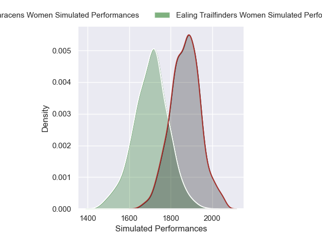

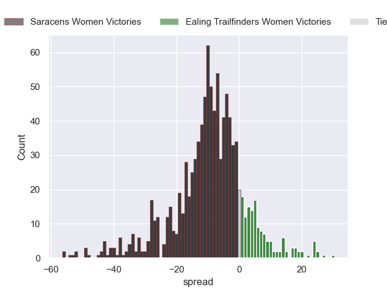

### Bristol Bears Women V Loughborough Lightning on 2025/02/01

Average Margin: Bristol Bears Women by 13.8

Average Scoreline: 31-17

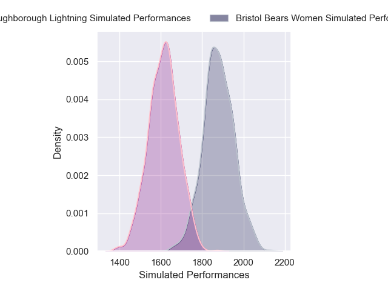
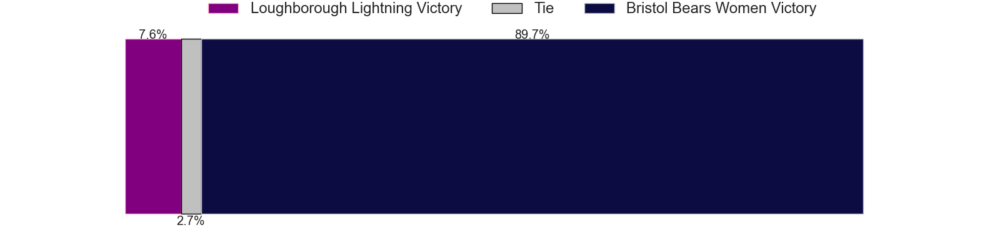
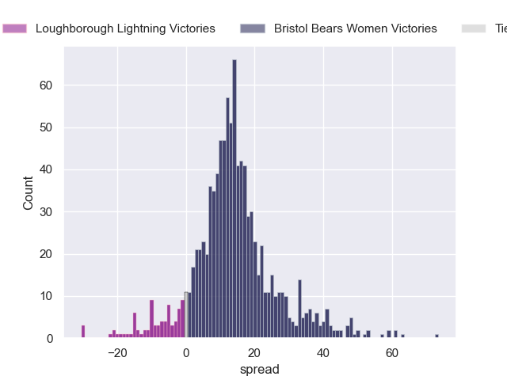

### Leicester Tigers Women V Gloucester-Hartpury Women on 2025/02/01

Average Margin: Gloucester-Hartpury Women by 27.0

Average Scoreline: 48-21

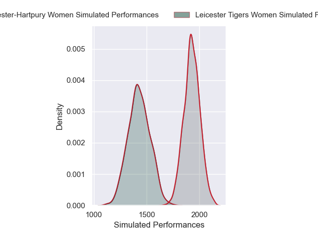
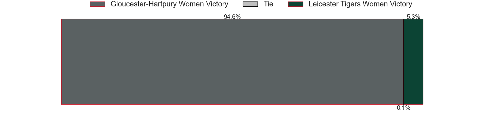
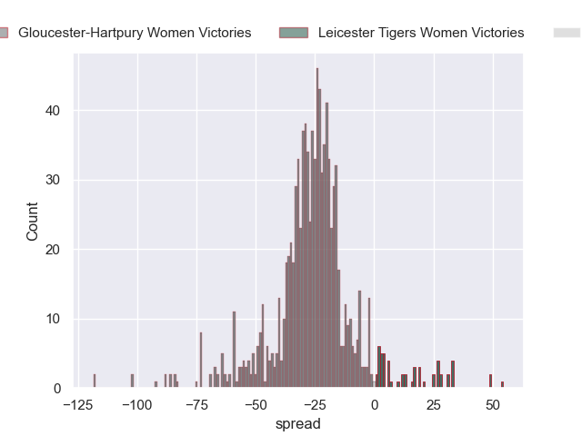

### Exeter Chiefs Women V Harlequins Women on 2025/02/02

Average Margin: Exeter Chiefs Women by 7.3

Average Scoreline: 28-20

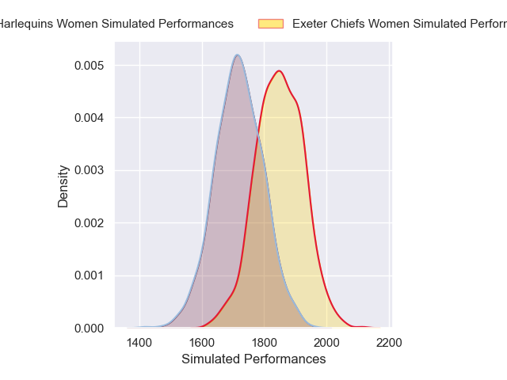
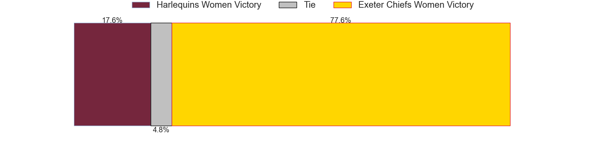
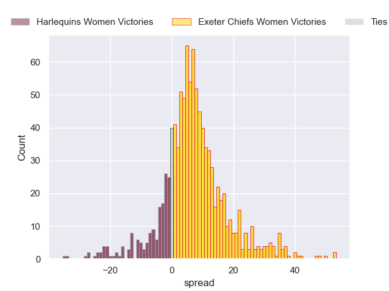

