---  
title: "Allianz Premier 15s 2024 Status"  
date: 2024-11-25 6:00:00 -0500  
categories: model review projection  
layout: article  
aside:  
    toc: true  
---
# Current Team Rankings

# Standings

## Current Standings

| Club                      |   Played |   Wins |   Point Differential |   Losing Bonus Points |   Try Bonus Points |   Competition Points |
|:--------------------------|---------:|-------:|---------------------:|----------------------:|-------------------:|---------------------:|
| Exeter Chiefs Women       |        7 |      7 |                  108 |                     0 |                nan |                   28 |
| Harlequins Women          |        7 |      5 |                   54 |                     1 |                nan |                   21 |
| Saracens Women            |        6 |      4 |                   57 |                     1 |                nan |                   17 |
| Gloucester-Hartpury Women |        6 |      4 |                   46 |                     1 |                nan |                   17 |
| Bristol Bears Women       |        6 |      4 |                  116 |                     0 |                nan |                   16 |
| Loughborough Lightning    |        6 |      2 |                  -51 |                     1 |                nan |                    9 |
| Ealing Trailfinders Women |        6 |      2 |                   -2 |                     0 |                nan |                    8 |
| Sale Sharks Women         |        6 |      0 |                 -158 |                     0 |                nan |                    0 |
| Leicester Tigers Women    |        6 |      0 |                 -170 |                     0 |                nan |                    0 |

## Projected Remaining Table

| Club                      |   Matches Remaining |   Wins |   Point Differential |   Losing Bonus Points |   Try Bonus Points |   Competition Points |
|:--------------------------|--------------------:|-------:|---------------------:|----------------------:|-------------------:|---------------------:|
| Saracens Women            |                   1 |    0.9 |             21.1867  |                   0   |                0.7 |                  4.5 |
| Sale Sharks Women         |                   1 |    0.9 |             11.0402  |                   0.1 |                0.6 |                  4.1 |
| Gloucester-Hartpury Women |                   1 |    0.8 |              8.35248 |                   0.1 |                0.2 |                  3.7 |
| Harlequins Women          |                   1 |    0.8 |              5.92145 |                   0.2 |                0.4 |                  3.6 |
| Ealing Trailfinders Women |                   1 |    0.2 |             -5.92145 |                   0.3 |                0.2 |                  1.5 |
| Bristol Bears Women       |                   1 |    0.2 |             -8.35248 |                   0.3 |                0.2 |                  1.2 |
| Leicester Tigers Women    |                   1 |    0.1 |            -11.0402  |                   0.2 |                0.2 |                  1   |
| Loughborough Lightning    |                   1 |    0.1 |            -21.1867  |                   0.1 |                0.1 |                  0.4 |

## Projected Total Table

| Club                      |   Total Matches |   Wins |   Point Differential |   Losing Bonus Points |   Try Bonus Points |   Competition Points |
|:--------------------------|----------------:|-------:|---------------------:|----------------------:|-------------------:|---------------------:|
| Exeter Chiefs Women       |               7 |    7   |            108       |                   0   |                0   |                 28   |
| Harlequins Women          |               8 |    5.8 |             59.9215  |                   1.2 |                0.4 |                 24.6 |
| Saracens Women            |               7 |    4.9 |             78.1867  |                   1   |                0.7 |                 21.5 |
| Gloucester-Hartpury Women |               7 |    4.8 |             54.3525  |                   1.1 |                0.2 |                 20.7 |
| Bristol Bears Women       |               7 |    4.2 |            107.648   |                   0.3 |                0.2 |                 17.2 |
| Ealing Trailfinders Women |               7 |    2.2 |             -7.92145 |                   0.3 |                0.2 |                  9.5 |
| Loughborough Lightning    |               7 |    2.1 |            -72.1867  |                   1.1 |                0.1 |                  9.4 |
| Sale Sharks Women         |               7 |    0.9 |           -146.96    |                   0.1 |                0.6 |                  4.1 |
| Leicester Tigers Women    |               7 |    0.1 |           -181.04    |                   0.2 |                0.2 |                  1   |

# Completed Match Review

| Model | Percent Correct Predictions | Spread Error |
| ------ | ------ | ------ |
| Club Level | 82.1% | 13.2 |
| Player Level: Lineup | nan% | nan |
| Player Level: Minutes | nan% | nan |

# Future Predictions

## Week 8

### Gloucester-Hartpury Women V Bristol Bears Women on 2024/11/30

Average Margin: Gloucester-Hartpury Women by 8.4

Average Scoreline: 34-26

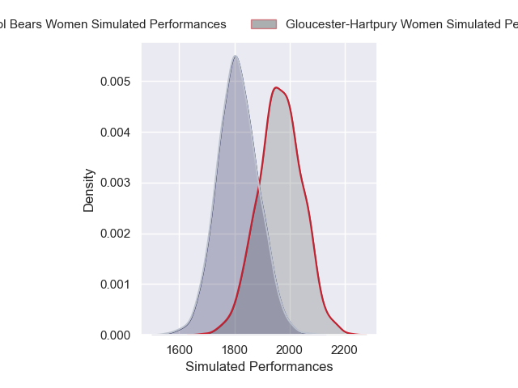
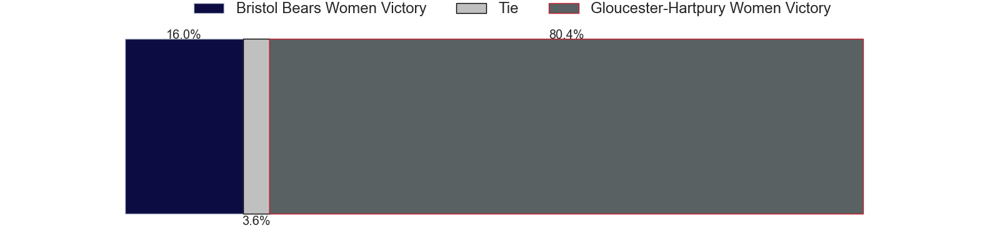
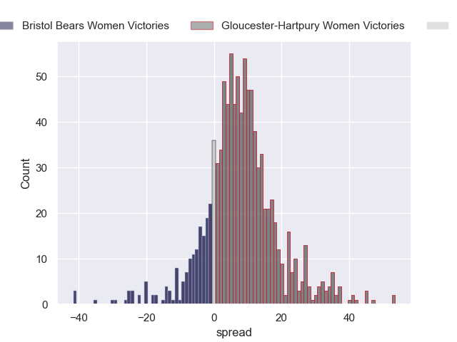

### Saracens Women V Loughborough Lightning on 2024/11/30

Average Margin: Saracens Women by 21.2

Average Scoreline: 38-17

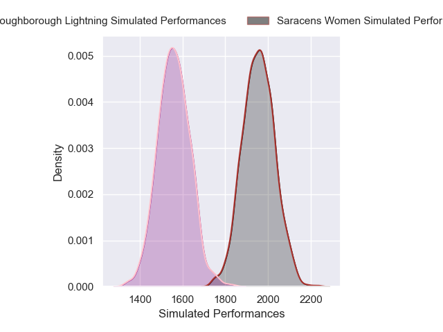
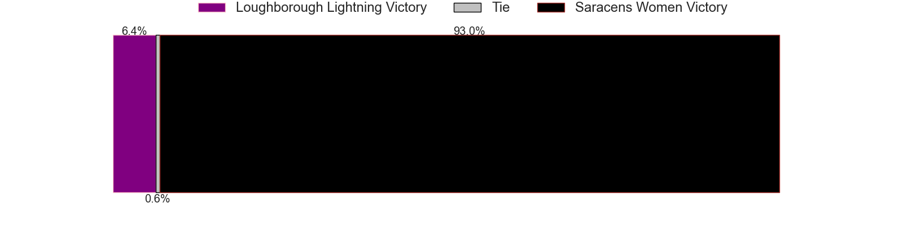
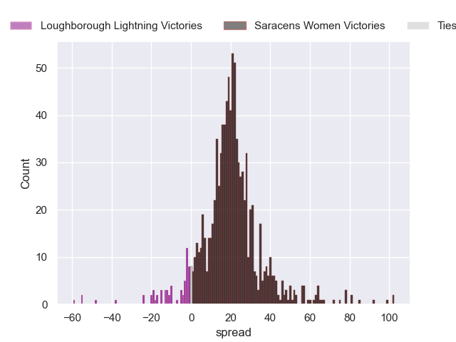

### Harlequins Women V Ealing Trailfinders Women on 2024/11/30

Average Margin: Harlequins Women by 5.9

Average Scoreline: 26-20

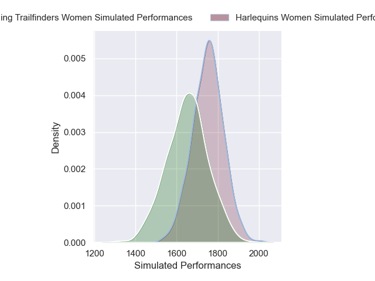
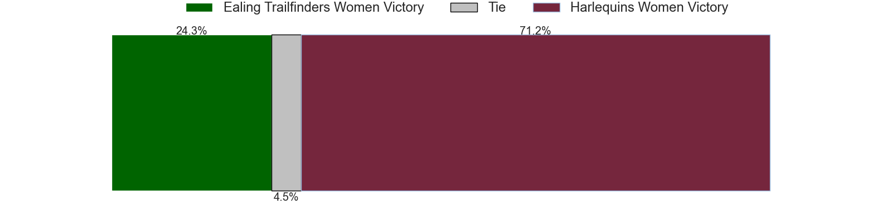
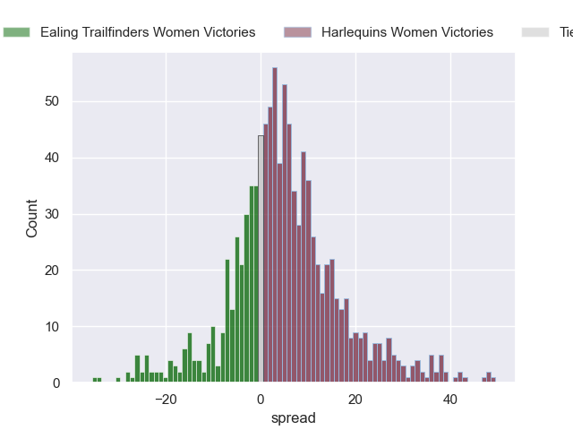

### Sale Sharks Women V Leicester Tigers Women on 2024/12/01

Average Margin: Sale Sharks Women by 11.0

Average Scoreline: 33-22

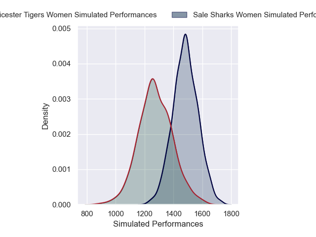
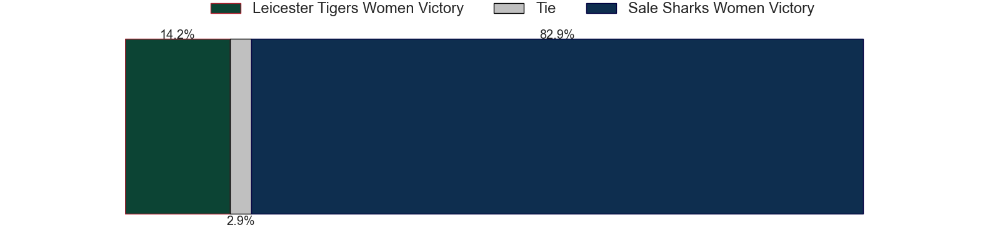
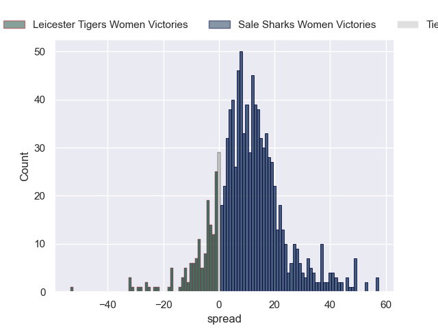

