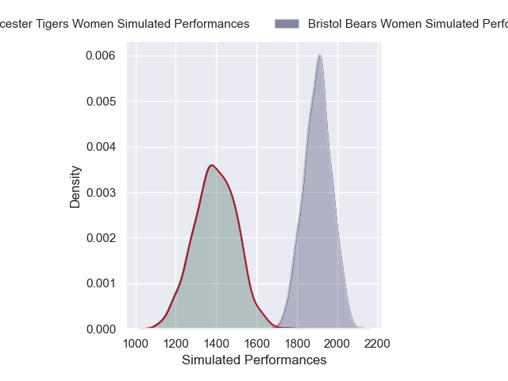
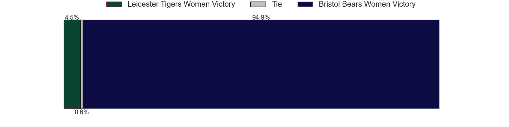
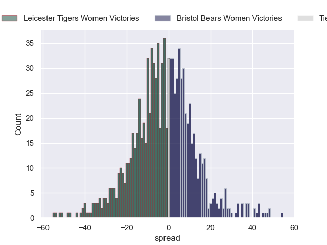
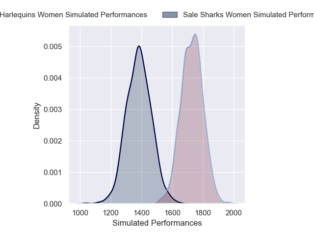
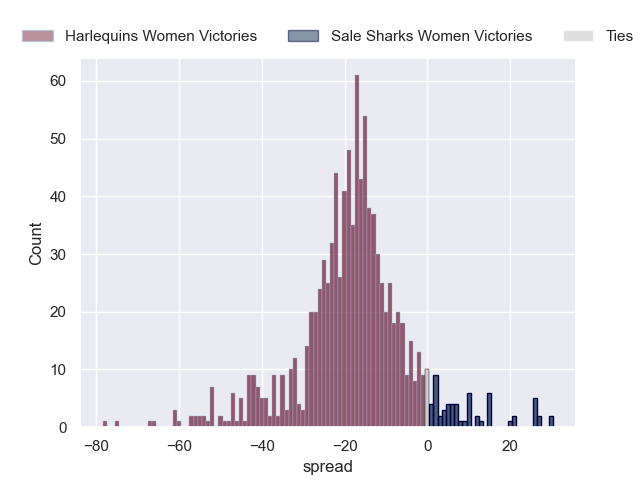
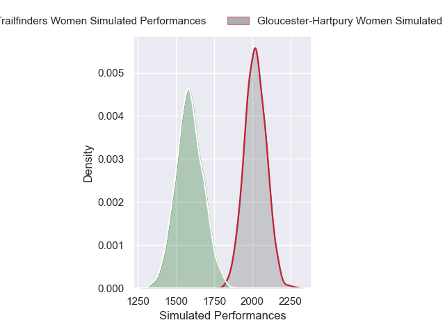
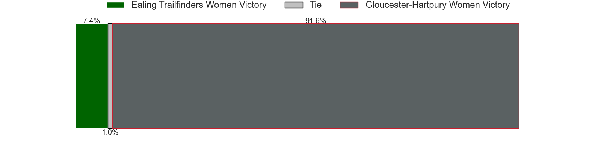
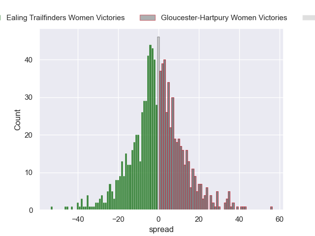

---  
title: "Allianz Premier 15s 2024 Status"  
date: 2025-01-13 6:00:00 -0500  
categories: model review projection  
layout: article  
aside:  
    toc: true  
---
# Current Team Rankings

# Standings

## Current Standings

| Club                      |   Played |   Wins |   Point Differential |   Losing Bonus Points |   Try Bonus Points |   Competition Points |
|:--------------------------|---------:|-------:|---------------------:|----------------------:|-------------------:|---------------------:|
| Gloucester-Hartpury Women |       12 |      9 |                  150 |                     2 |                nan |                   38 |
| Harlequins Women          |       11 |      9 |                  125 |                     1 |                nan |                   37 |
| Saracens Women            |       12 |      8 |                  189 |                     2 |                nan |                   34 |
| Exeter Chiefs Women       |       10 |      8 |                   88 |                     0 |                nan |                   32 |
| Bristol Bears Women       |       11 |      7 |                  136 |                     0 |                nan |                   28 |
| Loughborough Lightning    |       12 |      4 |                  -73 |                     1 |                nan |                   17 |
| Ealing Trailfinders Women |       10 |      3 |                  -23 |                     1 |                nan |                   13 |
| Leicester Tigers Women    |       11 |      2 |                 -290 |                     0 |                nan |                    8 |
| Sale Sharks Women         |       11 |      0 |                 -302 |                     0 |                nan |                    0 |

## Projected Remaining Table

| Club                      |   Matches Remaining |   Wins |   Point Differential |   Losing Bonus Points |   Try Bonus Points |   Competition Points |
|:--------------------------|--------------------:|-------:|---------------------:|----------------------:|-------------------:|---------------------:|
| Harlequins Women          |                   1 |    0.7 |             4.46174  |                   0.2 |                0.5 |                  3.3 |
| Loughborough Lightning    |                   1 |    0.6 |             2.57588  |                   0.2 |                0.3 |                  2.9 |
| Leicester Tigers Women    |                   1 |    0.6 |             2.25549  |                   0.2 |                0.4 |                  2.8 |
| Ealing Trailfinders Women |                   1 |    0.5 |             0.799048 |                   0.2 |                0.3 |                  2.7 |
| Gloucester-Hartpury Women |                   1 |    0.5 |            -0.799048 |                   0.3 |                0.2 |                  2.3 |
| Bristol Bears Women       |                   1 |    0.4 |            -2.25549  |                   0.2 |                0.2 |                  2.2 |
| Exeter Chiefs Women       |                   1 |    0.4 |            -2.57588  |                   0.3 |                0.3 |                  2.2 |
| Sale Sharks Women         |                   1 |    0.3 |            -4.46174  |                   0.3 |                0.2 |                  1.9 |

## Projected Total Table

| Club                      |   Total Matches |   Wins |   Point Differential |   Losing Bonus Points |   Try Bonus Points |   Competition Points |
|:--------------------------|----------------:|-------:|---------------------:|----------------------:|-------------------:|---------------------:|
| Gloucester-Hartpury Women |              13 |    9.5 |             149.201  |                   2.3 |                0.2 |                 40.3 |
| Harlequins Women          |              12 |    9.7 |             129.462  |                   1.2 |                0.5 |                 40.3 |
| Exeter Chiefs Women       |              11 |    8.4 |              85.4241 |                   0.3 |                0.3 |                 34.2 |
| Saracens Women            |              12 |    8   |             189      |                   2   |                0   |                 34   |
| Bristol Bears Women       |              12 |    7.4 |             133.745  |                   0.2 |                0.2 |                 30.2 |
| Loughborough Lightning    |              13 |    4.6 |             -70.4241 |                   1.2 |                0.3 |                 19.9 |
| Ealing Trailfinders Women |              11 |    3.5 |             -22.201  |                   1.2 |                0.3 |                 15.7 |
| Leicester Tigers Women    |              12 |    2.6 |            -287.745  |                   0.2 |                0.4 |                 10.8 |
| Sale Sharks Women         |              12 |    0.3 |            -306.462  |                   0.3 |                0.2 |                  1.9 |

# Completed Match Review

| Model | Percent Correct Predictions | Spread Error |
| ------ | ------ | ------ |
| Club Level | 80.0% | 15.0 |
| Player Level: Lineup | nan% | nan |
| Player Level: Minutes | nan% | nan |

# Future Predictions

## Week 13

### Bristol Bears Women V Leicester Tigers Women on 2025/01/18

Average Margin: Leicester Tigers Women by 2.3

Average Scoreline: 28-26

### Sale Sharks Women V Harlequins Women on 2025/01/18

Average Margin: Harlequins Women by 4.5

Average Scoreline: 30-26

### Gloucester-Hartpury Women V Ealing Trailfinders Women on 2025/01/18

Average Margin: Ealing Trailfinders Women by 0.8

Average Scoreline: 27-26

### Loughborough Lightning V Exeter Chiefs Women on 2025/01/19

Average Margin: Loughborough Lightning by 2.6

Average Scoreline: 26-24

