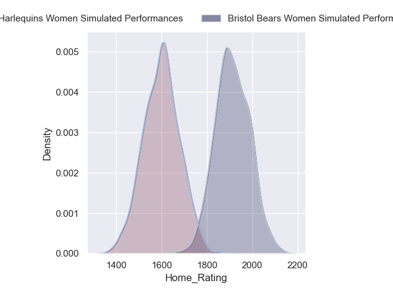
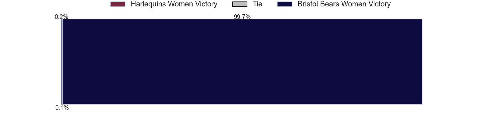
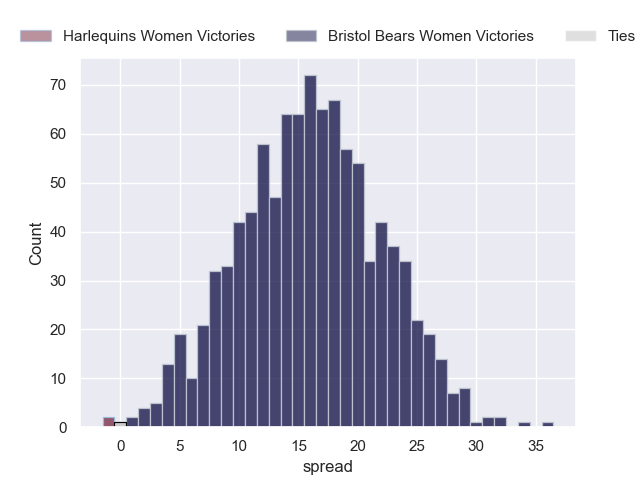
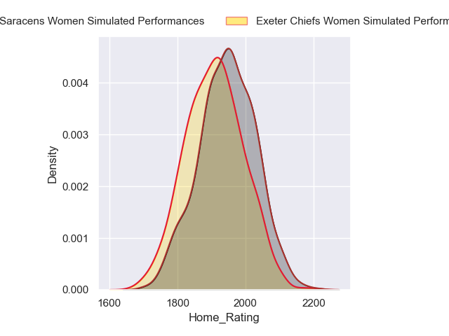
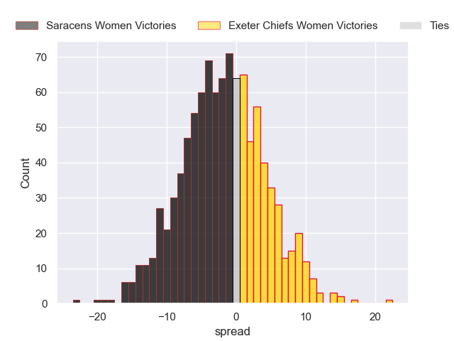
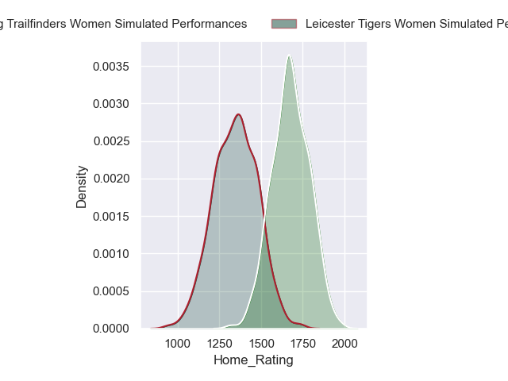
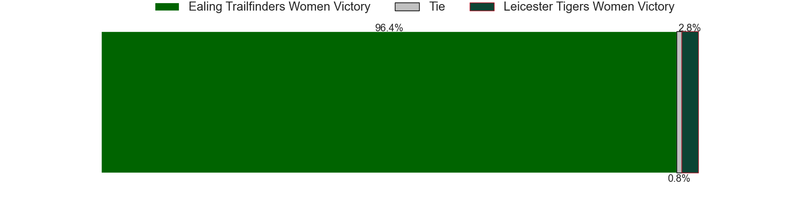
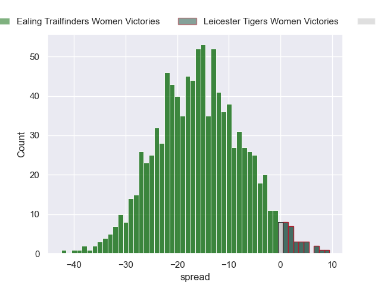
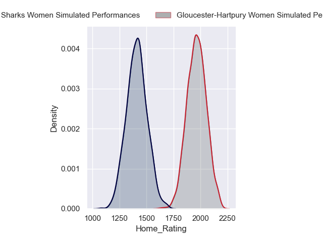
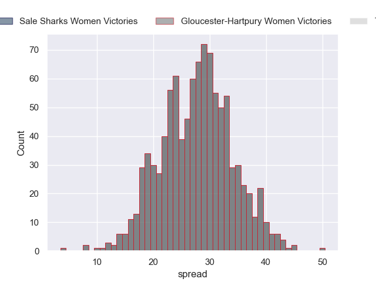

---  
title: "Allianz Premier 15s 2024 Status"  
date: 2024-10-28 6:00:00 -0500  
categories: model review projection  
layout: article  
aside:  
    toc: true  
---
# Current Team Rankings

# Standings

## Current Standings

| Club                      |   Played |   Wins |   Point Differential |   Losing Bonus Points |   Try Bonus Points |   Competition Points |
|:--------------------------|---------:|-------:|---------------------:|----------------------:|-------------------:|---------------------:|
| Saracens Women            |        4 |      4 |                   75 |                     0 |                nan |                   16 |
| Exeter Chiefs Women       |        4 |      4 |                   60 |                     0 |                nan |                   16 |
| Gloucester-Hartpury Women |        4 |      2 |                   20 |                     1 |                nan |                    9 |
| Harlequins Women          |        4 |      2 |                    7 |                     1 |                nan |                    9 |
| Bristol Bears Women       |        3 |      2 |                   57 |                     0 |                nan |                    8 |
| Loughborough Lightning    |        4 |      1 |                  -42 |                     1 |                nan |                    5 |
| Ealing Trailfinders Women |        3 |      1 |                   11 |                     0 |                nan |                    4 |
| Leicester Tigers Women    |        3 |      0 |                  -84 |                     0 |                nan |                    0 |
| Sale Sharks Women         |        3 |      0 |                 -104 |                     0 |                nan |                    0 |

## Projected Remaining Table

| Club                      |   Matches Remaining |   Wins |   Point Differential |   Losing Bonus Points |   Try Bonus Points |   Competition Points |
|:--------------------------|--------------------:|-------:|---------------------:|----------------------:|-------------------:|---------------------:|
| Gloucester-Hartpury Women |                   1 |    1   |             27.9757  |                   0   |                0.9 |                  4.9 |
| Ealing Trailfinders Women |                   1 |    1   |             15.6932  |                   0   |                0.7 |                  4.6 |
| Bristol Bears Women       |                   1 |    1   |             15.6725  |                   0   |                0.6 |                  4.6 |
| Saracens Women            |                   1 |    0.6 |              1.97229 |                   0.3 |                0.4 |                  3.3 |
| Exeter Chiefs Women       |                   1 |    0.4 |             -1.97229 |                   0.5 |                0.1 |                  2   |
| Leicester Tigers Women    |                   1 |    0   |            -15.6932  |                   0.1 |                0.2 |                  0.4 |
| Harlequins Women          |                   1 |    0   |            -15.6725  |                   0   |                0.1 |                  0.2 |
| Sale Sharks Women         |                   1 |    0   |            -27.9757  |                   0   |                0.1 |                  0.1 |

## Projected Total Table

| Club                      |   Total Matches |   Wins |   Point Differential |   Losing Bonus Points |   Try Bonus Points |   Competition Points |
|:--------------------------|----------------:|-------:|---------------------:|----------------------:|-------------------:|---------------------:|
| Saracens Women            |               5 |    4.6 |             76.9723  |                   0.3 |                0.4 |                 19.3 |
| Exeter Chiefs Women       |               5 |    4.4 |             58.0277  |                   0.5 |                0.1 |                 18   |
| Gloucester-Hartpury Women |               5 |    3   |             47.9757  |                   1   |                0.9 |                 13.9 |
| Bristol Bears Women       |               4 |    3   |             72.6725  |                   0   |                0.6 |                 12.6 |
| Harlequins Women          |               5 |    2   |             -8.67249 |                   1   |                0.1 |                  9.2 |
| Ealing Trailfinders Women |               4 |    2   |             26.6932  |                   0   |                0.7 |                  8.6 |
| Loughborough Lightning    |               4 |    1   |            -42       |                   1   |                0   |                  5   |
| Leicester Tigers Women    |               4 |    0   |            -99.6932  |                   0.1 |                0.2 |                  0.4 |
| Sale Sharks Women         |               4 |    0   |           -131.976   |                   0   |                0.1 |                  0.1 |

# Completed Match Review

| Model | Percent Correct Predictions | Spread Error |
| ------ | ------ | ------ |
| Club Level | 87.5% | 12.5 |
| Player Level: Lineup | nan% | nan |
| Player Level: Minutes | nan% | nan |

# Future Predictions

## Week 5

### Bristol Bears Women V Harlequins Women on 2024/11/01

Average Margin: Bristol Bears Women by 15.7

Average Scoreline: 37-21

### Exeter Chiefs Women V Saracens Women on 2024/11/02

Average Margin: Saracens Women by 2.0

Average Scoreline: 41-39

### Leicester Tigers Women V Ealing Trailfinders Women on 2024/11/03

Average Margin: Ealing Trailfinders Women by 15.7

Average Scoreline: 49-33

### Gloucester-Hartpury Women V Sale Sharks Women on 2024/11/03

Average Margin: Gloucester-Hartpury Women by 28.0

Average Scoreline: 43-15

