---  
title: "Allianz Premier 15s 2024 Status"  
date: 2024-10-21 6:00:00 -0500  
categories: model review projection  
layout: article  
aside:  
    toc: true  
---
# Current Team Rankings

# Standings

## Current Standings

| Club                      |   Played |   Wins |   Point Differential |   Losing Bonus Points |   Try Bonus Points |   Competition Points |
|:--------------------------|---------:|-------:|---------------------:|----------------------:|-------------------:|---------------------:|
| Saracens Women            |        3 |      3 |                   64 |                     0 |                nan |                   12 |
| Exeter Chiefs Women       |        3 |      3 |                   49 |                     0 |                nan |                   12 |
| Gloucester-Hartpury Women |        3 |      2 |                   31 |                     1 |                nan |                    9 |
| Harlequins Women          |        3 |      1 |                    4 |                     1 |                nan |                    5 |
| Ealing Trailfinders Women |        2 |      1 |                   22 |                     0 |                nan |                    4 |
| Bristol Bears Women       |        2 |      1 |                   10 |                     0 |                nan |                    4 |
| Loughborough Lightning    |        3 |      1 |                  -39 |                     0 |                nan |                    4 |
| Sale Sharks Women         |        2 |      0 |                  -57 |                     0 |                nan |                    0 |
| Leicester Tigers Women    |        3 |      0 |                  -84 |                     0 |                nan |                    0 |

## Projected Remaining Table

| Club                      |   Matches Remaining |   Wins |   Point Differential |   Losing Bonus Points |   Try Bonus Points |   Competition Points |
|:--------------------------|--------------------:|-------:|---------------------:|----------------------:|-------------------:|---------------------:|
| Bristol Bears Women       |                   1 |    1   |             17.8229  |                   0   |                0.7 |                  4.7 |
| Exeter Chiefs Women       |                   1 |    1   |             12.7559  |                   0   |                0.6 |                  4.5 |
| Harlequins Women          |                   1 |    0.8 |              5.02868 |                   0.2 |                0.3 |                  3.7 |
| Saracens Women            |                   1 |    0.8 |              4.68745 |                   0.2 |                0.2 |                  3.5 |
| Gloucester-Hartpury Women |                   1 |    0.2 |             -4.68745 |                   0.4 |                0.2 |                  1.5 |
| Loughborough Lightning    |                   1 |    0.2 |             -5.02868 |                   0.4 |                0.2 |                  1.5 |
| Ealing Trailfinders Women |                   1 |    0   |            -12.7559  |                   0.2 |                0.1 |                  0.4 |
| Sale Sharks Women         |                   1 |    0   |            -17.8229  |                   0   |                0.1 |                  0.2 |

## Projected Total Table

| Club                      |   Total Matches |   Wins |   Point Differential |   Losing Bonus Points |   Try Bonus Points |   Competition Points |
|:--------------------------|----------------:|-------:|---------------------:|----------------------:|-------------------:|---------------------:|
| Exeter Chiefs Women       |               4 |    4   |             61.7559  |                   0   |                0.6 |                 16.5 |
| Saracens Women            |               4 |    3.8 |             68.6875  |                   0.2 |                0.2 |                 15.5 |
| Gloucester-Hartpury Women |               4 |    2.2 |             26.3125  |                   1.4 |                0.2 |                 10.5 |
| Bristol Bears Women       |               3 |    2   |             27.8229  |                   0   |                0.7 |                  8.7 |
| Harlequins Women          |               4 |    1.8 |              9.02868 |                   1.2 |                0.3 |                  8.7 |
| Loughborough Lightning    |               4 |    1.2 |            -44.0287  |                   0.4 |                0.2 |                  5.5 |
| Ealing Trailfinders Women |               3 |    1   |              9.24408 |                   0.2 |                0.1 |                  4.4 |
| Sale Sharks Women         |               3 |    0   |            -74.8229  |                   0   |                0.1 |                  0.2 |
| Leicester Tigers Women    |               3 |    0   |            -84       |                   0   |                0   |                  0   |

# Completed Match Review

| Model | Percent Correct Predictions | Spread Error |
| ------ | ------ | ------ |
| Club Level | 83.3% | 12.9 |
| Player Level: Lineup | nan% | nan |
| Player Level: Minutes | nan% | nan |

# Future Predictions

## Week 4

### Exeter Chiefs Women V Ealing Trailfinders Women on 2024/10/26

Average Margin: Exeter Chiefs Women by 12.8

Average Scoreline: 38-26

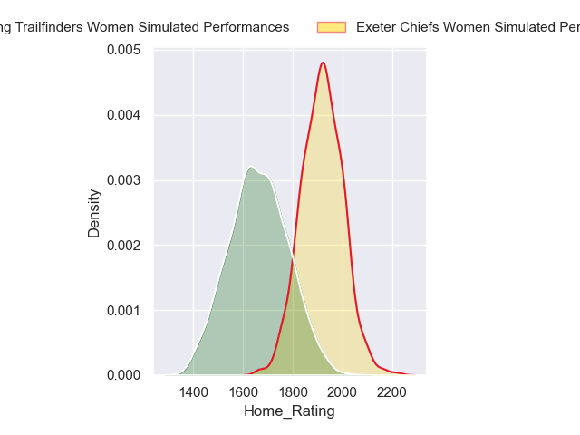
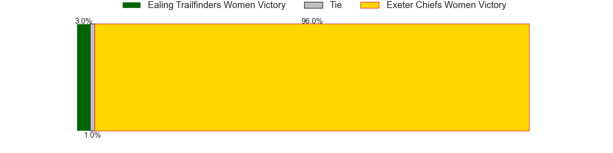
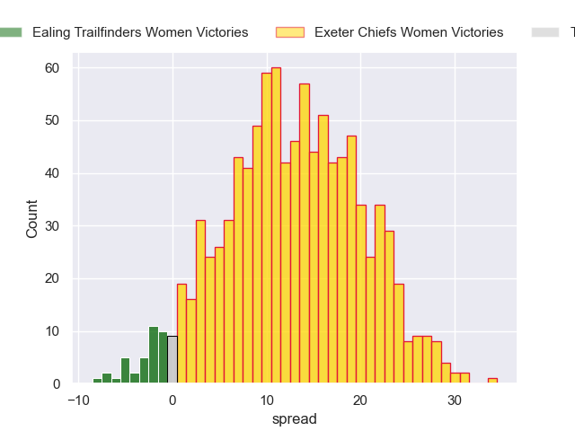

### Harlequins Women V Loughborough Lightning on 2024/10/26

Average Margin: Harlequins Women by 5.0

Average Scoreline: 29-24

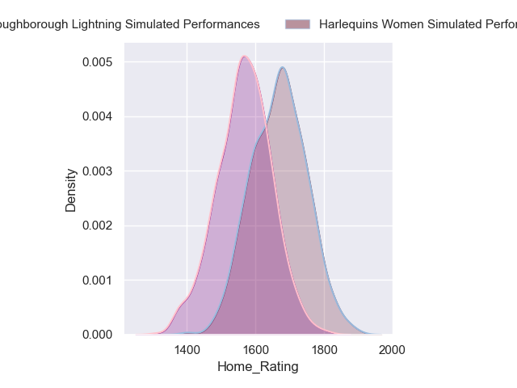
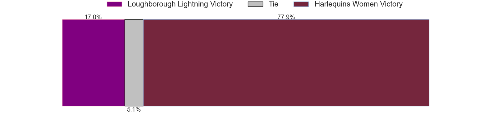
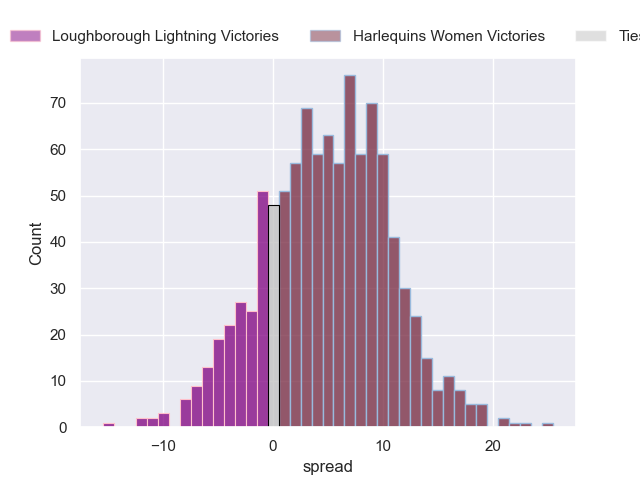

### Sale Sharks Women V Bristol Bears Women on 2024/10/26

Average Margin: Bristol Bears Women by 17.8

Average Scoreline: 32-14

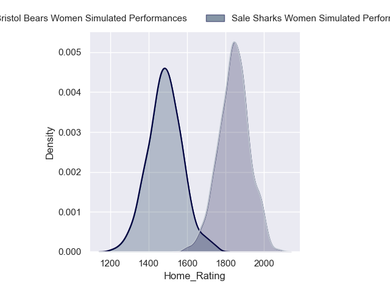

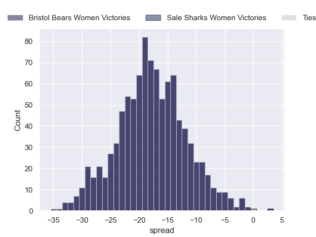

### Saracens Women V Gloucester-Hartpury Women on 2024/10/27

Average Margin: Saracens Women by 4.7

Average Scoreline: 32-27

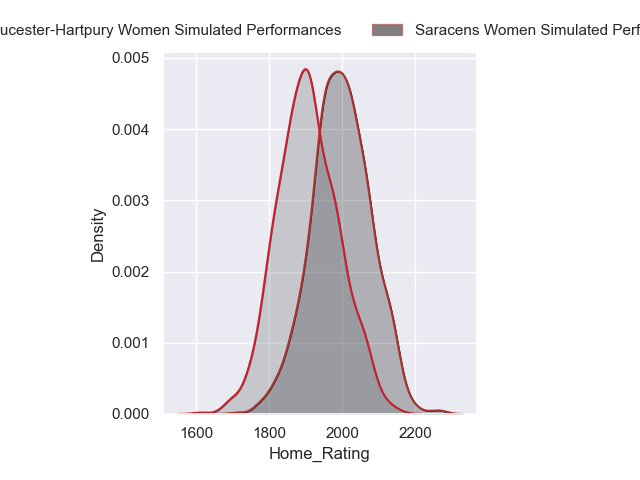
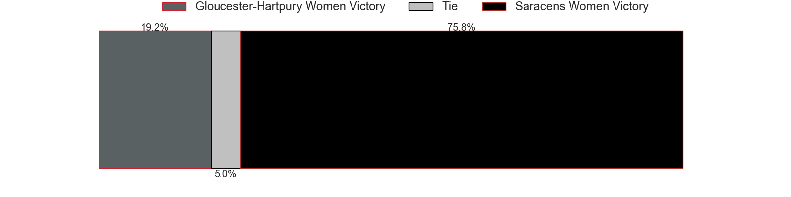
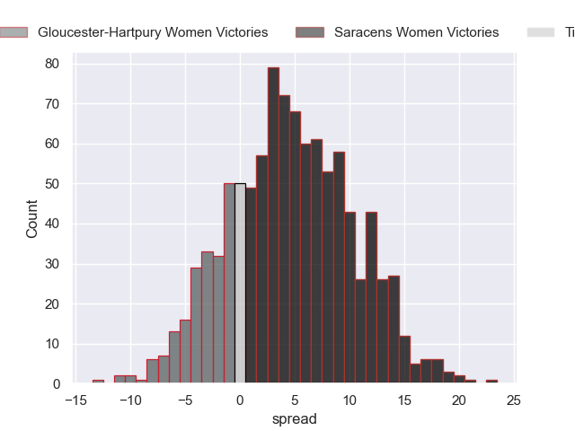

