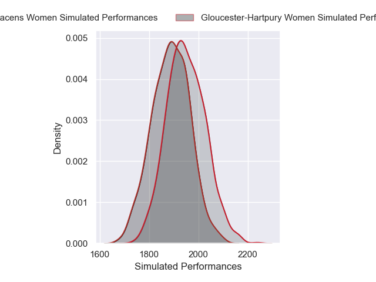
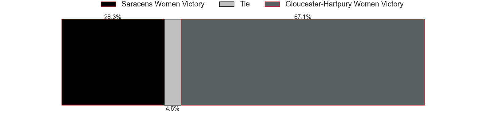
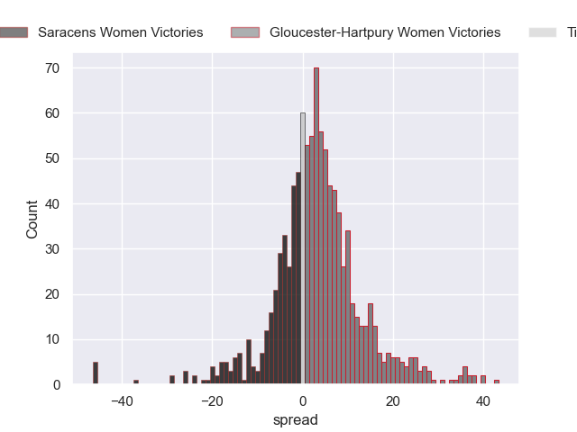
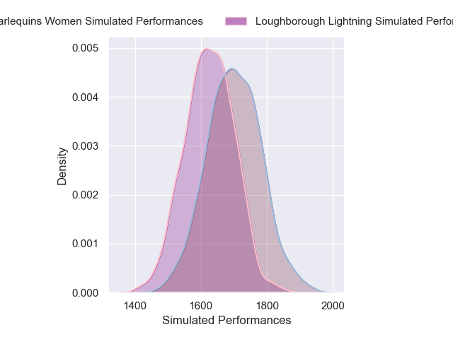
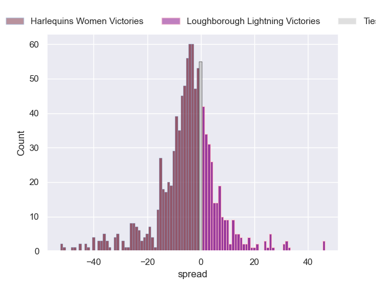
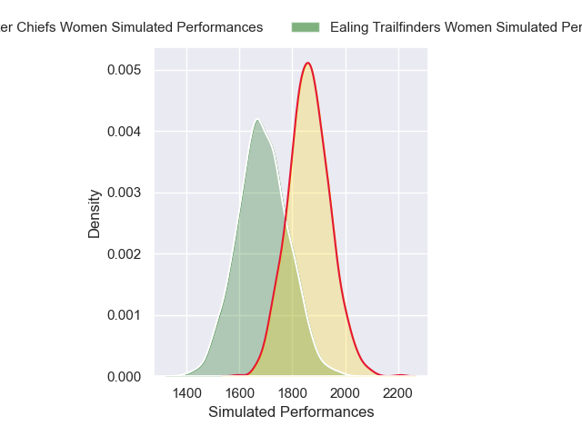
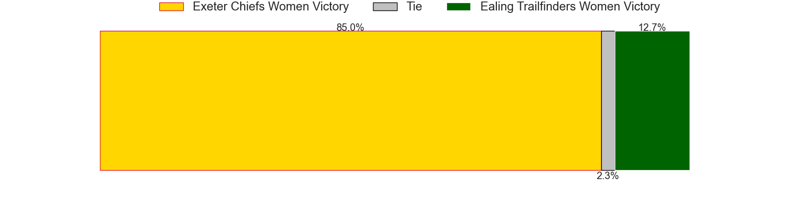
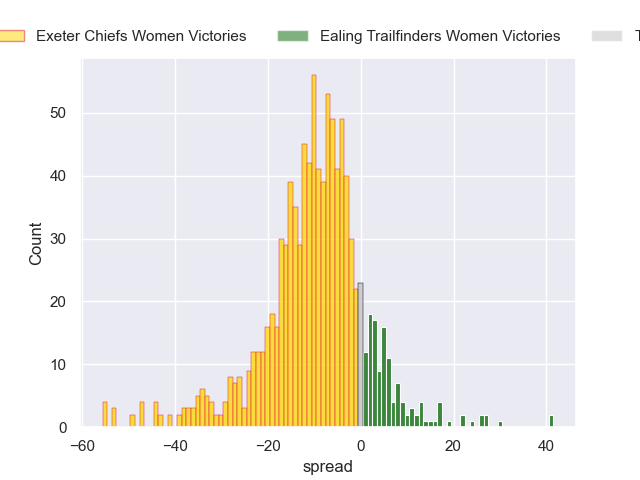

---  
title: "Allianz Premier 15s 2024 Status"  
date: 2024-12-09 6:00:00 -0500  
categories: model review projection  
layout: article  
aside:  
    toc: true  
---
# Current Team Rankings

# Standings

## Current Standings

| Club                      |   Played |   Wins |   Point Differential |   Losing Bonus Points |   Try Bonus Points |   Competition Points |
|:--------------------------|---------:|-------:|---------------------:|----------------------:|-------------------:|---------------------:|
| Exeter Chiefs Women       |        7 |      7 |                  108 |                     0 |                nan |                   28 |
| Saracens Women            |        8 |      6 |                  101 |                     1 |                nan |                   25 |
| Harlequins Women          |        8 |      6 |                   75 |                     1 |                nan |                   25 |
| Gloucester-Hartpury Women |        8 |      5 |                   65 |                     2 |                nan |                   22 |
| Bristol Bears Women       |        7 |      5 |                  121 |                     0 |                nan |                   20 |
| Ealing Trailfinders Women |        8 |      3 |                    3 |                     0 |                nan |                   12 |
| Loughborough Lightning    |        8 |      2 |                  -86 |                     1 |                nan |                    9 |
| Leicester Tigers Women    |        8 |      1 |                 -186 |                     0 |                nan |                    4 |
| Sale Sharks Women         |        8 |      0 |                 -201 |                     0 |                nan |                    0 |

## Projected Remaining Table

| Club                      |   Matches Remaining |   Wins |   Point Differential |   Losing Bonus Points |   Try Bonus Points |   Competition Points |
|:--------------------------|--------------------:|-------:|---------------------:|----------------------:|-------------------:|---------------------:|
| Bristol Bears Women       |                   1 |    1   |             29.5586  |                   0   |                0.8 |                  4.7 |
| Exeter Chiefs Women       |                   1 |    0.8 |              9.48553 |                   0.1 |                0.6 |                  4   |
| Harlequins Women          |                   1 |    0.7 |              4.38818 |                   0.2 |                0.5 |                  3.4 |
| Gloucester-Hartpury Women |                   1 |    0.7 |              3.77375 |                   0.2 |                0.2 |                  3.2 |
| Saracens Women            |                   1 |    0.3 |             -3.77375 |                   0.4 |                0.2 |                  1.8 |
| Loughborough Lightning    |                   1 |    0.3 |             -4.38818 |                   0.3 |                0.2 |                  1.7 |
| Ealing Trailfinders Women |                   1 |    0.2 |             -9.48553 |                   0.3 |                0.1 |                  1   |
| Sale Sharks Women         |                   1 |    0   |            -29.5586  |                   0   |                0.1 |                  0.2 |

## Projected Total Table

| Club                      |   Total Matches |   Wins |   Point Differential |   Losing Bonus Points |   Try Bonus Points |   Competition Points |
|:--------------------------|----------------:|-------:|---------------------:|----------------------:|-------------------:|---------------------:|
| Exeter Chiefs Women       |               8 |    7.8 |            117.486   |                   0.1 |                0.6 |                 32   |
| Harlequins Women          |               9 |    6.7 |             79.3882  |                   1.2 |                0.5 |                 28.4 |
| Saracens Women            |               9 |    6.3 |             97.2262  |                   1.4 |                0.2 |                 26.8 |
| Gloucester-Hartpury Women |               9 |    5.7 |             68.7738  |                   2.2 |                0.2 |                 25.2 |
| Bristol Bears Women       |               8 |    6   |            150.559   |                   0   |                0.8 |                 24.7 |
| Ealing Trailfinders Women |               9 |    3.2 |             -6.48553 |                   0.3 |                0.1 |                 13   |
| Loughborough Lightning    |               9 |    2.3 |            -90.3882  |                   1.3 |                0.2 |                 10.7 |
| Leicester Tigers Women    |               8 |    1   |           -186       |                   0   |                0   |                  4   |
| Sale Sharks Women         |               9 |    0   |           -230.559   |                   0   |                0.1 |                  0.2 |

# Completed Match Review

| Model | Percent Correct Predictions | Spread Error |
| ------ | ------ | ------ |
| Club Level | 80.0% | 13.5 |
| Player Level: Lineup | nan% | nan |
| Player Level: Minutes | nan% | nan |

# Future Predictions

## Week 9

### Gloucester-Hartpury Women V Saracens Women on 2024/12/14

Average Margin: Gloucester-Hartpury Women by 3.8

Average Scoreline: 29-25

### Loughborough Lightning V Harlequins Women on 2024/12/14

Average Margin: Harlequins Women by 4.4

Average Scoreline: 27-22

### Ealing Trailfinders Women V Exeter Chiefs Women on 2024/12/14

Average Margin: Exeter Chiefs Women by 9.5

Average Scoreline: 25-15

### Bristol Bears Women V Sale Sharks Women on 2024/12/15

Average Margin: Bristol Bears Women by 29.6

Average Scoreline: 40-11

