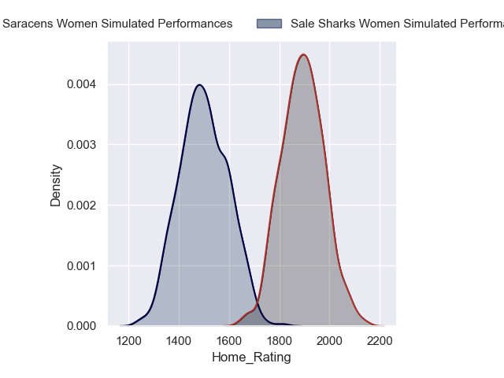
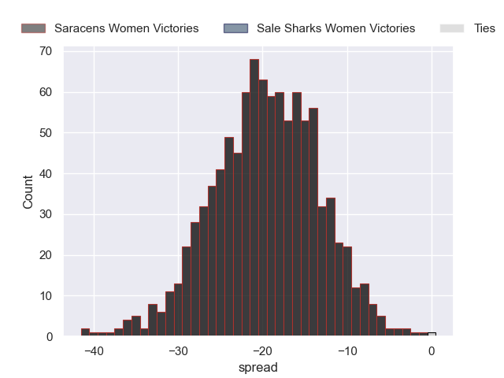
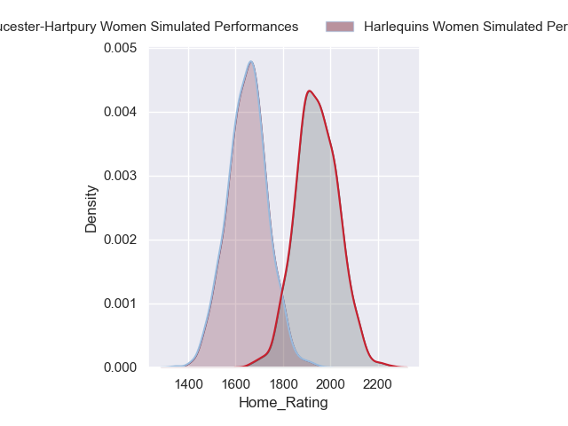
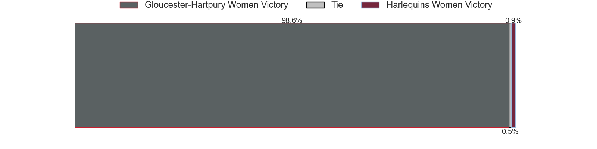
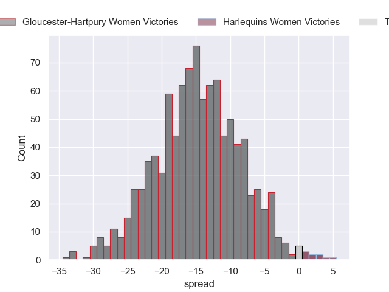
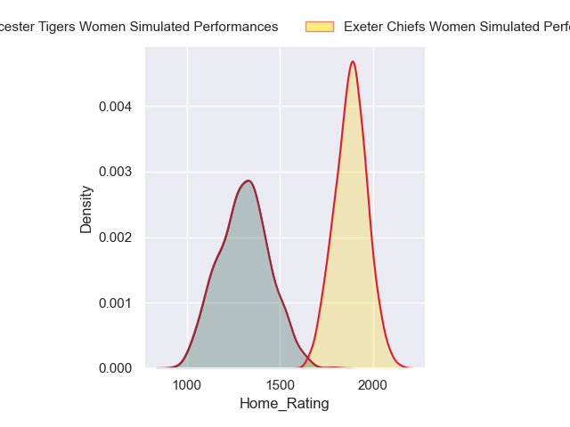
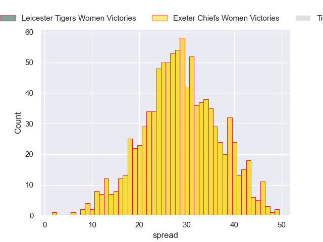
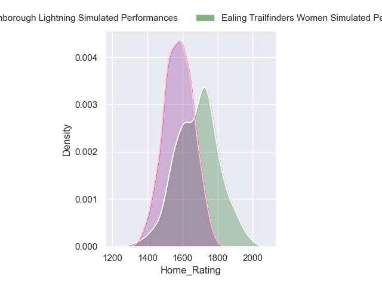
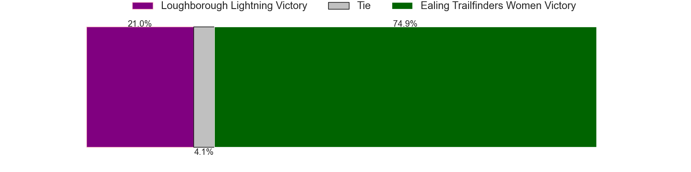
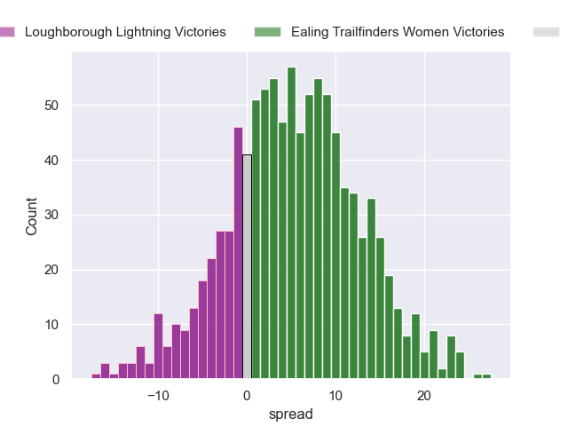

---  
title: "Allianz Premier 15s 2024 Status"  
date: 2024-10-07 6:00:00 -0500  
categories: model review projection  
layout: article  
aside:  
    toc: true  
---
# Current Team Rankings

# Standings

## Current Standings

| Club                      |   Played |   Wins |   Point Differential |   Losing Bonus Points |   Try Bonus Points |   Competition Points |
|:--------------------------|---------:|-------:|---------------------:|----------------------:|-------------------:|---------------------:|
| Gloucester-Hartpury Women |        1 |      1 |                   28 |                     0 |                nan |                    4 |
| Bristol Bears Women       |        1 |      1 |                   27 |                     0 |                nan |                    4 |
| Saracens Women            |        1 |      1 |                    9 |                     0 |                nan |                    4 |
| Exeter Chiefs Women       |        1 |      1 |                    1 |                     0 |                nan |                    4 |
| Harlequins Women          |        1 |      0 |                   -1 |                     1 |                nan |                    1 |
| Ealing Trailfinders Women |        1 |      0 |                   -9 |                     0 |                nan |                    0 |
| Loughborough Lightning    |        1 |      0 |                  -27 |                     0 |                nan |                    0 |
| Leicester Tigers Women    |        1 |      0 |                  -28 |                     0 |                nan |                    0 |

## Projected Remaining Table

| Club                      |   Matches Remaining |   Wins |   Point Differential |   Losing Bonus Points |   Try Bonus Points |   Competition Points |
|:--------------------------|--------------------:|-------:|---------------------:|----------------------:|-------------------:|---------------------:|
| Exeter Chiefs Women       |                   1 |    1   |             28.7234  |                   0   |                0.9 |                  4.9 |
| Saracens Women            |                   1 |    1   |             19.5945  |                   0   |                0.8 |                  4.8 |
| Gloucester-Hartpury Women |                   1 |    1   |             14.6681  |                   0   |                0.7 |                  4.6 |
| Ealing Trailfinders Women |                   1 |    0.8 |              5.33959 |                   0.2 |                0.2 |                  3.5 |
| Loughborough Lightning    |                   1 |    0.2 |             -5.33959 |                   0.4 |                0.3 |                  1.5 |
| Harlequins Women          |                   1 |    0   |            -14.6681  |                   0.1 |                0.1 |                  0.2 |
| Sale Sharks Women         |                   1 |    0   |            -19.5945  |                   0   |                0.1 |                  0.1 |
| Leicester Tigers Women    |                   1 |    0   |            -28.7234  |                   0   |                0   |                  0   |

## Projected Total Table

| Club                      |   Total Matches |   Wins |   Point Differential |   Losing Bonus Points |   Try Bonus Points |   Competition Points |
|:--------------------------|----------------:|-------:|---------------------:|----------------------:|-------------------:|---------------------:|
| Exeter Chiefs Women       |               2 |    2   |             29.7234  |                   0   |                0.9 |                  8.9 |
| Saracens Women            |               2 |    2   |             28.5945  |                   0   |                0.8 |                  8.8 |
| Gloucester-Hartpury Women |               2 |    2   |             42.6681  |                   0   |                0.7 |                  8.6 |
| Bristol Bears Women       |               1 |    1   |             27       |                   0   |                0   |                  4   |
| Ealing Trailfinders Women |               2 |    0.8 |             -3.66041 |                   0.2 |                0.2 |                  3.5 |
| Loughborough Lightning    |               2 |    0.2 |            -32.3396  |                   0.4 |                0.3 |                  1.5 |
| Harlequins Women          |               2 |    0   |            -15.6681  |                   1.1 |                0.1 |                  1.2 |
| Sale Sharks Women         |               1 |    0   |            -19.5945  |                   0   |                0.1 |                  0.1 |
| Leicester Tigers Women    |               2 |    0   |            -56.7234  |                   0   |                0   |                  0   |

# Completed Match Review

| Model | Percent Correct Predictions | Spread Error |
| ------ | ------ | ------ |
| Club Level | 100.0% | 11.5 |
| Player Level: Lineup | nan% | nan |
| Player Level: Minutes | nan% | nan |

# Future Predictions

## Week 2

### Sale Sharks Women V Saracens Women on 2024/10/12

Average Margin: Saracens Women by 19.6

Average Scoreline: 43-23

### Harlequins Women V Gloucester-Hartpury Women on 2024/10/12

Average Margin: Gloucester-Hartpury Women by 14.7

Average Scoreline: 31-16

### Exeter Chiefs Women V Leicester Tigers Women on 2024/10/13

Average Margin: Exeter Chiefs Women by 28.7

Average Scoreline: 47-18

### Ealing Trailfinders Women V Loughborough Lightning on 2024/10/13

Average Margin: Ealing Trailfinders Women by 5.3

Average Scoreline: 25-19

