---  
title: "Allianz Premier 15s 2024 Status"  
date: 2025-01-20 6:00:00 -0500  
categories: model review projection  
layout: article  
aside:  
    toc: true  
---
# Current Team Rankings

# Standings

## Current Standings

| Club                      |   Played |   Wins |   Point Differential |   Losing Bonus Points |   Try Bonus Points |   Competition Points |
|:--------------------------|---------:|-------:|---------------------:|----------------------:|-------------------:|---------------------:|
| Gloucester-Hartpury Women |       13 |     10 |                  152 |                     2 |                nan |                   42 |
| Harlequins Women          |       12 |     10 |                  158 |                     1 |                nan |                   41 |
| Exeter Chiefs Women       |       11 |      9 |                   92 |                     0 |                nan |                   36 |
| Saracens Women            |       12 |      8 |                  189 |                     2 |                nan |                   34 |
| Bristol Bears Women       |       12 |      8 |                  150 |                     0 |                nan |                   32 |
| Loughborough Lightning    |       13 |      4 |                  -77 |                     2 |                nan |                   18 |
| Ealing Trailfinders Women |       11 |      3 |                  -25 |                     2 |                nan |                   14 |
| Leicester Tigers Women    |       12 |      2 |                 -304 |                     0 |                nan |                    8 |
| Sale Sharks Women         |       12 |      0 |                 -335 |                     0 |                nan |                    0 |

## Projected Remaining Table

| Club                      |   Matches Remaining |   Wins |   Point Differential |   Losing Bonus Points |   Try Bonus Points |   Competition Points |
|:--------------------------|--------------------:|-------:|---------------------:|----------------------:|-------------------:|---------------------:|
| Exeter Chiefs Women       |                   1 |    0.9 |             30.0644  |                   0   |                0.9 |                  4.7 |
| Bristol Bears Women       |                   1 |    0.8 |              7.19534 |                   0.1 |                0.6 |                  3.9 |
| Loughborough Lightning    |                   1 |    0.8 |              6.52068 |                   0.2 |                0.6 |                  3.8 |
| Saracens Women            |                   1 |    0.7 |              3.13325 |                   0.2 |                0.3 |                  3.2 |
| Harlequins Women          |                   1 |    0.3 |             -3.13325 |                   0.4 |                0.1 |                  1.9 |
| Leicester Tigers Women    |                   1 |    0.2 |             -6.52068 |                   0.3 |                0.1 |                  1.4 |
| Ealing Trailfinders Women |                   1 |    0.2 |             -7.19534 |                   0.3 |                0.1 |                  1.2 |
| Sale Sharks Women         |                   1 |    0.1 |            -30.0644  |                   0   |                0.1 |                  0.3 |

## Projected Total Table

| Club                      |   Total Matches |   Wins |   Point Differential |   Losing Bonus Points |   Try Bonus Points |   Competition Points |
|:--------------------------|----------------:|-------:|---------------------:|----------------------:|-------------------:|---------------------:|
| Harlequins Women          |              13 |   10.3 |             154.867  |                   1.4 |                0.1 |                 42.9 |
| Gloucester-Hartpury Women |              13 |   10   |             152      |                   2   |                0   |                 42   |
| Exeter Chiefs Women       |              12 |    9.9 |             122.064  |                   0   |                0.9 |                 40.7 |
| Saracens Women            |              13 |    8.7 |             192.133  |                   2.2 |                0.3 |                 37.2 |
| Bristol Bears Women       |              13 |    8.8 |             157.195  |                   0.1 |                0.6 |                 35.9 |
| Loughborough Lightning    |              14 |    4.8 |             -70.4793 |                   2.2 |                0.6 |                 21.8 |
| Ealing Trailfinders Women |              12 |    3.2 |             -32.1953 |                   2.3 |                0.1 |                 15.2 |
| Leicester Tigers Women    |              13 |    2.2 |            -310.521  |                   0.3 |                0.1 |                  9.4 |
| Sale Sharks Women         |              13 |    0.1 |            -365.064  |                   0   |                0.1 |                  0.3 |

# Completed Match Review

| Model | Percent Correct Predictions | Spread Error |
| ------ | ------ | ------ |
| Club Level | 81.5% | 14.9 |
| Player Level: Lineup | nan% | nan |
| Player Level: Minutes | nan% | nan |

# Future Predictions

## Week 14

### Ealing Trailfinders Women V Bristol Bears Women on 2025/01/25

Average Margin: Bristol Bears Women by 7.2

Average Scoreline: 37-30

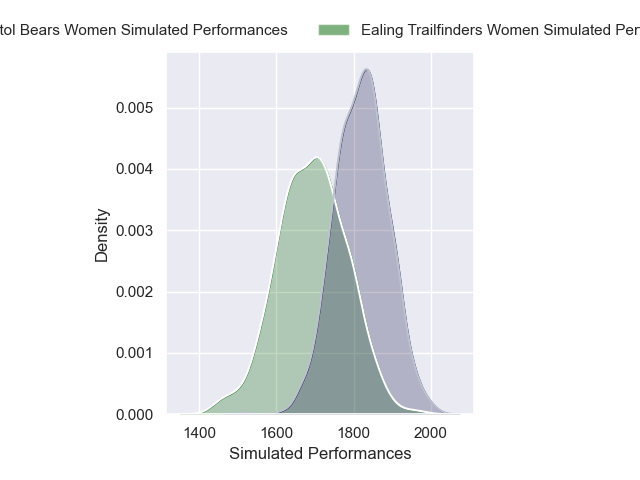
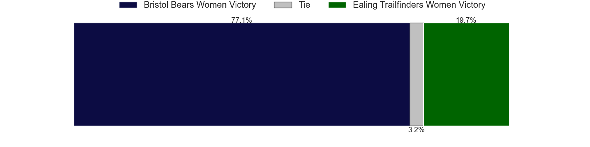
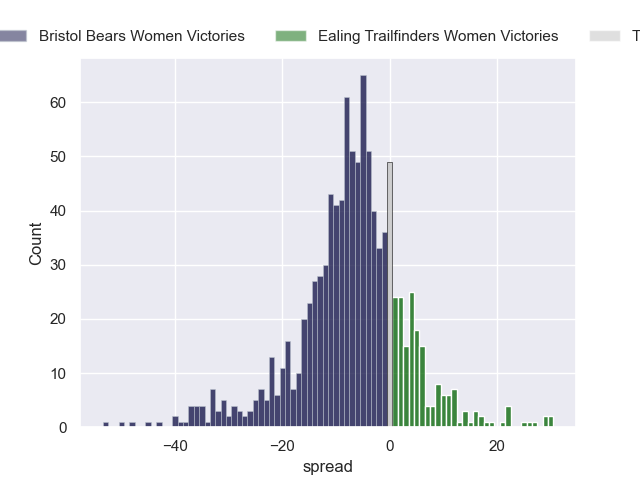

### Harlequins Women V Saracens Women on 2025/01/25

Average Margin: Saracens Women by 3.1

Average Scoreline: 32-29

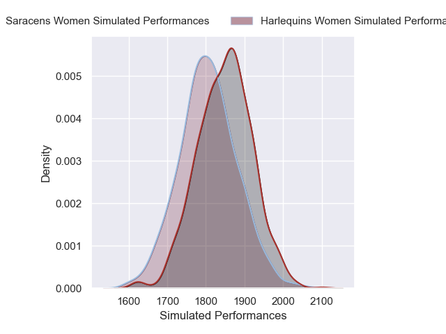

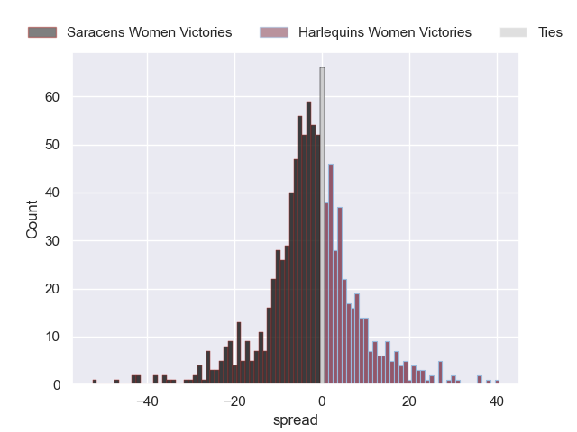

### Leicester Tigers Women V Loughborough Lightning on 2025/01/25

Average Margin: Loughborough Lightning by 6.5

Average Scoreline: 42-35

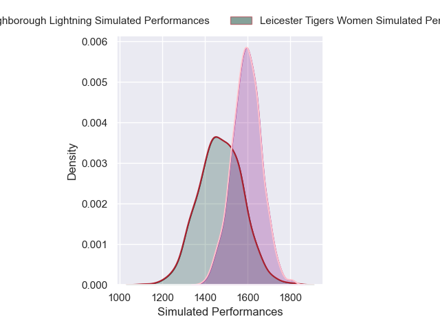
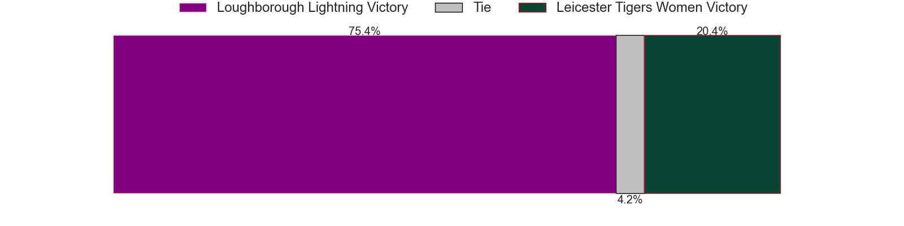
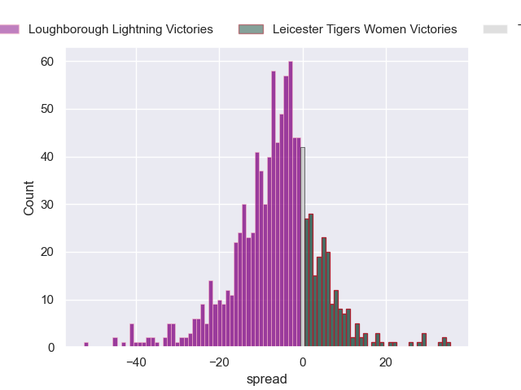

### Exeter Chiefs Women V Sale Sharks Women on 2025/01/26

Average Margin: Exeter Chiefs Women by 30.1

Average Scoreline: 44-14

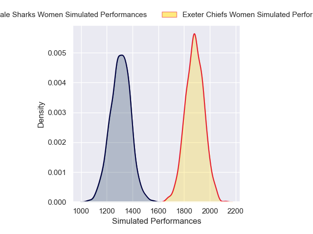
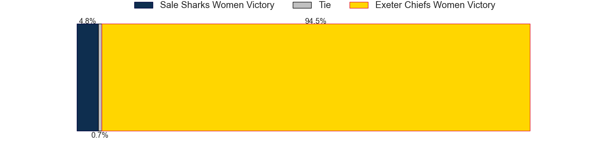
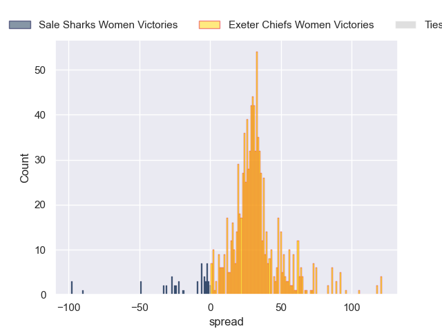

