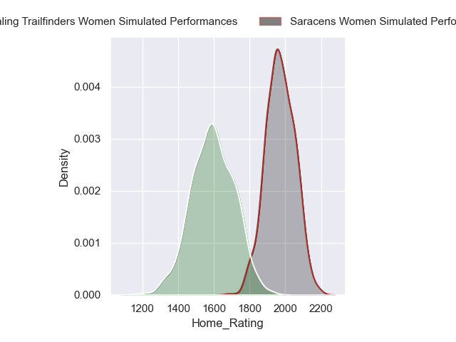
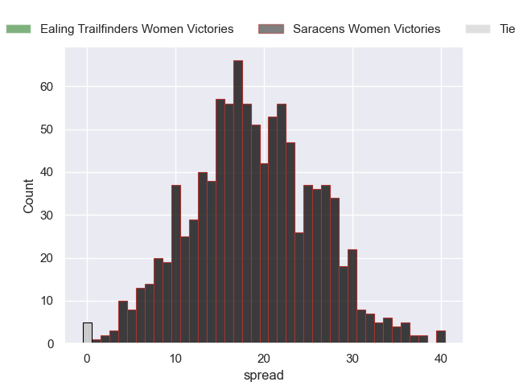
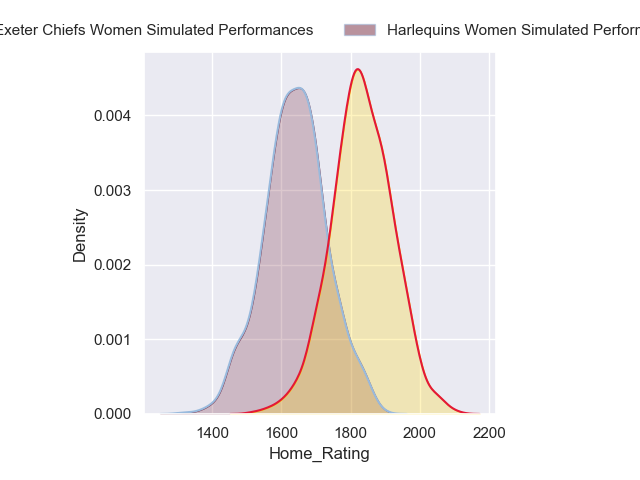
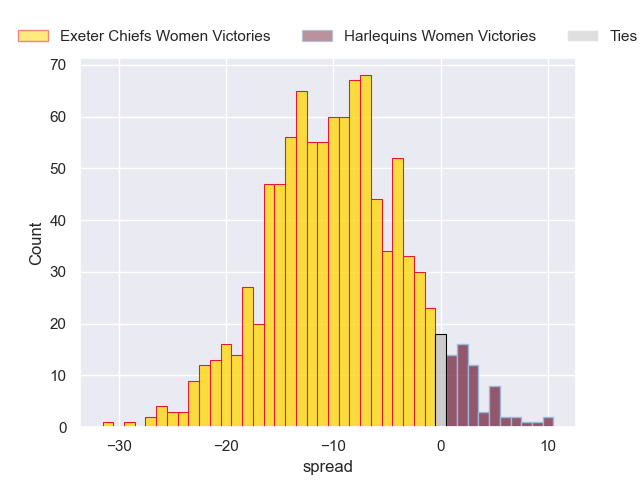
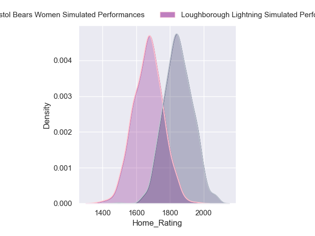
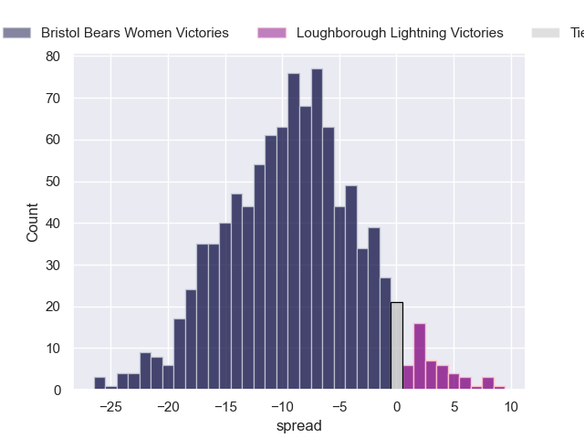
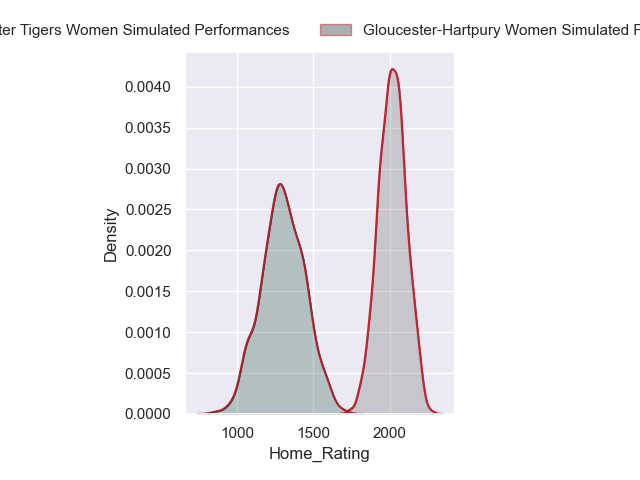
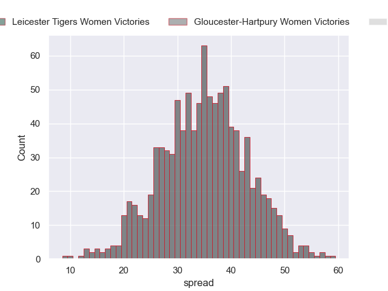

---  
title: "Allianz Premier 15s 2024 Status"  
date: 2024-09-30 6:00:00 -0500  
categories: model review projection  
layout: article  
aside:  
    toc: true  
---
# Current Team Rankings

# Standings

## Projected Total Table

| Club                      |   Total Matches |   Wins |   Point Differential |   Losing Bonus Points |   Try Bonus Points |   Competition Points |
|:--------------------------|----------------:|-------:|---------------------:|----------------------:|-------------------:|---------------------:|
| Gloucester-Hartpury Women |               1 |    1   |             34.9829  |                   0   |                0.9 |                  4.9 |
| Saracens Women            |               1 |    1   |             18.8035  |                   0   |                0.6 |                  4.6 |
| Exeter Chiefs Women       |               1 |    0.9 |              9.80215 |                   0.1 |                0.6 |                  4.4 |
| Bristol Bears Women       |               1 |    0.9 |              8.91259 |                   0.1 |                0.5 |                  4.4 |
| Loughborough Lightning    |               1 |    0.1 |             -8.91259 |                   0.3 |                0.1 |                  0.6 |
| Harlequins Women          |               1 |    0.1 |             -9.80215 |                   0.2 |                0.1 |                  0.6 |
| Ealing Trailfinders Women |               1 |    0   |            -18.8035  |                   0   |                0.1 |                  0.1 |
| Leicester Tigers Women    |               1 |    0   |            -34.9829  |                   0   |                0   |                  0   |

# Future Predictions

## Week 1

### Saracens Women V Ealing Trailfinders Women on 2024/10/05

Average Margin: Saracens Women by 18.8

Average Scoreline: 52-33

### Harlequins Women V Exeter Chiefs Women on 2024/10/05

Average Margin: Exeter Chiefs Women by 9.8

Average Scoreline: 24-14

### Loughborough Lightning V Bristol Bears Women on 2024/10/05

Average Margin: Bristol Bears Women by 8.9

Average Scoreline: 26-17

### Gloucester-Hartpury Women V Leicester Tigers Women on 2024/10/06

Average Margin: Gloucester-Hartpury Women by 35.0

Average Scoreline: 57-22

