---  
title: "Allianz Premier 15s 2024 Status"  
date: 2024-10-14 6:00:00 -0500  
categories: model review projection  
layout: article  
aside:  
    toc: true  
---
# Current Team Rankings

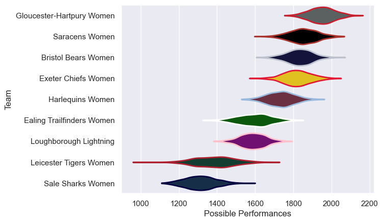
# Standings

## Current Standings

| Club                      |   Played |   Wins |   Point Differential |   Losing Bonus Points |   Try Bonus Points |   Competition Points |
|:--------------------------|---------:|-------:|---------------------:|----------------------:|-------------------:|---------------------:|
| Saracens Women            |        2 |      2 |                   47 |                     0 |                nan |                    8 |
| Exeter Chiefs Women       |        2 |      2 |                   43 |                     0 |                nan |                    8 |
| Gloucester-Hartpury Women |        2 |      2 |                   37 |                     0 |                nan |                    8 |
| Bristol Bears Women       |        1 |      1 |                   27 |                     0 |                nan |                    4 |
| Ealing Trailfinders Women |        2 |      1 |                   22 |                     0 |                nan |                    4 |
| Harlequins Women          |        2 |      0 |                  -10 |                     1 |                nan |                    1 |
| Sale Sharks Women         |        1 |      0 |                  -38 |                     0 |                nan |                    0 |
| Loughborough Lightning    |        2 |      0 |                  -58 |                     0 |                nan |                    0 |
| Leicester Tigers Women    |        2 |      0 |                  -70 |                     0 |                nan |                    0 |

## Projected Remaining Table

| Club                      |   Matches Remaining |   Wins |   Point Differential |   Losing Bonus Points |   Try Bonus Points |   Competition Points |
|:--------------------------|--------------------:|-------:|---------------------:|----------------------:|-------------------:|---------------------:|
| Harlequins Women          |                   1 |    0.9 |             11.0253  |                   0.1 |                0.7 |                  4.4 |
| Loughborough Lightning    |                   1 |    1   |              9.74719 |                   0   |                0.4 |                  4.3 |
| Gloucester-Hartpury Women |                   1 |    0.9 |              9.44958 |                   0.1 |                0.3 |                  4.1 |
| Bristol Bears Women       |                   1 |    0.6 |              1.49855 |                   0.3 |                0.2 |                  2.9 |
| Saracens Women            |                   1 |    0.4 |             -1.49855 |                   0.4 |                0.2 |                  2.2 |
| Exeter Chiefs Women       |                   1 |    0.1 |             -9.44958 |                   0.3 |                0.1 |                  0.6 |
| Sale Sharks Women         |                   1 |    0   |             -9.74719 |                   0.3 |                0.2 |                  0.6 |
| Leicester Tigers Women    |                   1 |    0.1 |            -11.0253  |                   0.2 |                0.1 |                  0.6 |

## Projected Total Table

| Club                      |   Total Matches |   Wins |   Point Differential |   Losing Bonus Points |   Try Bonus Points |   Competition Points |
|:--------------------------|----------------:|-------:|---------------------:|----------------------:|-------------------:|---------------------:|
| Gloucester-Hartpury Women |               3 |    2.9 |             46.4496  |                   0.1 |                0.3 |                 12.1 |
| Saracens Women            |               3 |    2.4 |             45.5014  |                   0.4 |                0.2 |                 10.2 |
| Exeter Chiefs Women       |               3 |    2.1 |             33.5504  |                   0.3 |                0.1 |                  8.6 |
| Bristol Bears Women       |               2 |    1.6 |             28.4986  |                   0.3 |                0.2 |                  6.9 |
| Harlequins Women          |               3 |    0.9 |              1.02529 |                   1.1 |                0.7 |                  5.4 |
| Loughborough Lightning    |               3 |    1   |            -48.2528  |                   0   |                0.4 |                  4.3 |
| Ealing Trailfinders Women |               2 |    1   |             22       |                   0   |                0   |                  4   |
| Sale Sharks Women         |               2 |    0   |            -47.7472  |                   0.3 |                0.2 |                  0.6 |
| Leicester Tigers Women    |               3 |    0.1 |            -81.0253  |                   0.2 |                0.1 |                  0.6 |

# Completed Match Review

| Model | Percent Correct Predictions | Spread Error |
| ------ | ------ | ------ |
| Club Level | 100.0% | 13.6 |
| Player Level: Lineup | nan% | nan |
| Player Level: Minutes | nan% | nan |

# Future Predictions

## Week 3

### Bristol Bears Women V Saracens Women on 2024/10/19

Average Margin: Bristol Bears Women by 1.5

Average Scoreline: 26-25

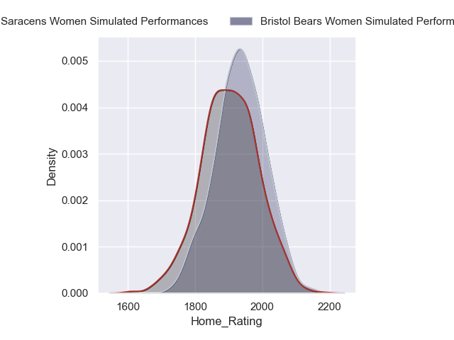

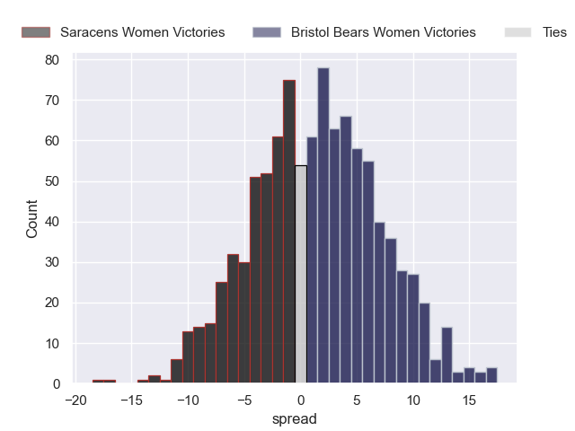

### Gloucester-Hartpury Women V Exeter Chiefs Women on 2024/10/19

Average Margin: Gloucester-Hartpury Women by 9.4

Average Scoreline: 30-21

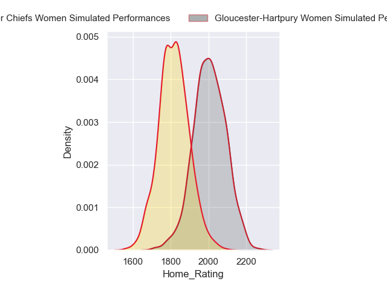
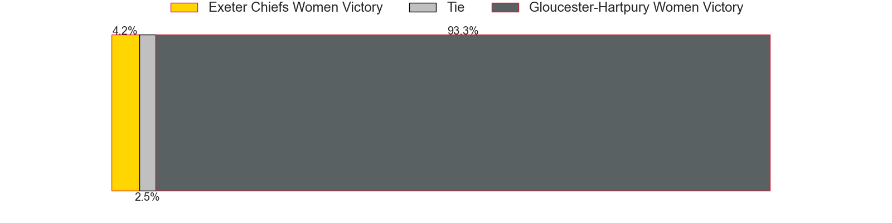
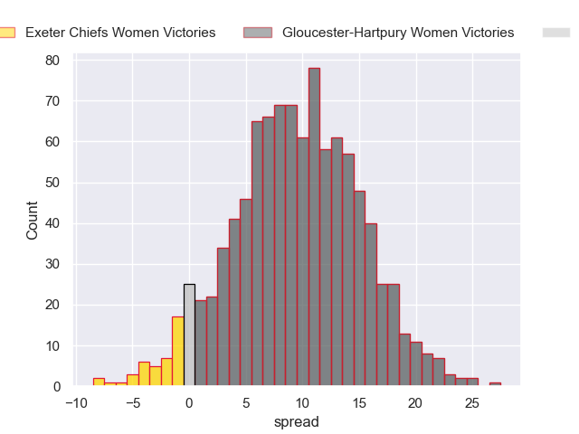

### Loughborough Lightning V Sale Sharks Women on 2024/10/19

Average Margin: Loughborough Lightning by 9.7

Average Scoreline: 28-18

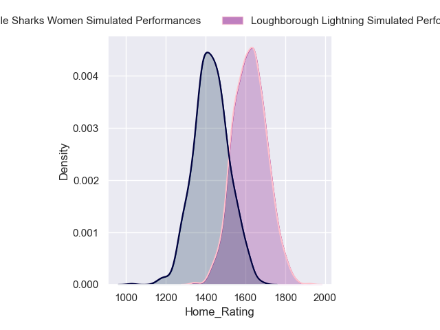
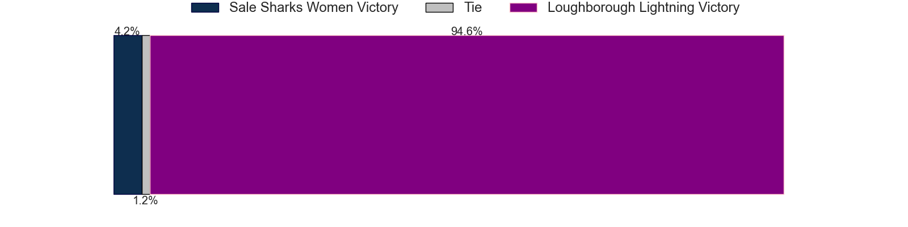
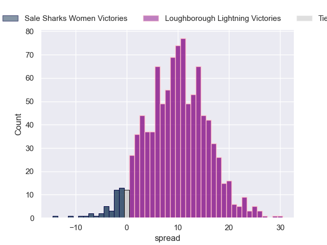

### Leicester Tigers Women V Harlequins Women on 2024/10/20

Average Margin: Harlequins Women by 11.0

Average Scoreline: 34-23

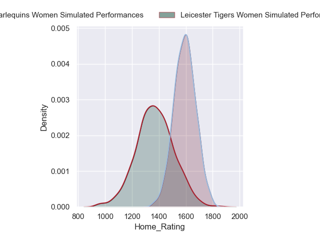

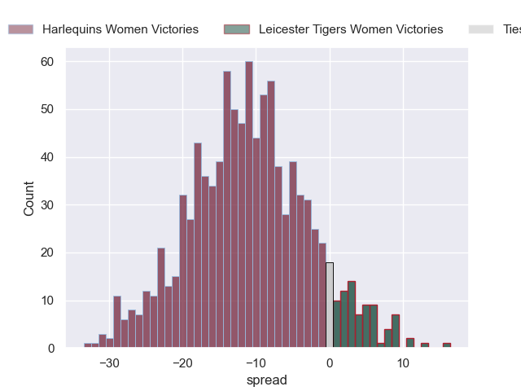

