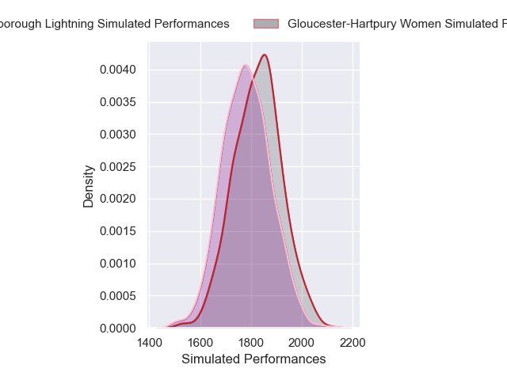
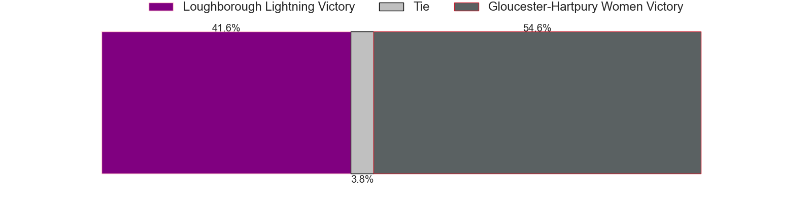
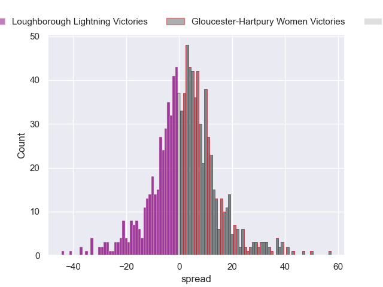
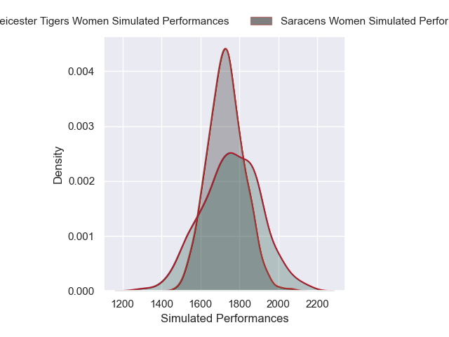
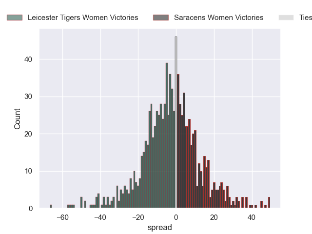
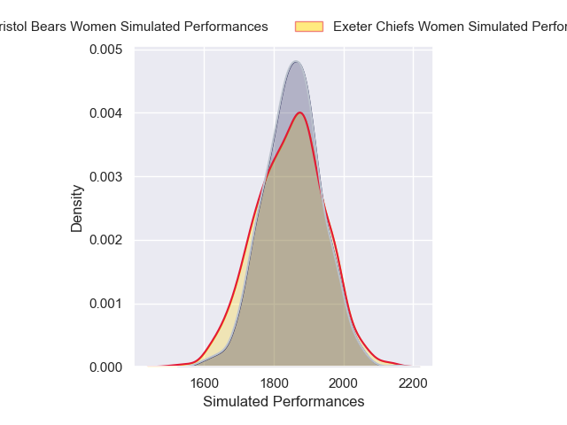
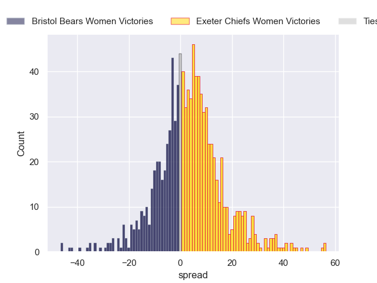
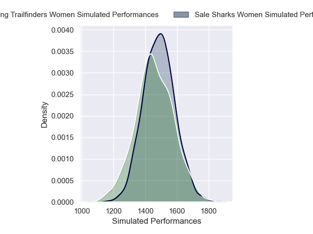
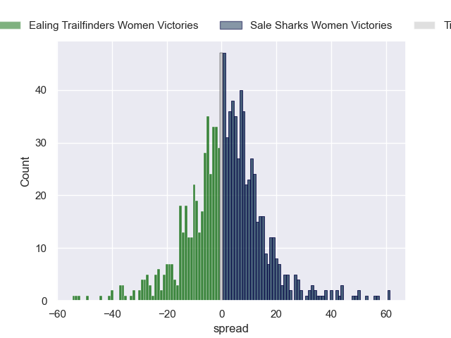

---  
title: "Allianz Premier 15s 2024 Status"  
date: 2025-01-09 6:00:00 -0500  
categories: model review projection  
layout: article  
aside:  
    toc: true  
---
# Current Team Rankings

# Standings

## Current Standings

| Club                      |   Played |   Wins |   Point Differential |   Losing Bonus Points |   Try Bonus Points |   Competition Points |
|:--------------------------|---------:|-------:|---------------------:|----------------------:|-------------------:|---------------------:|
| Harlequins Women          |       11 |      9 |                  125 |                     1 |                nan |                   37 |
| Gloucester-Hartpury Women |       11 |      8 |                  133 |                     2 |                nan |                   34 |
| Exeter Chiefs Women       |        9 |      8 |                   98 |                     0 |                nan |                   32 |
| Saracens Women            |       11 |      7 |                   89 |                     2 |                nan |                   30 |
| Bristol Bears Women       |       10 |      6 |                  126 |                     0 |                nan |                   24 |
| Loughborough Lightning    |       11 |      4 |                  -56 |                     1 |                nan |                   17 |
| Ealing Trailfinders Women |       10 |      3 |                  -23 |                     1 |                nan |                   13 |
| Leicester Tigers Women    |       10 |      2 |                 -190 |                     0 |                nan |                    8 |
| Sale Sharks Women         |       11 |      0 |                 -302 |                     0 |                nan |                    0 |

## Projected Remaining Table

| Club                      |   Matches Remaining |   Wins |   Point Differential |   Losing Bonus Points |   Try Bonus Points |   Competition Points |
|:--------------------------|--------------------:|-------:|---------------------:|----------------------:|-------------------:|---------------------:|
| Exeter Chiefs Women       |                   1 |    0.6 |             3.57971  |                   0.2 |                0.2 |                  2.9 |
| Gloucester-Hartpury Women |                   1 |    0.6 |             2.26103  |                   0.2 |                0.3 |                  2.8 |
| Leicester Tigers Women    |                   1 |    0.6 |             1.61083  |                   0.2 |                0.3 |                  2.8 |
| Ealing Trailfinders Women |                   1 |    0.5 |             0.739829 |                   0.2 |                0.4 |                  2.7 |
| Sale Sharks Women         |                   1 |    0.5 |            -0.739829 |                   0.2 |                0.2 |                  2.4 |
| Loughborough Lightning    |                   1 |    0.4 |            -2.26103  |                   0.2 |                0.3 |                  2.3 |
| Saracens Women            |                   1 |    0.4 |            -1.61083  |                   0.3 |                0.2 |                  2.2 |
| Bristol Bears Women       |                   1 |    0.4 |            -3.57971  |                   0.3 |                0.3 |                  2   |

## Projected Total Table

| Club                      |   Total Matches |   Wins |   Point Differential |   Losing Bonus Points |   Try Bonus Points |   Competition Points |
|:--------------------------|----------------:|-------:|---------------------:|----------------------:|-------------------:|---------------------:|
| Harlequins Women          |              11 |    9   |             125      |                   1   |                0   |                 37   |
| Gloucester-Hartpury Women |              12 |    8.6 |             135.261  |                   2.2 |                0.3 |                 36.8 |
| Exeter Chiefs Women       |              10 |    8.6 |             101.58   |                   0.2 |                0.2 |                 34.9 |
| Saracens Women            |              12 |    7.4 |              87.3892 |                   2.3 |                0.2 |                 32.2 |
| Bristol Bears Women       |              11 |    6.4 |             122.42   |                   0.3 |                0.3 |                 26   |
| Loughborough Lightning    |              12 |    4.4 |             -58.261  |                   1.2 |                0.3 |                 19.3 |
| Ealing Trailfinders Women |              11 |    3.5 |             -22.2602 |                   1.2 |                0.4 |                 15.7 |
| Leicester Tigers Women    |              11 |    2.6 |            -188.389  |                   0.2 |                0.3 |                 10.8 |
| Sale Sharks Women         |              12 |    0.5 |            -302.74   |                   0.2 |                0.2 |                  2.4 |

# Completed Match Review

| Model | Percent Correct Predictions | Spread Error |
| ------ | ------ | ------ |
| Club Level | 80.9% | 14.0 |
| Player Level: Lineup | nan% | nan |
| Player Level: Minutes | nan% | nan |

# Future Predictions

## Week 12

### Gloucester-Hartpury Women V Loughborough Lightning on 2025/01/11

Average Margin: Gloucester-Hartpury Women by 2.3

Average Scoreline: 31-29

### Saracens Women V Leicester Tigers Women on 2025/01/11

Average Margin: Leicester Tigers Women by 1.6

Average Scoreline: 33-31

### Exeter Chiefs Women V Bristol Bears Women on 2025/01/12

Average Margin: Exeter Chiefs Women by 3.6

Average Scoreline: 30-26

### Sale Sharks Women V Ealing Trailfinders Women on 2025/01/12

Average Margin: Ealing Trailfinders Women by 0.7

Average Scoreline: 24-23

