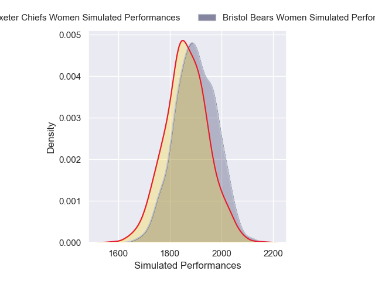
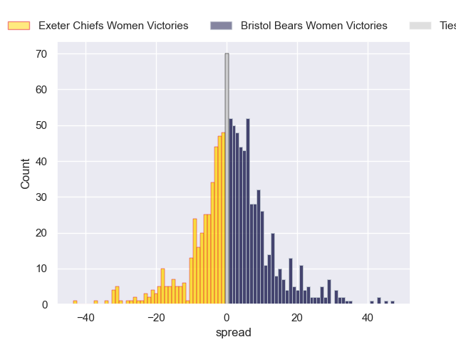
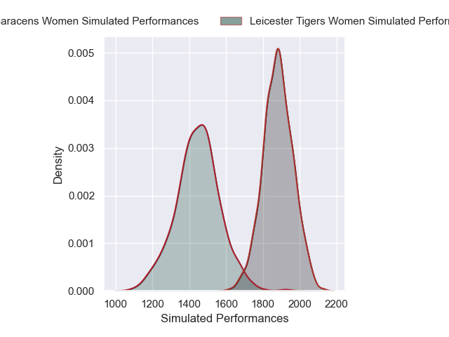
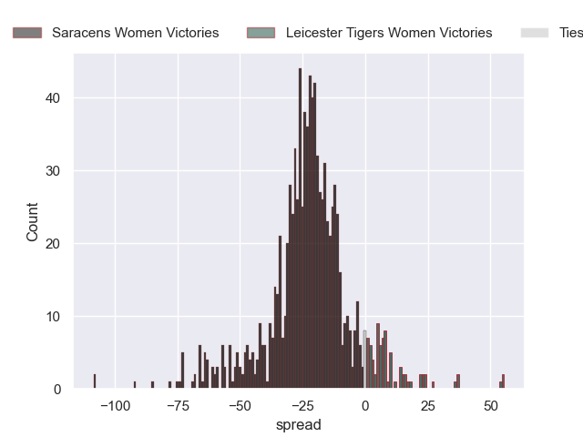
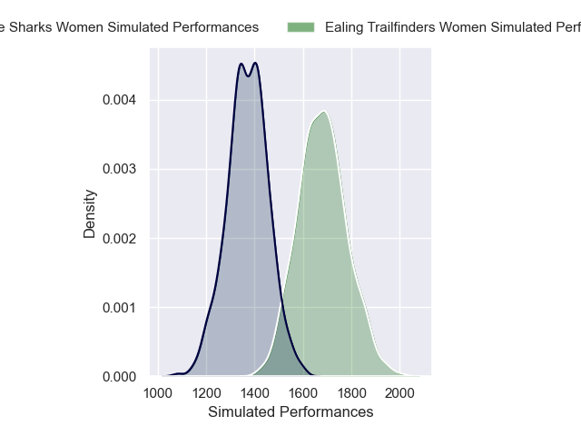
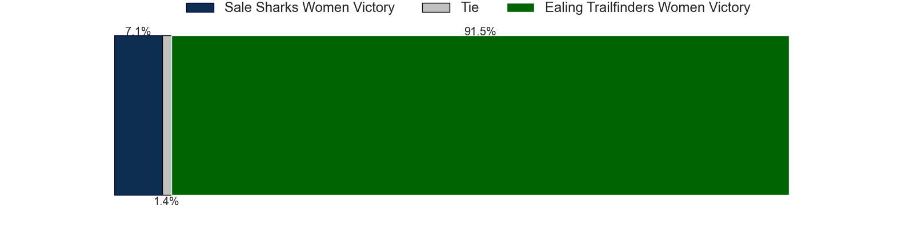
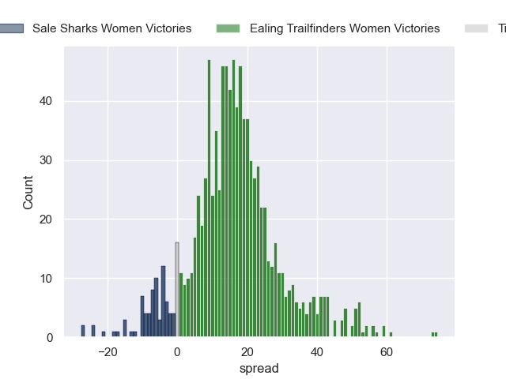
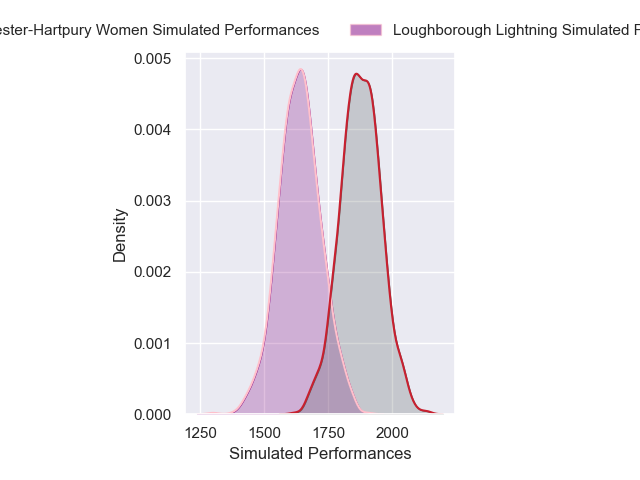
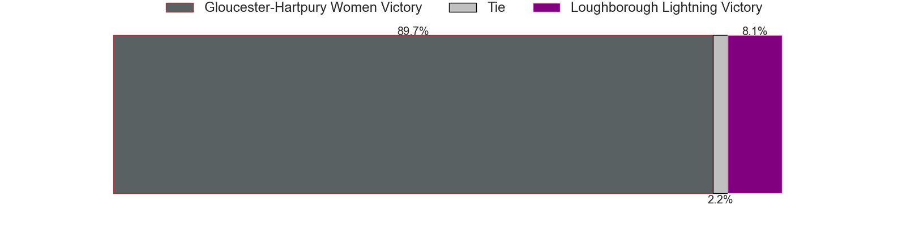
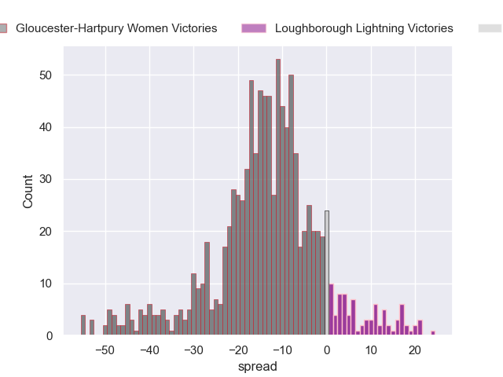

---  
title: "Allianz Premier 15s 2024 Status"  
date: 2024-12-05 6:00:00 -0500  
categories: model review projection  
layout: article  
aside:  
    toc: true  
---
# Current Team Rankings

# Standings

## Current Standings

| Club                      |   Played |   Wins |   Point Differential |   Losing Bonus Points |   Try Bonus Points |   Competition Points |
|:--------------------------|---------:|-------:|---------------------:|----------------------:|-------------------:|---------------------:|
| Exeter Chiefs Women       |        7 |      7 |                  108 |                     0 |                nan |                   28 |
| Harlequins Women          |        8 |      6 |                   75 |                     1 |                nan |                   25 |
| Saracens Women            |        7 |      5 |                   68 |                     1 |                nan |                   21 |
| Bristol Bears Women       |        7 |      5 |                  121 |                     0 |                nan |                   20 |
| Gloucester-Hartpury Women |        7 |      4 |                   41 |                     2 |                nan |                   18 |
| Loughborough Lightning    |        7 |      2 |                  -62 |                     1 |                nan |                    9 |
| Ealing Trailfinders Women |        7 |      2 |                  -23 |                     0 |                nan |                    8 |
| Leicester Tigers Women    |        7 |      1 |                 -153 |                     0 |                nan |                    4 |
| Sale Sharks Women         |        7 |      0 |                 -175 |                     0 |                nan |                    0 |

## Projected Remaining Table

| Club                      |   Matches Remaining |   Wins |   Point Differential |   Losing Bonus Points |   Try Bonus Points |   Competition Points |
|:--------------------------|--------------------:|-------:|---------------------:|----------------------:|-------------------:|---------------------:|
| Saracens Women            |                   1 |    0.9 |             23.3661  |                   0   |                0.8 |                  4.6 |
| Ealing Trailfinders Women |                   1 |    0.9 |             16.6547  |                   0   |                0.7 |                  4.4 |
| Gloucester-Hartpury Women |                   1 |    0.9 |             13.3338  |                   0.1 |                0.7 |                  4.3 |
| Bristol Bears Women       |                   1 |    0.6 |              2.42545 |                   0.2 |                0.1 |                  2.8 |
| Exeter Chiefs Women       |                   1 |    0.4 |             -2.42545 |                   0.3 |                0.2 |                  2.1 |
| Loughborough Lightning    |                   1 |    0.1 |            -13.3338  |                   0.2 |                0.1 |                  0.6 |
| Sale Sharks Women         |                   1 |    0.1 |            -16.6547  |                   0.1 |                0.2 |                  0.6 |
| Leicester Tigers Women    |                   1 |    0.1 |            -23.3661  |                   0.1 |                0   |                  0.4 |

## Projected Total Table

| Club                      |   Total Matches |   Wins |   Point Differential |   Losing Bonus Points |   Try Bonus Points |   Competition Points |
|:--------------------------|----------------:|-------:|---------------------:|----------------------:|-------------------:|---------------------:|
| Exeter Chiefs Women       |               8 |    7.4 |            105.575   |                   0.3 |                0.2 |                 30.1 |
| Saracens Women            |               8 |    5.9 |             91.3661  |                   1   |                0.8 |                 25.6 |
| Harlequins Women          |               8 |    6   |             75       |                   1   |                0   |                 25   |
| Bristol Bears Women       |               8 |    5.6 |            123.425   |                   0.2 |                0.1 |                 22.8 |
| Gloucester-Hartpury Women |               8 |    4.9 |             54.3338  |                   2.1 |                0.7 |                 22.3 |
| Ealing Trailfinders Women |               8 |    2.9 |             -6.34529 |                   0   |                0.7 |                 12.4 |
| Loughborough Lightning    |               8 |    2.1 |            -75.3338  |                   1.2 |                0.1 |                  9.6 |
| Leicester Tigers Women    |               8 |    1.1 |           -176.366   |                   0.1 |                0   |                  4.4 |
| Sale Sharks Women         |               8 |    0.1 |           -191.655   |                   0.1 |                0.2 |                  0.6 |

# Completed Match Review

| Model | Percent Correct Predictions | Spread Error |
| ------ | ------ | ------ |
| Club Level | 78.1% | 13.8 |
| Player Level: Lineup | nan% | nan |
| Player Level: Minutes | nan% | nan |

# Future Predictions

## Week 9

### Bristol Bears Women V Exeter Chiefs Women on 2024/12/07

Average Margin: Bristol Bears Women by 2.4

Average Scoreline: 21-19

### Leicester Tigers Women V Saracens Women on 2024/12/07

Average Margin: Saracens Women by 23.4

Average Scoreline: 34-11

### Ealing Trailfinders Women V Sale Sharks Women on 2024/12/07

Average Margin: Ealing Trailfinders Women by 16.7

Average Scoreline: 35-18

### Loughborough Lightning V Gloucester-Hartpury Women on 2024/12/08

Average Margin: Gloucester-Hartpury Women by 13.3

Average Scoreline: 26-12

