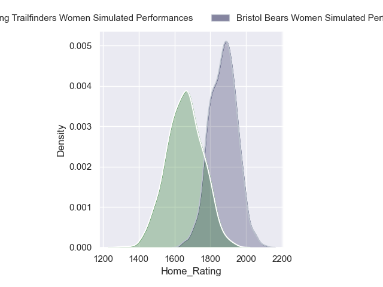
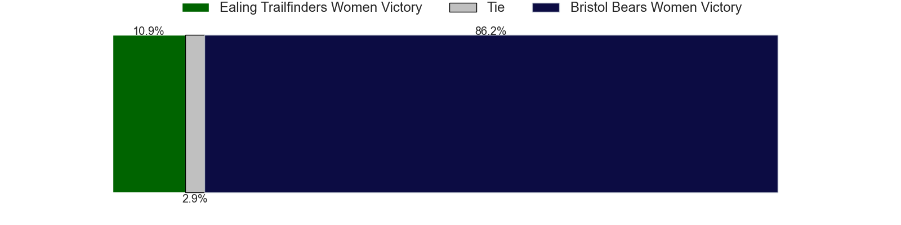
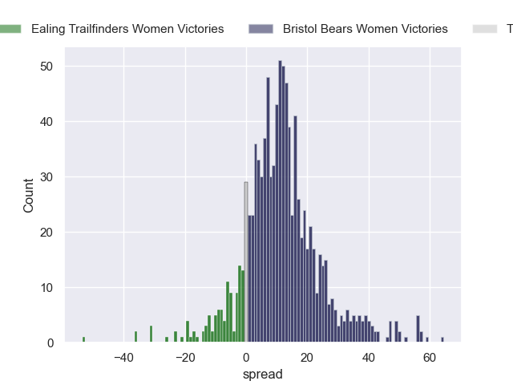
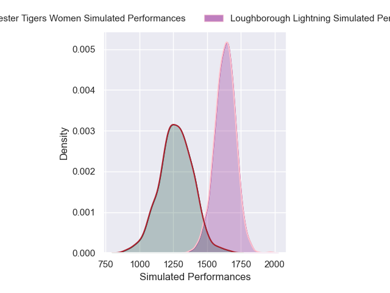
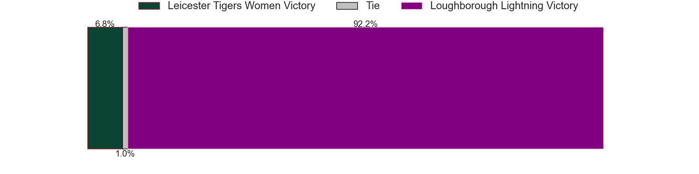
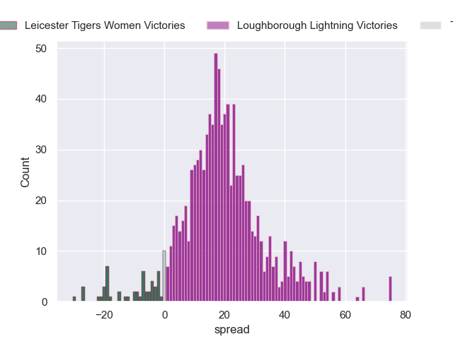
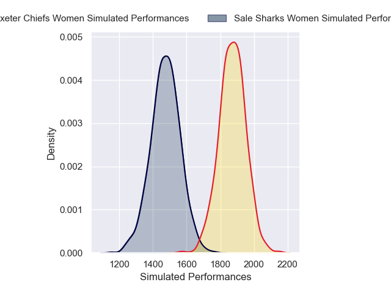
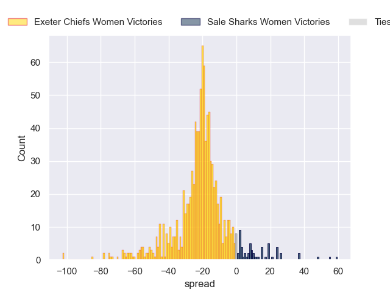
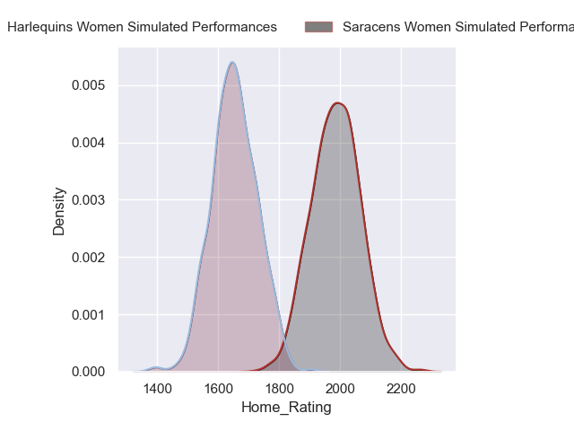
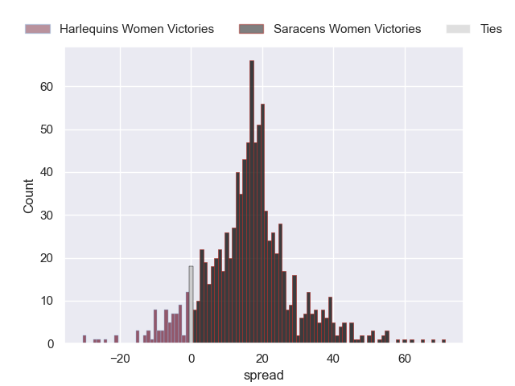

---  
title: "Allianz Premier 15s 2024 Status"  
date: 2024-11-21 6:00:00 -0500  
categories: model review projection  
layout: article  
aside:  
    toc: true  
---
# Current Team Rankings

# Standings

## Current Standings

| Club                      |   Played |   Wins |   Point Differential |   Losing Bonus Points |   Try Bonus Points |   Competition Points |
|:--------------------------|---------:|-------:|---------------------:|----------------------:|-------------------:|---------------------:|
| Exeter Chiefs Women       |        6 |      6 |                   98 |                     0 |                nan |                   24 |
| Harlequins Women          |        6 |      4 |                   53 |                     1 |                nan |                   17 |
| Gloucester-Hartpury Women |        6 |      4 |                   46 |                     1 |                nan |                   17 |
| Saracens Women            |        5 |      4 |                   58 |                     0 |                nan |                   16 |
| Bristol Bears Women       |        5 |      3 |                   97 |                     0 |                nan |                   12 |
| Ealing Trailfinders Women |        5 |      2 |                   17 |                     0 |                nan |                    8 |
| Loughborough Lightning    |        5 |      1 |                  -63 |                     1 |                nan |                    5 |
| Sale Sharks Women         |        5 |      0 |                 -148 |                     0 |                nan |                    0 |
| Leicester Tigers Women    |        5 |      0 |                 -158 |                     0 |                nan |                    0 |

## Projected Remaining Table

| Club                      |   Matches Remaining |   Wins |   Point Differential |   Losing Bonus Points |   Try Bonus Points |   Competition Points |
|:--------------------------|--------------------:|-------:|---------------------:|----------------------:|-------------------:|---------------------:|
| Exeter Chiefs Women       |                   1 |    0.9 |              20.9102 |                   0   |                0.8 |                  4.6 |
| Loughborough Lightning    |                   1 |    0.9 |              18.4313 |                   0   |                0.7 |                  4.4 |
| Saracens Women            |                   1 |    0.9 |              16.6027 |                   0.1 |                0.6 |                  4.3 |
| Bristol Bears Women       |                   1 |    0.9 |              10.9184 |                   0.1 |                0.4 |                  4   |
| Ealing Trailfinders Women |                   1 |    0.1 |             -10.9184 |                   0.2 |                0.1 |                  0.9 |
| Harlequins Women          |                   1 |    0.1 |             -16.6027 |                   0.1 |                0.1 |                  0.6 |
| Leicester Tigers Women    |                   1 |    0.1 |             -18.4313 |                   0.1 |                0.1 |                  0.5 |
| Sale Sharks Women         |                   1 |    0.1 |             -20.9102 |                   0.1 |                0.1 |                  0.4 |

## Projected Total Table

| Club                      |   Total Matches |   Wins |   Point Differential |   Losing Bonus Points |   Try Bonus Points |   Competition Points |
|:--------------------------|----------------:|-------:|---------------------:|----------------------:|-------------------:|---------------------:|
| Exeter Chiefs Women       |               7 |    6.9 |            118.91    |                   0   |                0.8 |                 28.6 |
| Saracens Women            |               6 |    4.9 |             74.6027  |                   0.1 |                0.6 |                 20.3 |
| Harlequins Women          |               7 |    4.1 |             36.3973  |                   1.1 |                0.1 |                 17.6 |
| Gloucester-Hartpury Women |               6 |    4   |             46       |                   1   |                0   |                 17   |
| Bristol Bears Women       |               6 |    3.9 |            107.918   |                   0.1 |                0.4 |                 16   |
| Loughborough Lightning    |               6 |    1.9 |            -44.5687  |                   1   |                0.7 |                  9.4 |
| Ealing Trailfinders Women |               6 |    2.1 |              6.08163 |                   0.2 |                0.1 |                  8.9 |
| Leicester Tigers Women    |               6 |    0.1 |           -176.431   |                   0.1 |                0.1 |                  0.5 |
| Sale Sharks Women         |               6 |    0.1 |           -168.91    |                   0.1 |                0.1 |                  0.4 |

# Completed Match Review

| Model | Percent Correct Predictions | Spread Error |
| ------ | ------ | ------ |
| Club Level | 83.3% | 13.6 |
| Player Level: Lineup | nan% | nan |
| Player Level: Minutes | nan% | nan |

# Future Predictions

## Week 7

### Bristol Bears Women V Ealing Trailfinders Women on 2024/11/23

Average Margin: Bristol Bears Women by 10.9

Average Scoreline: 32-21

### Loughborough Lightning V Leicester Tigers Women on 2024/11/23

Average Margin: Loughborough Lightning by 18.4

Average Scoreline: 34-15

### Sale Sharks Women V Exeter Chiefs Women on 2024/11/24

Average Margin: Exeter Chiefs Women by 20.9

Average Scoreline: 46-25

### Saracens Women V Harlequins Women on 2024/11/24

Average Margin: Saracens Women by 16.6

Average Scoreline: 31-15

