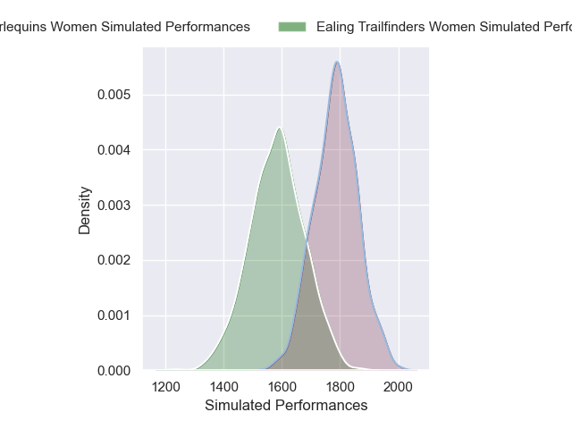
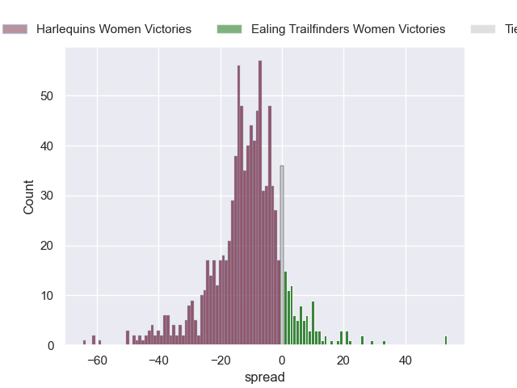
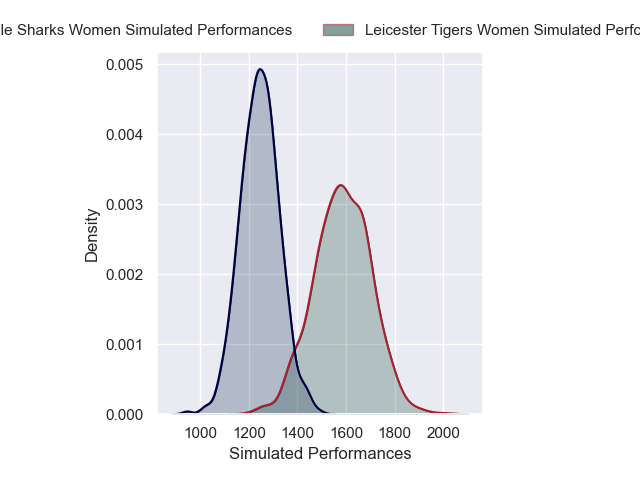
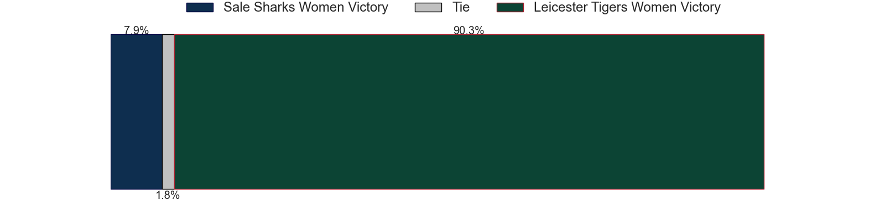
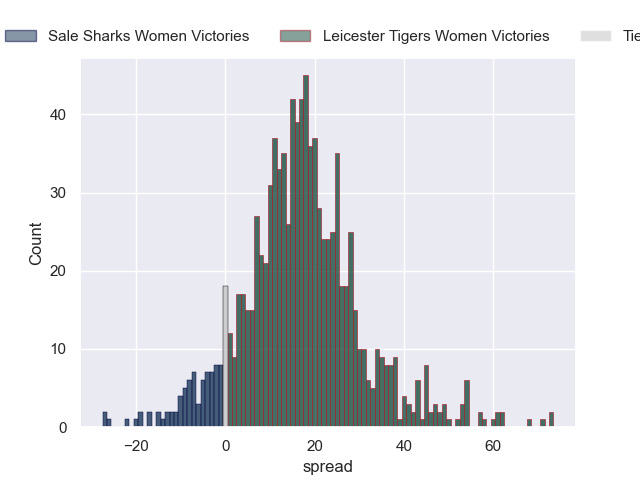
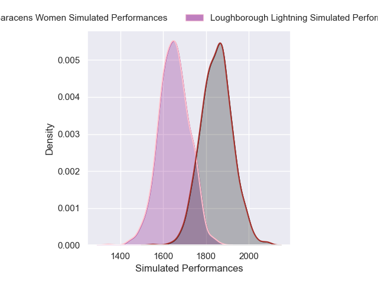
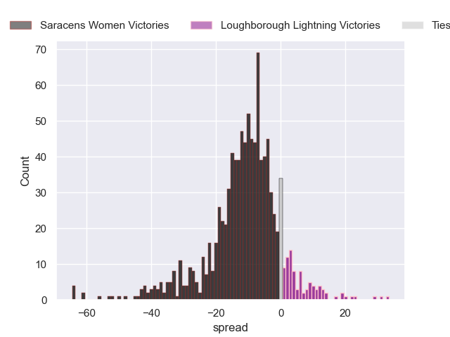
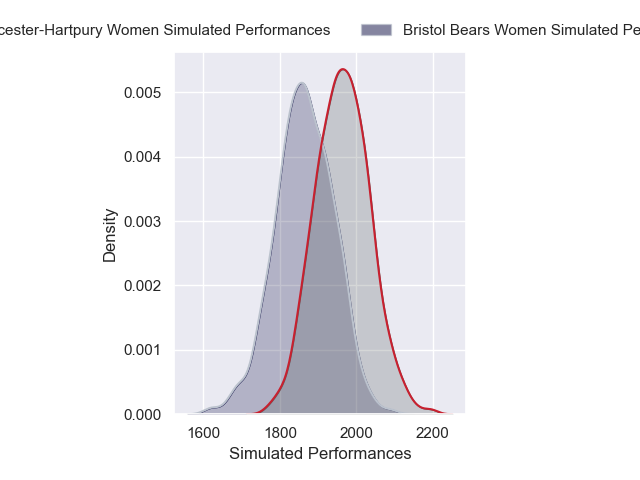
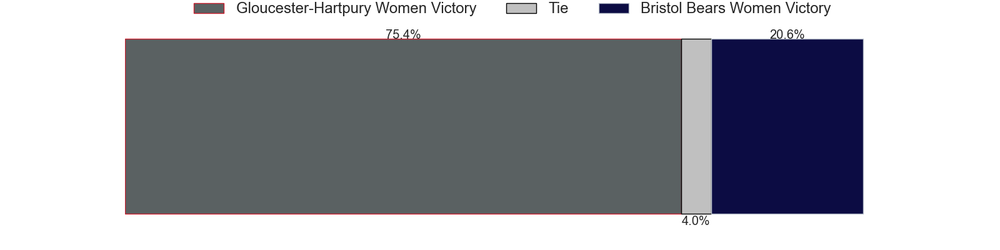
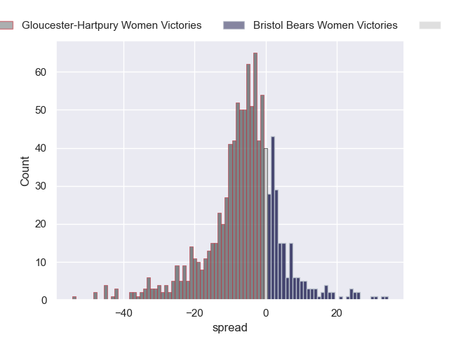

---  
title: "Allianz Premier 15s 2024 Status"  
date: 2024-12-30 6:00:00 -0500  
categories: model review projection  
layout: article  
aside:  
    toc: true  
---
# Current Team Rankings

# Standings

## Current Standings

| Club                      |   Played |   Wins |   Point Differential |   Losing Bonus Points |   Try Bonus Points |   Competition Points |
|:--------------------------|---------:|-------:|---------------------:|----------------------:|-------------------:|---------------------:|
| Harlequins Women          |       10 |      8 |                  118 |                     1 |                nan |                   33 |
| Exeter Chiefs Women       |        9 |      8 |                   98 |                     0 |                nan |                   32 |
| Gloucester-Hartpury Women |       10 |      7 |                  110 |                     2 |                nan |                   30 |
| Saracens Women            |       10 |      7 |                   94 |                     1 |                nan |                   29 |
| Bristol Bears Women       |        9 |      6 |                  149 |                     0 |                nan |                   24 |
| Loughborough Lightning    |       10 |      3 |                  -61 |                     1 |                nan |                   13 |
| Ealing Trailfinders Women |        9 |      3 |                  -16 |                     0 |                nan |                   12 |
| Leicester Tigers Women    |        9 |      1 |                 -211 |                     0 |                nan |                    4 |
| Sale Sharks Women         |       10 |      0 |                 -281 |                     0 |                nan |                    0 |

## Projected Remaining Table

| Club                      |   Matches Remaining |   Wins |   Point Differential |   Losing Bonus Points |   Try Bonus Points |   Competition Points |
|:--------------------------|--------------------:|-------:|---------------------:|----------------------:|-------------------:|---------------------:|
| Leicester Tigers Women    |                   1 |    0.9 |             17.0584  |                   0   |                0.6 |                  4.3 |
| Harlequins Women          |                   1 |    0.9 |             11.0597  |                   0.1 |                0.7 |                  4.3 |
| Saracens Women            |                   1 |    0.9 |             11.2446  |                   0.1 |                0.6 |                  4.2 |
| Gloucester-Hartpury Women |                   1 |    0.8 |              6.25217 |                   0.2 |                0.4 |                  3.7 |
| Bristol Bears Women       |                   1 |    0.2 |             -6.25217 |                   0.4 |                0.1 |                  1.4 |
| Ealing Trailfinders Women |                   1 |    0.1 |            -11.0597  |                   0.2 |                0.1 |                  0.8 |
| Loughborough Lightning    |                   1 |    0.1 |            -11.2446  |                   0.2 |                0.1 |                  0.8 |
| Sale Sharks Women         |                   1 |    0.1 |            -17.0584  |                   0.1 |                0.2 |                  0.6 |

## Projected Total Table

| Club                      |   Total Matches |   Wins |   Point Differential |   Losing Bonus Points |   Try Bonus Points |   Competition Points |
|:--------------------------|----------------:|-------:|---------------------:|----------------------:|-------------------:|---------------------:|
| Harlequins Women          |              11 |    8.9 |             129.06   |                   1.1 |                0.7 |                 37.3 |
| Gloucester-Hartpury Women |              11 |    7.8 |             116.252  |                   2.2 |                0.4 |                 33.7 |
| Saracens Women            |              11 |    7.9 |             105.245  |                   1.1 |                0.6 |                 33.2 |
| Exeter Chiefs Women       |               9 |    8   |              98      |                   0   |                0   |                 32   |
| Bristol Bears Women       |              10 |    6.2 |             142.748  |                   0.4 |                0.1 |                 25.4 |
| Loughborough Lightning    |              11 |    3.1 |             -72.2446 |                   1.2 |                0.1 |                 13.8 |
| Ealing Trailfinders Women |              10 |    3.1 |             -27.0597 |                   0.2 |                0.1 |                 12.8 |
| Leicester Tigers Women    |              10 |    1.9 |            -193.942  |                   0   |                0.6 |                  8.3 |
| Sale Sharks Women         |              11 |    0.1 |            -298.058  |                   0.1 |                0.2 |                  0.6 |

# Completed Match Review

| Model | Percent Correct Predictions | Spread Error |
| ------ | ------ | ------ |
| Club Level | 81.4% | 14.0 |
| Player Level: Lineup | nan% | nan |
| Player Level: Minutes | nan% | nan |

# Future Predictions

## Week 11

### Ealing Trailfinders Women V Harlequins Women on 2025/01/04

Average Margin: Harlequins Women by 11.1

Average Scoreline: 29-18

### Leicester Tigers Women V Sale Sharks Women on 2025/01/04

Average Margin: Leicester Tigers Women by 17.1

Average Scoreline: 32-14

### Loughborough Lightning V Saracens Women on 2025/01/05

Average Margin: Saracens Women by 11.2

Average Scoreline: 26-14

### Bristol Bears Women V Gloucester-Hartpury Women on 2025/01/05

Average Margin: Gloucester-Hartpury Women by 6.3

Average Scoreline: 23-17

