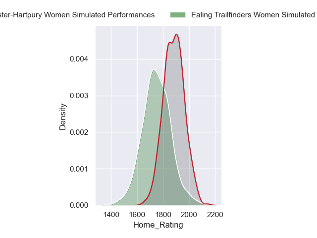
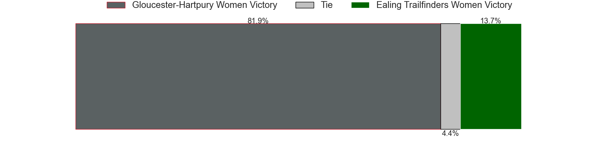
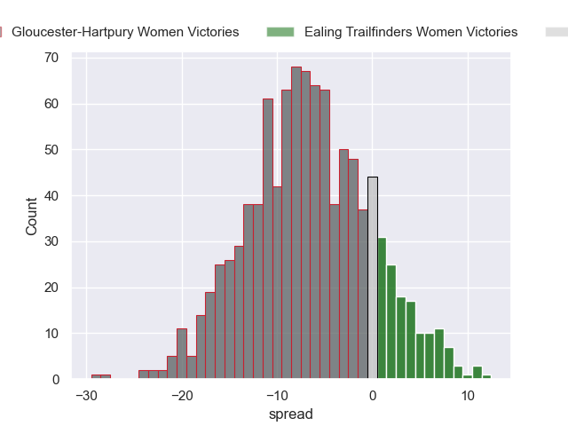
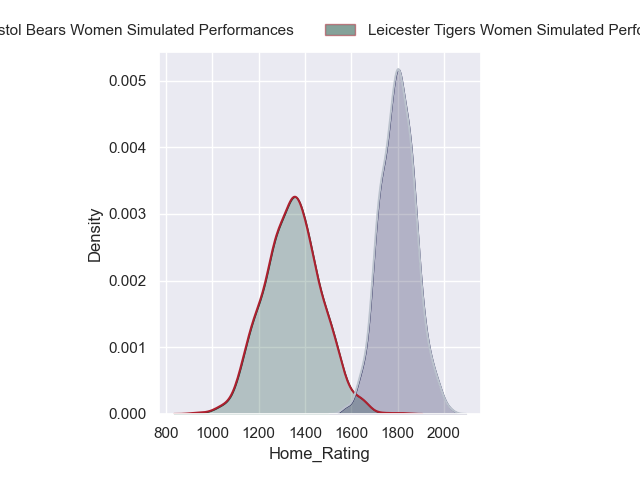
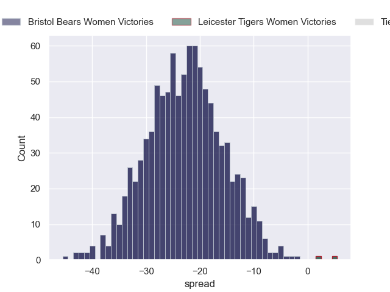

---  
title: "Allianz Premier 15s 2024 Status"  
date: 2024-11-04 6:00:00 -0500  
categories: model review projection  
layout: article  
aside:  
    toc: true  
---
# Current Team Rankings

# Standings

## Current Standings

| Club                      |   Played |   Wins |   Point Differential |   Losing Bonus Points |   Try Bonus Points |   Competition Points |
|:--------------------------|---------:|-------:|---------------------:|----------------------:|-------------------:|---------------------:|
| Exeter Chiefs Women       |        5 |      5 |                   77 |                     0 |                nan |                   20 |
| Saracens Women            |        5 |      4 |                   58 |                     0 |                nan |                   16 |
| Gloucester-Hartpury Women |        5 |      3 |                   33 |                     1 |                nan |                   13 |
| Harlequins Women          |        5 |      3 |                   22 |                     1 |                nan |                   13 |
| Bristol Bears Women       |        4 |      2 |                   42 |                     0 |                nan |                    8 |
| Ealing Trailfinders Women |        4 |      2 |                   30 |                     0 |                nan |                    8 |
| Loughborough Lightning    |        4 |      1 |                  -42 |                     1 |                nan |                    5 |
| Leicester Tigers Women    |        4 |      0 |                 -103 |                     0 |                nan |                    0 |
| Sale Sharks Women         |        4 |      0 |                 -117 |                     0 |                nan |                    0 |

## Projected Remaining Table

| Club                      |   Matches Remaining |   Wins |   Point Differential |   Losing Bonus Points |   Try Bonus Points |   Competition Points |
|:--------------------------|--------------------:|-------:|---------------------:|----------------------:|-------------------:|---------------------:|
| Bristol Bears Women       |                   1 |    1   |             22.7285  |                   0   |                0.8 |                  4.8 |
| Exeter Chiefs Women       |                   1 |    1   |             18.4408  |                   0   |                0.7 |                  4.7 |
| Harlequins Women          |                   1 |    1   |             14.7949  |                   0   |                0.6 |                  4.6 |
| Gloucester-Hartpury Women |                   1 |    0.8 |              6.59966 |                   0.1 |                0.5 |                  4   |
| Ealing Trailfinders Women |                   1 |    0.2 |             -6.59966 |                   0.4 |                0.1 |                  1.1 |
| Sale Sharks Women         |                   1 |    0   |            -14.7949  |                   0.1 |                0.1 |                  0.3 |
| Loughborough Lightning    |                   1 |    0   |            -18.4408  |                   0   |                0.1 |                  0.1 |
| Leicester Tigers Women    |                   1 |    0   |            -22.7285  |                   0   |                0.1 |                  0.1 |

## Projected Total Table

| Club                      |   Total Matches |   Wins |   Point Differential |   Losing Bonus Points |   Try Bonus Points |   Competition Points |
|:--------------------------|----------------:|-------:|---------------------:|----------------------:|-------------------:|---------------------:|
| Exeter Chiefs Women       |               6 |    6   |              95.4408 |                   0   |                0.7 |                 24.7 |
| Harlequins Women          |               6 |    4   |              36.7949 |                   1   |                0.6 |                 17.6 |
| Gloucester-Hartpury Women |               6 |    3.8 |              39.5997 |                   1.1 |                0.5 |                 17   |
| Saracens Women            |               5 |    4   |              58      |                   0   |                0   |                 16   |
| Bristol Bears Women       |               5 |    3   |              64.7285 |                   0   |                0.8 |                 12.8 |
| Ealing Trailfinders Women |               5 |    2.2 |              23.4003 |                   0.4 |                0.1 |                  9.1 |
| Loughborough Lightning    |               5 |    1   |             -60.4408 |                   1   |                0.1 |                  5.1 |
| Sale Sharks Women         |               5 |    0   |            -131.795  |                   0.1 |                0.1 |                  0.3 |
| Leicester Tigers Women    |               5 |    0   |            -125.729  |                   0   |                0.1 |                  0.1 |

# Completed Match Review

| Model | Percent Correct Predictions | Spread Error |
| ------ | ------ | ------ |
| Club Level | 80.0% | 13.5 |
| Player Level: Lineup | nan% | nan |
| Player Level: Minutes | nan% | nan |

# Future Predictions

## Week 6

### Ealing Trailfinders Women V Gloucester-Hartpury Women on 2024/11/09

Average Margin: Gloucester-Hartpury Women by 6.6

Average Scoreline: 30-23

### Leicester Tigers Women V Bristol Bears Women on 2024/11/09

Average Margin: Bristol Bears Women by 22.7

Average Scoreline: 38-15

### Exeter Chiefs Women V Loughborough Lightning on 2024/11/10

Average Margin: Exeter Chiefs Women by 18.4

Average Scoreline: 32-14

### Harlequins Women V Sale Sharks Women on 2024/11/10

Average Margin: Harlequins Women by 14.8

Average Scoreline: 30-15

