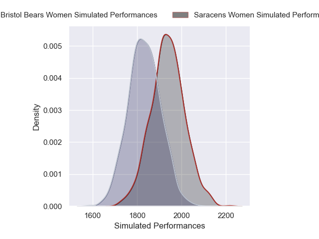
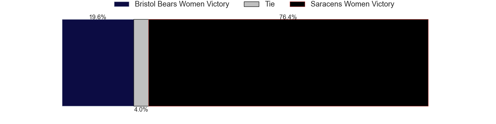
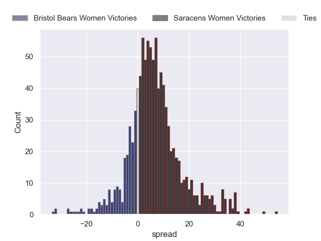
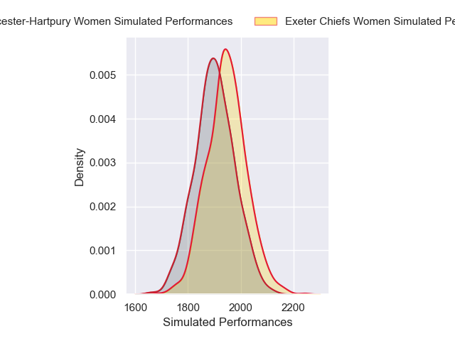
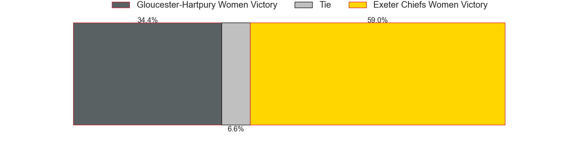
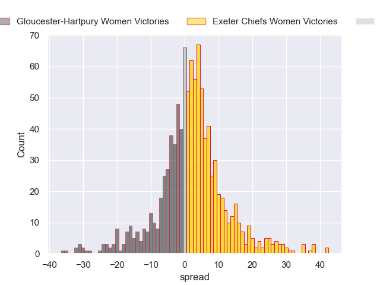
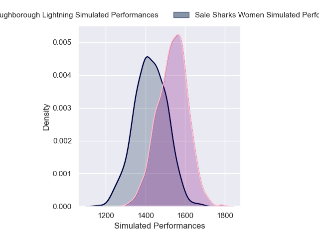
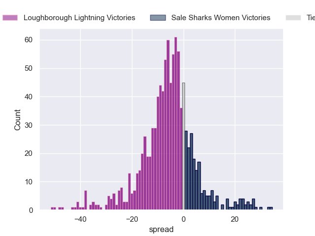

---  
title: "Allianz Premier 15s 2024 Status"  
date: 2024-12-16 6:00:00 -0500  
categories: model review projection  
layout: article  
aside:  
    toc: true  
---
# Current Team Rankings

# Standings

## Current Standings

| Club                      |   Played |   Wins |   Point Differential |   Losing Bonus Points |   Try Bonus Points |   Competition Points |
|:--------------------------|---------:|-------:|---------------------:|----------------------:|-------------------:|---------------------:|
| Exeter Chiefs Women       |        8 |      8 |                  127 |                     0 |                nan |                   32 |
| Harlequins Women          |        9 |      7 |                   93 |                     1 |                nan |                   29 |
| Gloucester-Hartpury Women |        9 |      6 |                   81 |                     2 |                nan |                   26 |
| Saracens Women            |        9 |      6 |                   85 |                     1 |                nan |                   25 |
| Bristol Bears Women       |        8 |      6 |                  158 |                     0 |                nan |                   24 |
| Ealing Trailfinders Women |        9 |      3 |                  -16 |                     0 |                nan |                   12 |
| Loughborough Lightning    |        9 |      2 |                 -104 |                     1 |                nan |                    9 |
| Leicester Tigers Women    |        8 |      1 |                 -186 |                     0 |                nan |                    4 |
| Sale Sharks Women         |        9 |      0 |                 -238 |                     0 |                nan |                    0 |

## Projected Remaining Table

| Club                      |   Matches Remaining |   Wins |   Point Differential |   Losing Bonus Points |   Try Bonus Points |   Competition Points |
|:--------------------------|--------------------:|-------:|---------------------:|----------------------:|-------------------:|---------------------:|
| Loughborough Lightning    |                   1 |    0.8 |              6.19001 |                   0.2 |                0.6 |                  3.9 |
| Saracens Women            |                   1 |    0.8 |              5.95018 |                   0.2 |                0.3 |                  3.5 |
| Exeter Chiefs Women       |                   1 |    0.6 |              2.19487 |                   0.2 |                0.1 |                  2.9 |
| Gloucester-Hartpury Women |                   1 |    0.4 |             -2.19487 |                   0.4 |                0.2 |                  2.1 |
| Bristol Bears Women       |                   1 |    0.2 |             -5.95018 |                   0.4 |                0.2 |                  1.5 |
| Sale Sharks Women         |                   1 |    0.2 |             -6.19001 |                   0.4 |                0.2 |                  1.4 |

## Projected Total Table

| Club                      |   Total Matches |   Wins |   Point Differential |   Losing Bonus Points |   Try Bonus Points |   Competition Points |
|:--------------------------|----------------:|-------:|---------------------:|----------------------:|-------------------:|---------------------:|
| Exeter Chiefs Women       |               9 |    8.6 |             129.195  |                   0.2 |                0.1 |                 34.9 |
| Harlequins Women          |               9 |    7   |              93      |                   1   |                0   |                 29   |
| Saracens Women            |              10 |    6.8 |              90.9502 |                   1.2 |                0.3 |                 28.5 |
| Gloucester-Hartpury Women |              10 |    6.4 |              78.8051 |                   2.4 |                0.2 |                 28.1 |
| Bristol Bears Women       |               9 |    6.2 |             152.05   |                   0.4 |                0.2 |                 25.5 |
| Loughborough Lightning    |              10 |    2.8 |             -97.81   |                   1.2 |                0.6 |                 12.9 |
| Ealing Trailfinders Women |               9 |    3   |             -16      |                   0   |                0   |                 12   |
| Leicester Tigers Women    |               8 |    1   |            -186      |                   0   |                0   |                  4   |
| Sale Sharks Women         |              10 |    0.2 |            -244.19   |                   0.4 |                0.2 |                  1.4 |

# Completed Match Review

| Model | Percent Correct Predictions | Spread Error |
| ------ | ------ | ------ |
| Club Level | 82.1% | 13.5 |
| Player Level: Lineup | nan% | nan |
| Player Level: Minutes | nan% | nan |

# Future Predictions

## Week 10

### Saracens Women V Bristol Bears Women on 2024/12/21

Average Margin: Saracens Women by 6.0

Average Scoreline: 32-26

### Exeter Chiefs Women V Gloucester-Hartpury Women on 2024/12/21

Average Margin: Exeter Chiefs Women by 2.2

Average Scoreline: 23-21

### Sale Sharks Women V Loughborough Lightning on 2024/12/21

Average Margin: Loughborough Lightning by 6.2

Average Scoreline: 26-20

