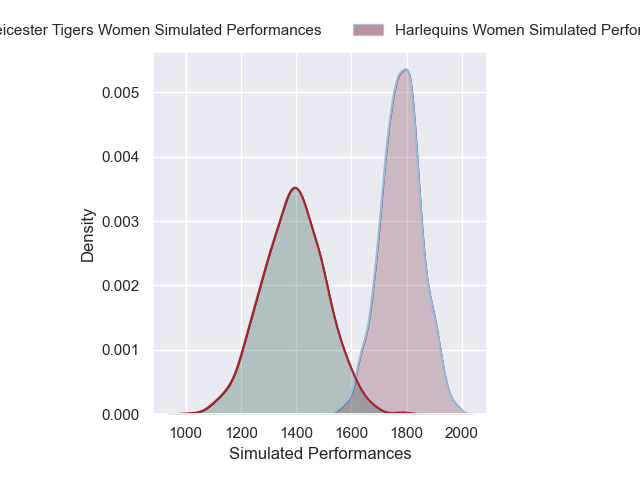
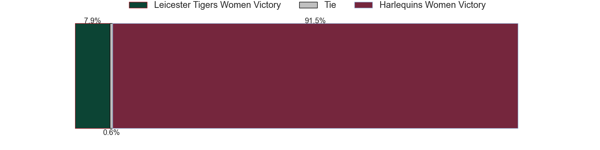
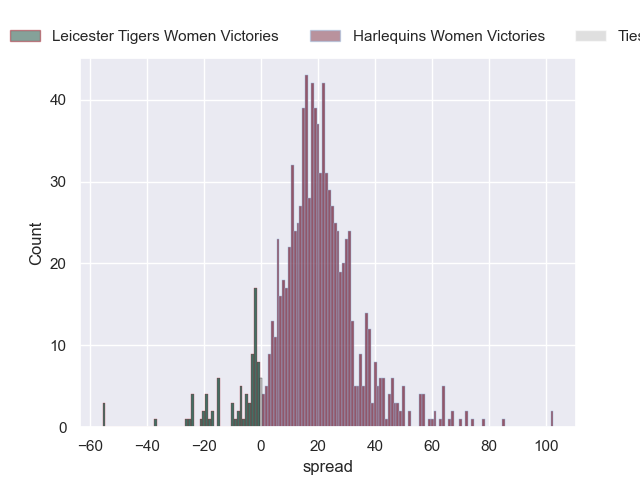

---  
title: "Allianz Premier 15s 2024 Status"  
date: 2024-12-23 6:00:00 -0500  
categories: model review projection  
layout: article  
aside:  
    toc: true  
---
# Current Team Rankings

# Standings

## Current Standings

| Club                      |   Played |   Wins |   Point Differential |   Losing Bonus Points |   Try Bonus Points |   Competition Points |
|:--------------------------|---------:|-------:|---------------------:|----------------------:|-------------------:|---------------------:|
| Exeter Chiefs Women       |        9 |      8 |                   98 |                     0 |                nan |                   32 |
| Gloucester-Hartpury Women |       10 |      7 |                  110 |                     2 |                nan |                   30 |
| Saracens Women            |       10 |      7 |                   94 |                     1 |                nan |                   29 |
| Harlequins Women          |        9 |      7 |                   93 |                     1 |                nan |                   29 |
| Bristol Bears Women       |        9 |      6 |                  149 |                     0 |                nan |                   24 |
| Loughborough Lightning    |       10 |      3 |                  -61 |                     1 |                nan |                   13 |
| Ealing Trailfinders Women |        9 |      3 |                  -16 |                     0 |                nan |                   12 |
| Leicester Tigers Women    |        8 |      1 |                 -186 |                     0 |                nan |                    4 |
| Sale Sharks Women         |       10 |      0 |                 -281 |                     0 |                nan |                    0 |

## Projected Remaining Table

| Club                   |   Matches Remaining |   Wins |   Point Differential |   Losing Bonus Points |   Try Bonus Points |   Competition Points |
|:-----------------------|--------------------:|-------:|---------------------:|----------------------:|-------------------:|---------------------:|
| Harlequins Women       |                   1 |    0.9 |              19.4556 |                   0   |                0.6 |                  4.4 |
| Leicester Tigers Women |                   1 |    0.1 |             -19.4556 |                   0.1 |                0.1 |                  0.5 |

## Projected Total Table

| Club                      |   Total Matches |   Wins |   Point Differential |   Losing Bonus Points |   Try Bonus Points |   Competition Points |
|:--------------------------|----------------:|-------:|---------------------:|----------------------:|-------------------:|---------------------:|
| Harlequins Women          |              10 |    7.9 |              112.456 |                   1   |                0.6 |                 33.4 |
| Exeter Chiefs Women       |               9 |    8   |               98     |                   0   |                0   |                 32   |
| Gloucester-Hartpury Women |              10 |    7   |              110     |                   2   |                0   |                 30   |
| Saracens Women            |              10 |    7   |               94     |                   1   |                0   |                 29   |
| Bristol Bears Women       |               9 |    6   |              149     |                   0   |                0   |                 24   |
| Loughborough Lightning    |              10 |    3   |              -61     |                   1   |                0   |                 13   |
| Ealing Trailfinders Women |               9 |    3   |              -16     |                   0   |                0   |                 12   |
| Leicester Tigers Women    |               9 |    1.1 |             -205.456 |                   0.1 |                0.1 |                  4.5 |
| Sale Sharks Women         |              10 |    0   |             -281     |                   0   |                0   |                  0   |

# Completed Match Review

| Model | Percent Correct Predictions | Spread Error |
| ------ | ------ | ------ |
| Club Level | 81.0% | 14.3 |
| Player Level: Lineup | nan% | nan |
| Player Level: Minutes | nan% | nan |

# Future Predictions

## Week 11

### Harlequins Women V Leicester Tigers Women on 2024/12/28

Average Margin: Harlequins Women by 19.5

Average Scoreline: 32-13

