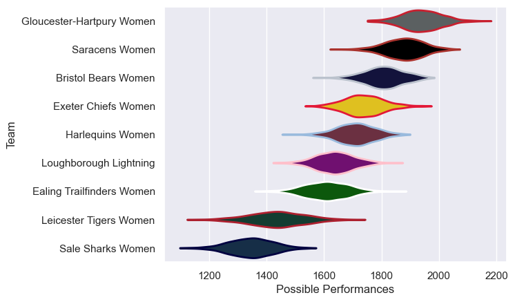
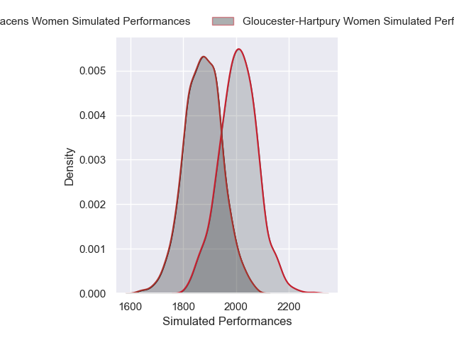
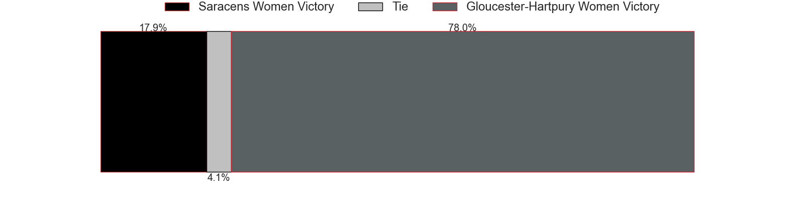
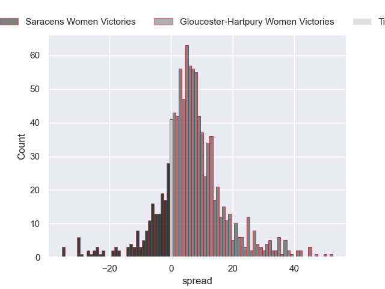

---  
title: "Allianz Premier 15s 24/25 Status"  
date: 2025-03-14 6:00:00 -0500  
categories: model review projection  
layout: article  
aside:  
    toc: true  
---
# Current Team Rankings

# Standings

## Current Standings

| Club                      |   Played |   Wins |   Point Differential |   Losing Bonus Points |   Try Bonus Points |   Competition Points |
|:--------------------------|---------:|-------:|---------------------:|----------------------:|-------------------:|---------------------:|
| Gloucester-Hartpury Women |       17 |     14 |                  256 |                     2 |                nan |                   58 |
| Saracens Women            |       17 |     13 |                  295 |                     2 |                nan |                   54 |
| Harlequins Women          |       17 |     11 |                   79 |                     1 |                nan |                   45 |
| Exeter Chiefs Women       |       16 |     10 |                   54 |                     2 |                nan |                   42 |
| Bristol Bears Women       |       17 |     10 |                  161 |                     1 |                nan |                   41 |
| Loughborough Lightning    |       16 |      7 |                  -17 |                     2 |                nan |                   30 |
| Ealing Trailfinders Women |       16 |      5 |                  -29 |                     4 |                nan |                   24 |
| Leicester Tigers Women    |       16 |      3 |                 -387 |                     1 |                nan |                   13 |
| Sale Sharks Women         |       16 |      1 |                 -412 |                     0 |                nan |                    4 |

## Projected Remaining Table

| Club                      |   Matches Remaining |   Wins |   Point Differential |   Losing Bonus Points |   Try Bonus Points |   Competition Points |
|:--------------------------|--------------------:|-------:|---------------------:|----------------------:|-------------------:|---------------------:|
| Gloucester-Hartpury Women |                   1 |    0.8 |              7.54482 |                   0.1 |                0.3 |                  3.7 |
| Saracens Women            |                   1 |    0.2 |             -7.54482 |                   0.3 |                0.2 |                  1.2 |

## Projected Total Table

| Club                      |   Total Matches |   Wins |   Point Differential |   Losing Bonus Points |   Try Bonus Points |   Competition Points |
|:--------------------------|----------------:|-------:|---------------------:|----------------------:|-------------------:|---------------------:|
| Gloucester-Hartpury Women |              18 |   14.8 |              263.545 |                   2.1 |                0.3 |                 61.7 |
| Saracens Women            |              18 |   13.2 |              287.455 |                   2.3 |                0.2 |                 55.2 |
| Harlequins Women          |              17 |   11   |               79     |                   1   |                0   |                 45   |
| Exeter Chiefs Women       |              16 |   10   |               54     |                   2   |                0   |                 42   |
| Bristol Bears Women       |              17 |   10   |              161     |                   1   |                0   |                 41   |
| Loughborough Lightning    |              16 |    7   |              -17     |                   2   |                0   |                 30   |
| Ealing Trailfinders Women |              16 |    5   |              -29     |                   4   |                0   |                 24   |
| Leicester Tigers Women    |              16 |    3   |             -387     |                   1   |                0   |                 13   |
| Sale Sharks Women         |              16 |    1   |             -412     |                   0   |                0   |                  4   |

# Completed Match Review

| Model | Percent Correct Predictions | Spread Error |
| ------ | ------ | ------ |
| Club Level | 79.7% | 14.7 |
| Player Level: Lineup | nan% | nan |
| Player Level: Minutes | nan% | nan |

# Future Predictions

## Week 18

### Gloucester-Hartpury Women V Saracens Women on 2025/03/16

Average Margin: Gloucester-Hartpury Women by 7.5

Average Scoreline: 30-22

