---  
title: "Allianz Premier 15s 24/25 Status"  
date: 2025-02-20 6:00:00 -0500  
categories: model review projection  
layout: article  
aside:  
    toc: true  
---
# Current Team Rankings

# Standings

## Current Standings

| Club                      |   Played |   Wins |   Point Differential |   Losing Bonus Points |   Try Bonus Points |   Competition Points |
|:--------------------------|---------:|-------:|---------------------:|----------------------:|-------------------:|---------------------:|
| Gloucester-Hartpury Women |       15 |     12 |                  200 |                     2 |                nan |                   50 |
| Saracens Women            |       15 |     11 |                  235 |                     2 |                nan |                   46 |
| Harlequins Women          |       15 |     11 |                  127 |                     1 |                nan |                   45 |
| Bristol Bears Women       |       16 |     10 |                  177 |                     1 |                nan |                   41 |
| Exeter Chiefs Women       |       15 |      9 |                   49 |                     2 |                nan |                   38 |
| Loughborough Lightning    |       15 |      6 |                  -19 |                     2 |                nan |                   26 |
| Ealing Trailfinders Women |       15 |      5 |                  -27 |                     3 |                nan |                   23 |
| Leicester Tigers Women    |       15 |      3 |                 -382 |                     0 |                nan |                   12 |
| Sale Sharks Women         |       15 |      1 |                 -360 |                     0 |                nan |                    4 |

## Projected Remaining Table

| Club                      |   Matches Remaining |   Wins |   Point Differential |   Losing Bonus Points |   Try Bonus Points |   Competition Points |
|:--------------------------|--------------------:|-------:|---------------------:|----------------------:|-------------------:|---------------------:|
| Saracens Women            |                   1 |    0.9 |             30.2467  |                   0   |                0.9 |                  4.7 |
| Exeter Chiefs Women       |                   1 |    0.9 |             14.6372  |                   0.1 |                0.8 |                  4.5 |
| Gloucester-Hartpury Women |                   1 |    0.9 |             14.9341  |                   0   |                0.6 |                  4.3 |
| Loughborough Lightning    |                   1 |    0.8 |              5.93515 |                   0.1 |                0.3 |                  3.5 |
| Ealing Trailfinders Women |                   1 |    0.2 |             -5.93515 |                   0.4 |                0.2 |                  1.5 |
| Leicester Tigers Women    |                   1 |    0.1 |            -14.6372  |                   0.1 |                0.2 |                  0.6 |
| Harlequins Women          |                   1 |    0.1 |            -14.9341  |                   0.1 |                0.1 |                  0.5 |
| Sale Sharks Women         |                   1 |    0.1 |            -30.2467  |                   0   |                0.1 |                  0.3 |

## Projected Total Table

| Club                      |   Total Matches |   Wins |   Point Differential |   Losing Bonus Points |   Try Bonus Points |   Competition Points |
|:--------------------------|----------------:|-------:|---------------------:|----------------------:|-------------------:|---------------------:|
| Gloucester-Hartpury Women |              16 |   12.9 |             214.934  |                   2   |                0.6 |                 54.3 |
| Saracens Women            |              16 |   11.9 |             265.247  |                   2   |                0.9 |                 50.7 |
| Harlequins Women          |              16 |   11.1 |             112.066  |                   1.1 |                0.1 |                 45.5 |
| Exeter Chiefs Women       |              16 |    9.9 |              63.6372 |                   2.1 |                0.8 |                 42.5 |
| Bristol Bears Women       |              16 |   10   |             177      |                   1   |                0   |                 41   |
| Loughborough Lightning    |              16 |    6.8 |             -13.0649 |                   2.1 |                0.3 |                 29.5 |
| Ealing Trailfinders Women |              16 |    5.2 |             -32.9351 |                   3.4 |                0.2 |                 24.5 |
| Leicester Tigers Women    |              16 |    3.1 |            -396.637  |                   0.1 |                0.2 |                 12.6 |
| Sale Sharks Women         |              16 |    1.1 |            -390.247  |                   0   |                0.1 |                  4.3 |

# Completed Match Review

| Model | Percent Correct Predictions | Spread Error |
| ------ | ------ | ------ |
| Club Level | 77.9% | 15.0 |
| Player Level: Lineup | nan% | nan |
| Player Level: Minutes | nan% | nan |

# Future Predictions

## Week 17

### Gloucester-Hartpury Women V Harlequins Women on 2025/02/21

Average Margin: Gloucester-Hartpury Women by 14.9

Average Scoreline: 32-17

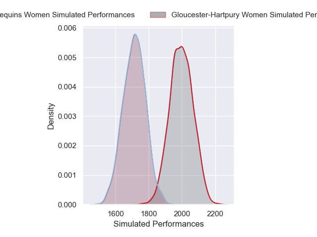
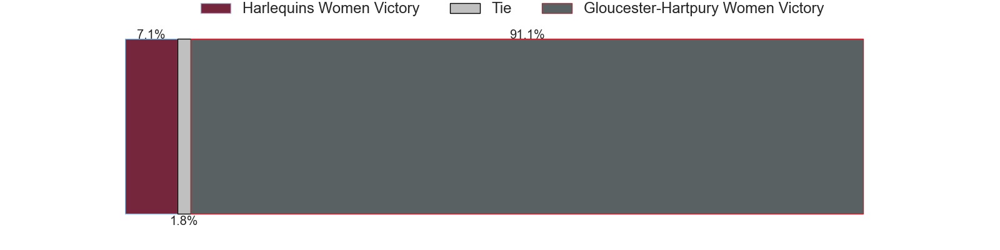
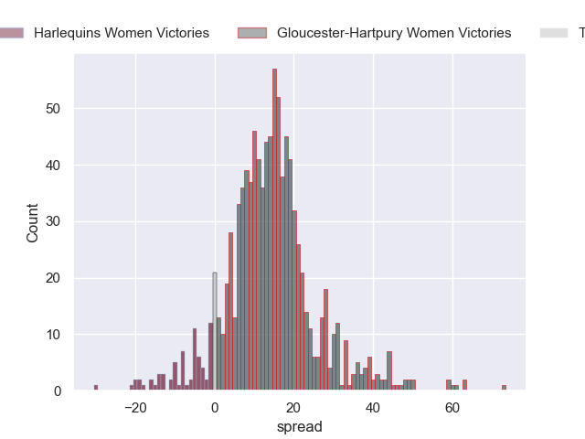

### Leicester Tigers Women V Exeter Chiefs Women on 2025/02/21

Average Margin: Exeter Chiefs Women by 14.6

Average Scoreline: 39-25

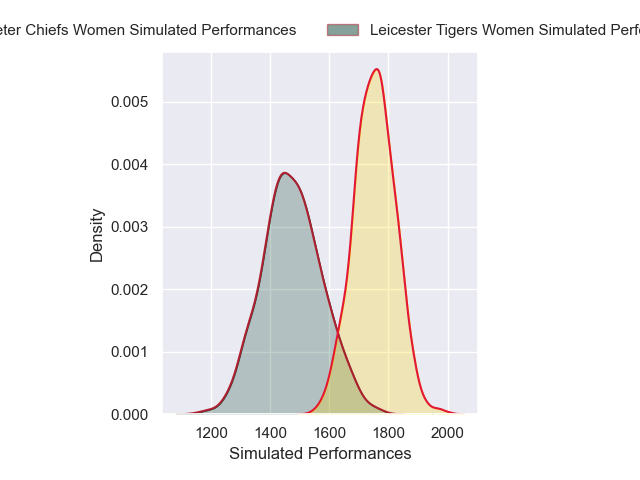
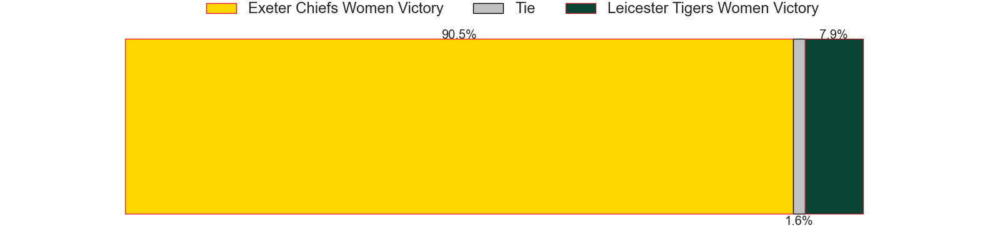
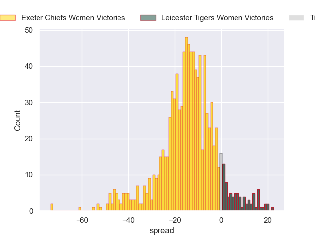

### Saracens Women V Sale Sharks Women on 2025/02/21

Average Margin: Saracens Women by 30.2

Average Scoreline: 45-15

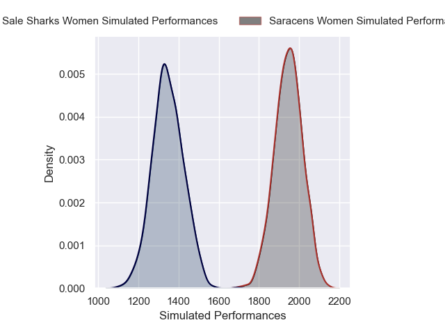

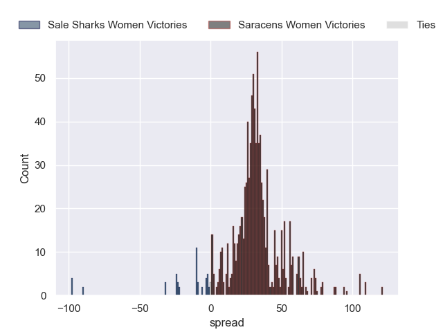

### Loughborough Lightning V Ealing Trailfinders Women on 2025/02/21

Average Margin: Loughborough Lightning by 5.9

Average Scoreline: 31-25

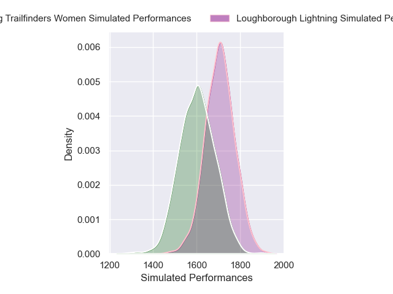
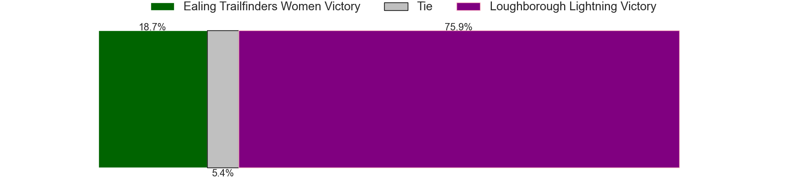
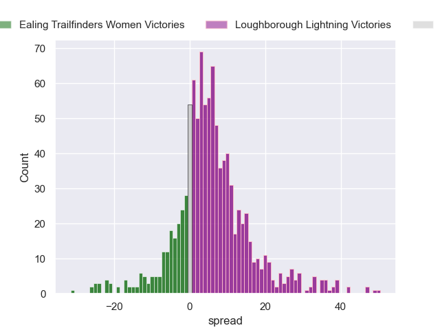

