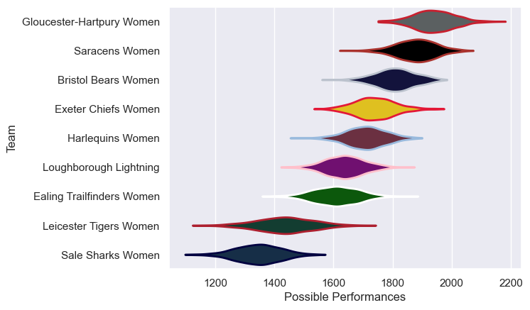
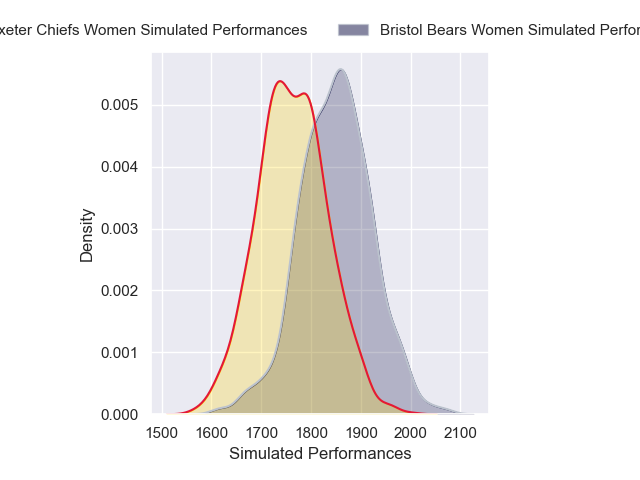
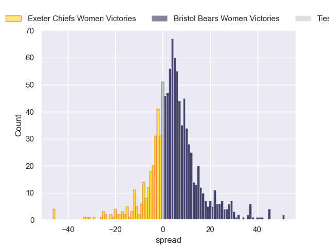
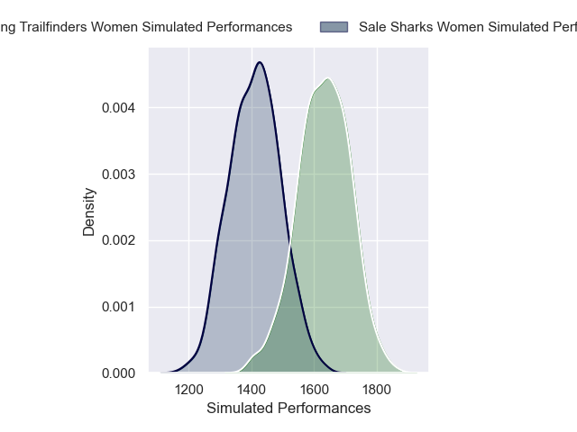
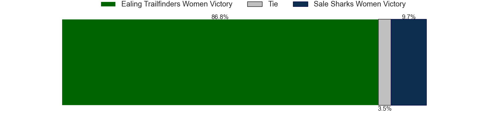
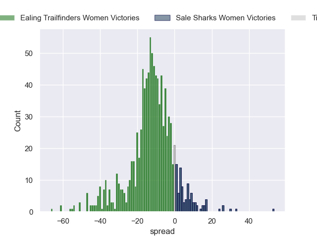

---  
title: "Allianz Premier 15s 24/25 Status"  
date: 2025-02-03 6:00:00 -0500  
categories: model review projection  
layout: article  
aside:  
    toc: true  
---
# Current Team Rankings

# Standings

## Current Standings

| Club                      |   Played |   Wins |   Point Differential |   Losing Bonus Points |   Try Bonus Points |   Competition Points |
|:--------------------------|---------:|-------:|---------------------:|----------------------:|-------------------:|---------------------:|
| Gloucester-Hartpury Women |       14 |     11 |                  183 |                     2 |                nan |                   46 |
| Harlequins Women          |       14 |     11 |                  136 |                     1 |                nan |                   45 |
| Saracens Women            |       14 |     10 |                  226 |                     2 |                nan |                   42 |
| Exeter Chiefs Women       |       13 |      9 |                   86 |                     2 |                nan |                   38 |
| Bristol Bears Women       |       14 |      8 |                  140 |                     1 |                nan |                   33 |
| Loughborough Lightning    |       15 |      6 |                  -19 |                     2 |                nan |                   26 |
| Ealing Trailfinders Women |       13 |      4 |                  -38 |                     2 |                nan |                   18 |
| Leicester Tigers Women    |       14 |      2 |                 -384 |                     0 |                nan |                    8 |
| Sale Sharks Women         |       13 |      1 |                 -330 |                     0 |                nan |                    4 |

## Projected Remaining Table

| Club                      |   Matches Remaining |   Wins |   Point Differential |   Losing Bonus Points |   Try Bonus Points |   Competition Points |
|:--------------------------|--------------------:|-------:|---------------------:|----------------------:|-------------------:|---------------------:|
| Ealing Trailfinders Women |                   1 |    0.9 |             11.6958  |                   0.1 |                0.6 |                  4.2 |
| Bristol Bears Women       |                   1 |    0.7 |              4.72368 |                   0.2 |                0.2 |                  3.3 |
| Exeter Chiefs Women       |                   1 |    0.3 |             -4.72368 |                   0.4 |                0.2 |                  1.7 |
| Sale Sharks Women         |                   1 |    0.1 |            -11.6958  |                   0.2 |                0.2 |                  0.8 |

## Projected Total Table

| Club                      |   Total Matches |   Wins |   Point Differential |   Losing Bonus Points |   Try Bonus Points |   Competition Points |
|:--------------------------|----------------:|-------:|---------------------:|----------------------:|-------------------:|---------------------:|
| Gloucester-Hartpury Women |              14 |   11   |             183      |                   2   |                0   |                 46   |
| Harlequins Women          |              14 |   11   |             136      |                   1   |                0   |                 45   |
| Saracens Women            |              14 |   10   |             226      |                   2   |                0   |                 42   |
| Exeter Chiefs Women       |              14 |    9.3 |              81.2763 |                   2.4 |                0.2 |                 39.7 |
| Bristol Bears Women       |              15 |    8.7 |             144.724  |                   1.2 |                0.2 |                 36.3 |
| Loughborough Lightning    |              15 |    6   |             -19      |                   2   |                0   |                 26   |
| Ealing Trailfinders Women |              14 |    4.9 |             -26.3042 |                   2.1 |                0.6 |                 22.2 |
| Leicester Tigers Women    |              14 |    2   |            -384      |                   0   |                0   |                  8   |
| Sale Sharks Women         |              14 |    1.1 |            -341.696  |                   0.2 |                0.2 |                  4.8 |

# Completed Match Review

| Model | Percent Correct Predictions | Spread Error |
| ------ | ------ | ------ |
| Club Level | 77.4% | 15.5 |
| Player Level: Lineup | nan% | nan |
| Player Level: Minutes | nan% | nan |

# Future Predictions

## Week 16

### Bristol Bears Women V Exeter Chiefs Women on 2025/02/08

Average Margin: Bristol Bears Women by 4.7

Average Scoreline: 34-29

### Sale Sharks Women V Ealing Trailfinders Women on 2025/02/08

Average Margin: Ealing Trailfinders Women by 11.7

Average Scoreline: 33-21

