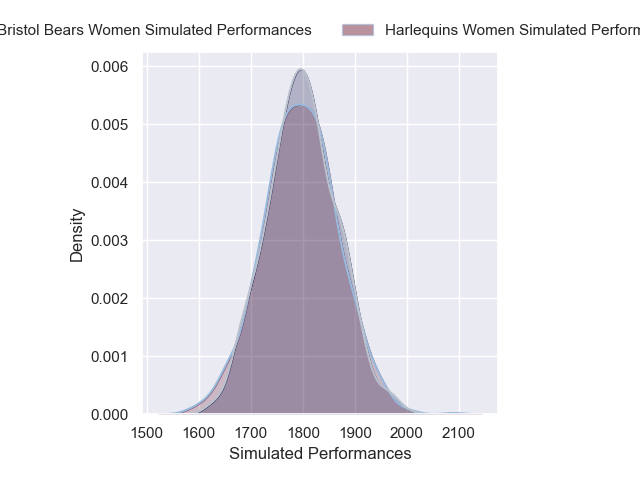
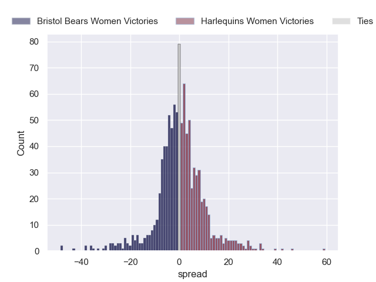
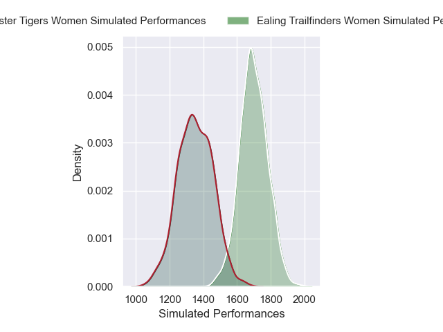
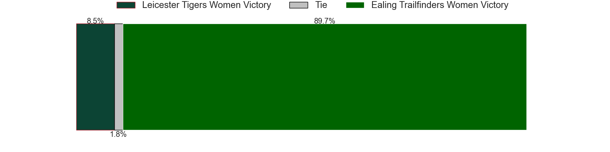
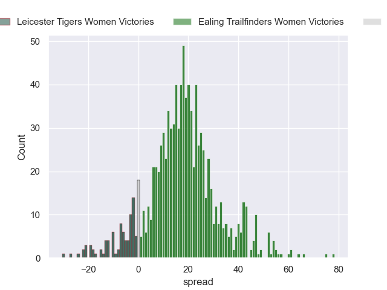
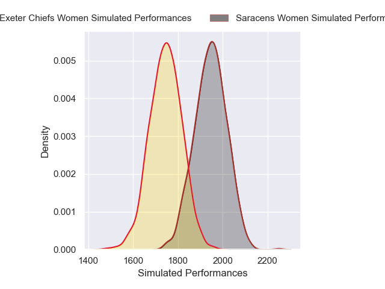
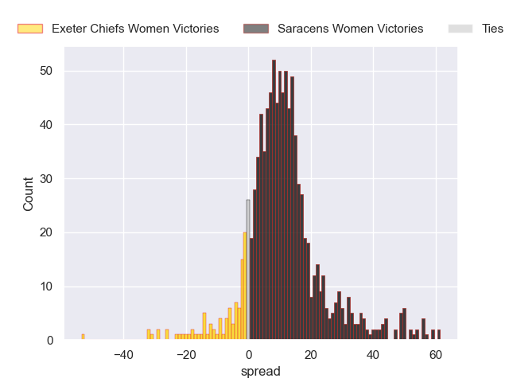
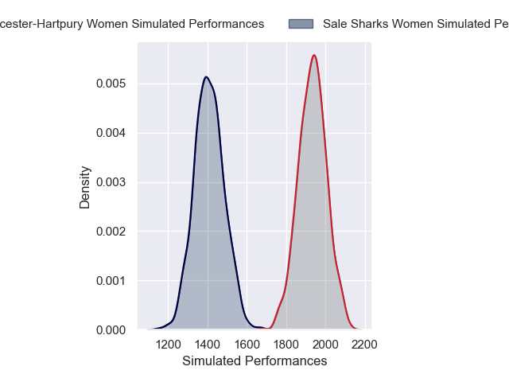
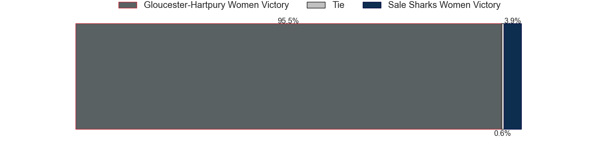
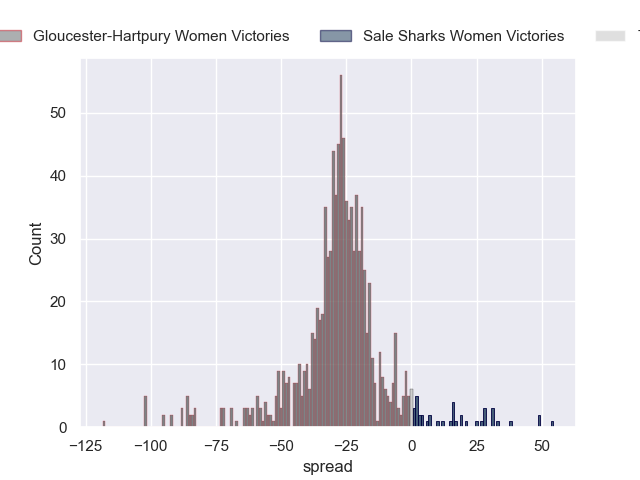

---  
title: "Allianz Premier 15s 24/25 Status"  
date: 2025-02-10 6:00:00 -0500  
categories: model review projection  
layout: article  
aside:  
    toc: true  
---
# Current Team Rankings

# Standings

## Current Standings

| Club                      |   Played |   Wins |   Point Differential |   Losing Bonus Points |   Try Bonus Points |   Competition Points |
|:--------------------------|---------:|-------:|---------------------:|----------------------:|-------------------:|---------------------:|
| Gloucester-Hartpury Women |       14 |     11 |                  183 |                     2 |                nan |                   46 |
| Harlequins Women          |       14 |     11 |                  136 |                     1 |                nan |                   45 |
| Saracens Women            |       14 |     10 |                  226 |                     2 |                nan |                   42 |
| Exeter Chiefs Women       |       14 |      9 |                   58 |                     2 |                nan |                   38 |
| Bristol Bears Women       |       15 |      9 |                  168 |                     1 |                nan |                   37 |
| Loughborough Lightning    |       15 |      6 |                  -19 |                     2 |                nan |                   26 |
| Ealing Trailfinders Women |       14 |      5 |                  -25 |                     2 |                nan |                   22 |
| Leicester Tigers Women    |       14 |      2 |                 -384 |                     0 |                nan |                    8 |
| Sale Sharks Women         |       14 |      1 |                 -343 |                     0 |                nan |                    4 |

## Projected Remaining Table

| Club                      |   Matches Remaining |   Wins |   Point Differential |   Losing Bonus Points |   Try Bonus Points |   Competition Points |
|:--------------------------|--------------------:|-------:|---------------------:|----------------------:|-------------------:|---------------------:|
| Gloucester-Hartpury Women |                   1 |    0.9 |            27.1278   |                   0   |                0.9 |                  4.7 |
| Ealing Trailfinders Women |                   1 |    0.9 |            17.8994   |                   0.1 |                0.7 |                  4.4 |
| Saracens Women            |                   1 |    0.9 |            11.519    |                   0.1 |                0.4 |                  4   |
| Harlequins Women          |                   1 |    0.5 |             0.356597 |                   0.3 |                0.1 |                  2.5 |
| Bristol Bears Women       |                   1 |    0.5 |            -0.356597 |                   0.3 |                0.3 |                  2.5 |
| Exeter Chiefs Women       |                   1 |    0.1 |           -11.519    |                   0.2 |                0.2 |                  0.8 |
| Leicester Tigers Women    |                   1 |    0.1 |           -17.8994   |                   0.1 |                0.1 |                  0.6 |
| Sale Sharks Women         |                   1 |    0.1 |           -27.1278   |                   0   |                0.1 |                  0.4 |

## Projected Total Table

| Club                      |   Total Matches |   Wins |   Point Differential |   Losing Bonus Points |   Try Bonus Points |   Competition Points |
|:--------------------------|----------------:|-------:|---------------------:|----------------------:|-------------------:|---------------------:|
| Gloucester-Hartpury Women |              15 |   11.9 |            210.128   |                   2   |                0.9 |                 50.7 |
| Harlequins Women          |              15 |   11.5 |            136.357   |                   1.3 |                0.1 |                 47.5 |
| Saracens Women            |              15 |   10.9 |            237.519   |                   2.1 |                0.4 |                 46   |
| Bristol Bears Women       |              16 |    9.5 |            167.643   |                   1.3 |                0.3 |                 39.5 |
| Exeter Chiefs Women       |              15 |    9.1 |             46.481   |                   2.2 |                0.2 |                 38.8 |
| Ealing Trailfinders Women |              15 |    5.9 |             -7.10061 |                   2.1 |                0.7 |                 26.4 |
| Loughborough Lightning    |              15 |    6   |            -19       |                   2   |                0   |                 26   |
| Leicester Tigers Women    |              15 |    2.1 |           -401.899   |                   0.1 |                0.1 |                  8.6 |
| Sale Sharks Women         |              15 |    1.1 |           -370.128   |                   0   |                0.1 |                  4.4 |

# Completed Match Review

| Model | Percent Correct Predictions | Spread Error |
| ------ | ------ | ------ |
| Club Level | 78.1% | 15.4 |
| Player Level: Lineup | nan% | nan |
| Player Level: Minutes | nan% | nan |

# Future Predictions

## Week 16

### Harlequins Women V Bristol Bears Women on 2025/02/14

Average Margin: Harlequins Women by 0.4

Average Scoreline: 27-27

### Ealing Trailfinders Women V Leicester Tigers Women on 2025/02/15

Average Margin: Ealing Trailfinders Women by 17.9

Average Scoreline: 40-22

### Saracens Women V Exeter Chiefs Women on 2025/02/15

Average Margin: Saracens Women by 11.5

Average Scoreline: 29-17

### Sale Sharks Women V Gloucester-Hartpury Women on 2025/02/15

Average Margin: Gloucester-Hartpury Women by 27.1

Average Scoreline: 49-22

