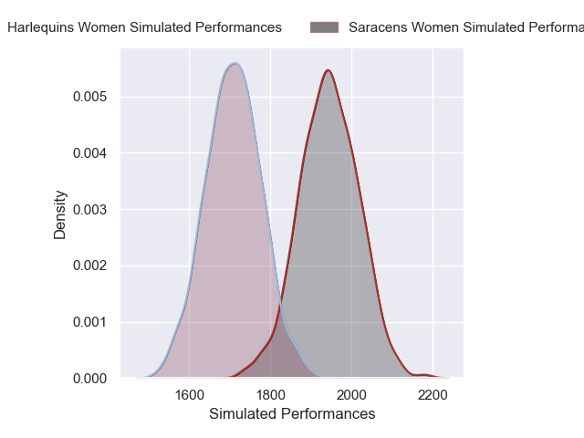
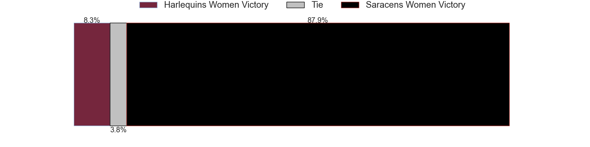
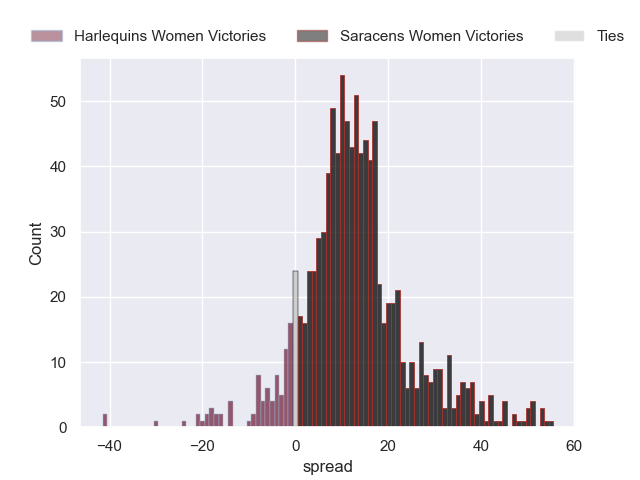
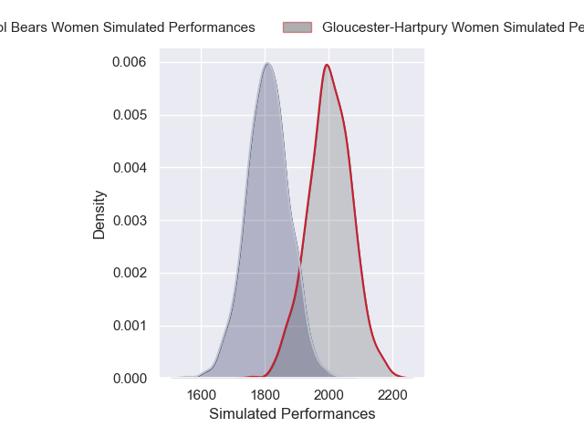
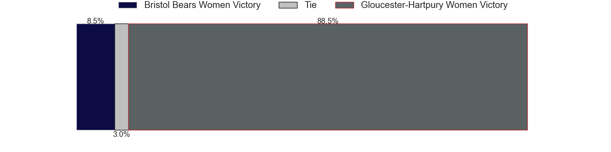
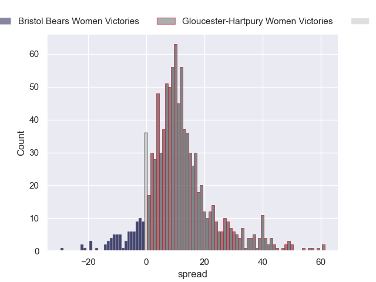

---  
title: "Allianz Premier 15s 24/25 Status"  
date: 2025-02-28 6:00:00 -0500  
categories: model review projection  
layout: article  
aside:  
    toc: true  
---
# Current Team Rankings

# Standings

## Current Standings

| Club                      |   Played |   Wins |   Point Differential |   Losing Bonus Points |   Try Bonus Points |   Competition Points |
|:--------------------------|---------:|-------:|---------------------:|----------------------:|-------------------:|---------------------:|
| Gloucester-Hartpury Women |       16 |     13 |                  240 |                     2 |                nan |                   54 |
| Saracens Women            |       16 |     12 |                  287 |                     2 |                nan |                   50 |
| Harlequins Women          |       16 |     11 |                   87 |                     1 |                nan |                   45 |
| Exeter Chiefs Women       |       16 |     10 |                   54 |                     2 |                nan |                   42 |
| Bristol Bears Women       |       16 |     10 |                  177 |                     1 |                nan |                   41 |
| Loughborough Lightning    |       16 |      7 |                  -17 |                     2 |                nan |                   30 |
| Ealing Trailfinders Women |       16 |      5 |                  -29 |                     4 |                nan |                   24 |
| Leicester Tigers Women    |       16 |      3 |                 -387 |                     1 |                nan |                   13 |
| Sale Sharks Women         |       16 |      1 |                 -412 |                     0 |                nan |                    4 |

## Projected Remaining Table

| Club                      |   Matches Remaining |   Wins |   Point Differential |   Losing Bonus Points |   Try Bonus Points |   Competition Points |
|:--------------------------|--------------------:|-------:|---------------------:|----------------------:|-------------------:|---------------------:|
| Saracens Women            |                   1 |    0.9 |              12.1691 |                   0.1 |                0.4 |                  4.1 |
| Gloucester-Hartpury Women |                   1 |    0.9 |              11.1371 |                   0.1 |                0.4 |                  4   |
| Bristol Bears Women       |                   1 |    0.1 |             -11.1371 |                   0.2 |                0.1 |                  0.8 |
| Harlequins Women          |                   1 |    0.1 |             -12.1691 |                   0.2 |                0.1 |                  0.7 |

## Projected Total Table

| Club                      |   Total Matches |   Wins |   Point Differential |   Losing Bonus Points |   Try Bonus Points |   Competition Points |
|:--------------------------|----------------:|-------:|---------------------:|----------------------:|-------------------:|---------------------:|
| Gloucester-Hartpury Women |              17 |   13.9 |             251.137  |                   2.1 |                0.4 |                 58   |
| Saracens Women            |              17 |   12.9 |             299.169  |                   2.1 |                0.4 |                 54.1 |
| Harlequins Women          |              17 |   11.1 |              74.8309 |                   1.2 |                0.1 |                 45.7 |
| Exeter Chiefs Women       |              16 |   10   |              54      |                   2   |                0   |                 42   |
| Bristol Bears Women       |              17 |   10.1 |             165.863  |                   1.2 |                0.1 |                 41.8 |
| Loughborough Lightning    |              16 |    7   |             -17      |                   2   |                0   |                 30   |
| Ealing Trailfinders Women |              16 |    5   |             -29      |                   4   |                0   |                 24   |
| Leicester Tigers Women    |              16 |    3   |            -387      |                   1   |                0   |                 13   |
| Sale Sharks Women         |              16 |    1   |            -412      |                   0   |                0   |                  4   |

# Completed Match Review

| Model | Percent Correct Predictions | Spread Error |
| ------ | ------ | ------ |
| Club Level | 79.2% | 15.0 |
| Player Level: Lineup | nan% | nan |
| Player Level: Minutes | nan% | nan |

# Future Predictions

## Week 17

### Saracens Women V Harlequins Women on 2025/03/01

Average Margin: Saracens Women by 12.2

Average Scoreline: 33-20

### Gloucester-Hartpury Women V Bristol Bears Women on 2025/03/02

Average Margin: Gloucester-Hartpury Women by 11.1

Average Scoreline: 33-22

