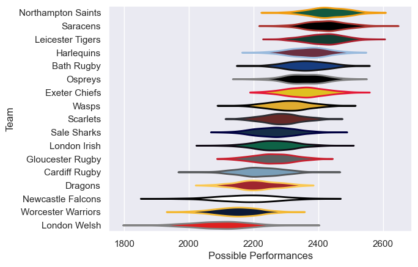

---  
title: "Anglo-Welsh Cup 2013 Status"  
date: 2025-07-28 6:00:00 -0500  
categories: model review projection  
layout: article  
aside:  
    toc: true  
---
# Current Team Rankings

# Standings

## Current Standings

| Club               |   Played |   Wins |   Point Differential |   Losing Bonus Points |   Try Bonus Points |   Competition Points |
|:-------------------|---------:|-------:|---------------------:|----------------------:|-------------------:|---------------------:|
| Sale Sharks        |        6 |      4 |                    8 |                     1 |                  3 |                   20 |
| Saracens           |        5 |      4 |                   56 |                     1 |                  2 |                   19 |
| Harlequins         |        6 |      4 |                   28 |                     1 |                  2 |                   19 |
| Bath Rugby         |        5 |      4 |                   58 |                     0 |                  2 |                   18 |
| Leicester Tigers   |        4 |      3 |                   31 |                     0 |                  2 |                   14 |
| Northampton Saints |        4 |      3 |                   58 |                     0 |                  1 |                   13 |
| Dragons            |        4 |      3 |                   36 |                     0 |                    |                   12 |
| Cardiff Rugby      |        4 |      2 |                   -1 |                     1 |                    |                    9 |
| Exeter Chiefs      |        4 |      2 |                   -9 |                     0 |                    |                    8 |
| Scarlets           |        4 |      2 |                  -31 |                     0 |                    |                    8 |
| London Irish       |        4 |      1 |                  -11 |                     1 |                  1 |                    6 |
| Worcester Warriors |        4 |      1 |                  -30 |                     1 |                    |                    5 |
| Newcastle Falcons  |        2 |      1 |                   -9 |                     0 |                    |                    4 |
| Gloucester Rugby   |        4 |      1 |                  -56 |                     0 |                    |                    4 |
| Ospreys            |        4 |      0 |                  -39 |                     2 |                    |                    2 |
| Wasps              |        4 |      0 |                  -44 |                     2 |                    |                    2 |
| London Welsh       |        2 |      0 |                  -45 |                     0 |                    |                    0 |

# Completed Match Review

| Model | Percent Correct Predictions | Spread Error |
| ------ | ------ | ------ |
| Club Level | 65.7% | 12.0 |
| Player Level: Lineup | nan% | nan |
| Player Level: Minutes | nan% | nan |

