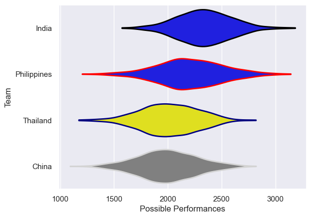

---  
title: "Asia Rugby Championship - D1 2010 Status"  
date: 2025-07-28 6:00:00 -0500  
categories: model review projection  
layout: article  
aside:  
    toc: true  
---
# Current Team Rankings

# Standings

## Current Standings

| Club        |   Played |   Wins |   Point Differential |   Losing Bonus Points | Try Bonus Points   |   Competition Points |
|:------------|---------:|-------:|---------------------:|----------------------:|:-------------------|---------------------:|
| Philippines |        2 |      2 |                   42 |                     0 |                    |                    8 |
| India       |        2 |      1 |                   72 |                     0 |                    |                    4 |
| Thailand    |        2 |      1 |                   33 |                     0 |                    |                    4 |
| China       |        2 |      0 |                 -147 |                     0 |                    |                    0 |

# Completed Match Review

| Model | Percent Correct Predictions | Spread Error |
| ------ | ------ | ------ |
| Club Level | 75.0% | 42.0 |
| Player Level: Lineup | nan% | nan |
| Player Level: Minutes | nan% | nan |

