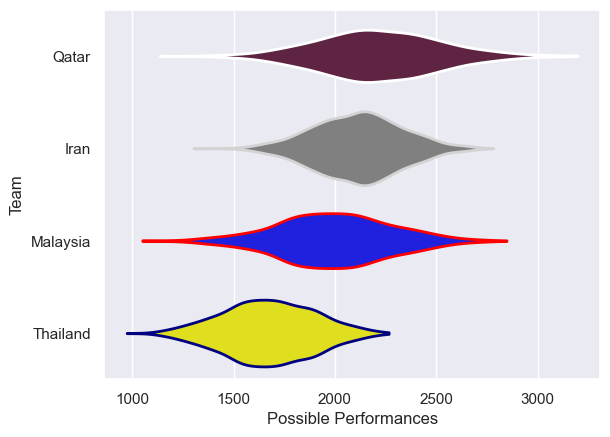

---  
title: "Asia Rugby Championship - D1 2014"  
date: 2025-07-29 6:00:00 -0500  
categories: model review projection  
layout: article  
aside:  
    toc: true  
---
# Current Team Rankings

# Standings

## Current Standings

| Club     |   Played |   Wins |   Point Differential |   Losing Bonus Points | Try Bonus Points   |   Competition Points |
|:---------|---------:|-------:|---------------------:|----------------------:|:-------------------|---------------------:|
| Malaysia |        2 |      2 |                   30 |                     0 |                    |                    8 |
| Qatar    |        2 |      1 |                    4 |                     0 |                    |                    4 |
| Thailand |        1 |      0 |                  -13 |                     0 |                    |                    0 |
| Iran     |        1 |      0 |                  -21 |                     0 |                    |                    0 |

# Completed Match Review

| Model | Percent Correct Predictions | Spread Error |
| ------ | ------ | ------ |
| Club Level | 66.7% | 17.9 |
| Player Level: Lineup | nan% | nan |
| Player Level: Minutes | nan% | nan |

