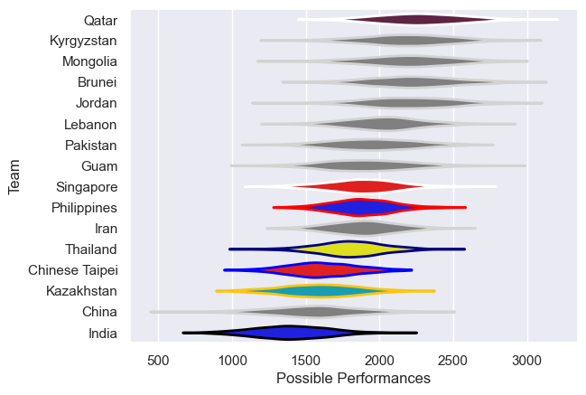

---  
title: "Asia Rugby Championship - D1 2018 Status"  
date: 2025-07-28 6:00:00 -0500  
categories: model review projection  
layout: article  
aside:  
    toc: true  
---
# Current Team Rankings

# Standings

## Current Standings

| Club           |   Played |   Wins |   Point Differential |   Losing Bonus Points | Try Bonus Points   |   Competition Points |
|:---------------|---------:|-------:|---------------------:|----------------------:|:-------------------|---------------------:|
| Kazakhstan     |        2 |      2 |                   97 |                     0 |                    |                    8 |
| Guam           |        2 |      2 |                   94 |                     0 |                    |                    8 |
| Lebanon        |        2 |      2 |                   71 |                     0 |                    |                    8 |
| Chinese Taipei |        2 |      2 |                   46 |                     0 |                    |                    8 |
| Philippines    |        2 |      2 |                   34 |                     0 |                    |                    8 |
| Thailand       |        2 |      1 |                   -1 |                     1 |                    |                    5 |
| Pakistan       |        2 |      1 |                   34 |                     0 |                    |                    4 |
| Qatar          |        2 |      1 |                    5 |                     0 |                    |                    4 |
| Iran           |        2 |      1 |                   -3 |                     0 |                    |                    4 |
| China          |        2 |      1 |                  -19 |                     0 |                    |                    4 |
| India          |        2 |      0 |                  -45 |                     1 |                    |                    1 |
| Singapore      |        2 |      0 |                  -34 |                     0 |                    |                    0 |
| Mongolia       |        1 |      0 |                  -49 |                     0 |                    |                    0 |
| Jordan         |        2 |      0 |                  -73 |                     0 |                    |                    0 |
| Brunei         |        2 |      0 |                  -75 |                     0 |                    |                    0 |
| Kyrgyzstan     |        1 |      0 |                  -82 |                     0 |                    |                    0 |

## Projected Remaining Table

| Club       |   To Play |   Projected Wins |   Projected Differential |   Projected Losing Bonus Points | Projected Try Bonus Points   |   Projected Competition Points |
|:-----------|----------:|-----------------:|-------------------------:|--------------------------------:|:-----------------------------|-------------------------------:|
| Kyrgyzstan |         1 |             0.52 |                     3.99 |                            0.17 |                              |                           2.31 |
| Mongolia   |         1 |             0.45 |                    -3.99 |                            0.15 |                              |                           2.01 |

## Projected Total Table

| Club           |   Played |   Wins |   Point Differential |   Losing Bonus Points | Try Bonus Points   |   Competition Points |
|:---------------|---------:|-------:|---------------------:|----------------------:|:-------------------|---------------------:|
| Kazakhstan     |        2 |   2    |                97    |                  0    |                    |                 8    |
| Guam           |        2 |   2    |                94    |                  0    |                    |                 8    |
| Lebanon        |        2 |   2    |                71    |                  0    |                    |                 8    |
| Chinese Taipei |        2 |   2    |                46    |                  0    |                    |                 8    |
| Philippines    |        2 |   2    |                34    |                  0    |                    |                 8    |
| Thailand       |        2 |   1    |                -1    |                  1    |                    |                 5    |
| Pakistan       |        2 |   1    |                34    |                  0    |                    |                 4    |
| Qatar          |        2 |   1    |                 5    |                  0    |                    |                 4    |
| Iran           |        2 |   1    |                -3    |                  0    |                    |                 4    |
| China          |        2 |   1    |               -19    |                  0    |                    |                 4    |
| Kyrgyzstan     |        2 |   0.52 |               -78.01 |                  0.17 |                    |                 2.31 |
| Mongolia       |        2 |   0.45 |               -52.99 |                  0.15 |                    |                 2.01 |
| India          |        2 |   0    |               -45    |                  1    |                    |                 1    |
| Singapore      |        2 |   0    |               -34    |                  0    |                    |                 0    |
| Jordan         |        2 |   0    |               -73    |                  0    |                    |                 0    |
| Brunei         |        2 |   0    |               -75    |                  0    |                    |                 0    |

# Completed Match Review

| Model | Percent Correct Predictions | Spread Error |
| ------ | ------ | ------ |
| Club Level | 50.0% | 36.3 |
| Player Level: Lineup | nan% | nan |
| Player Level: Minutes | nan% | nan |

# Future Predictions

## Week 3

### Kyrgyzstan V Mongolia on 2018/05/19

Average Margin: Kyrgyzstan by 3.8

