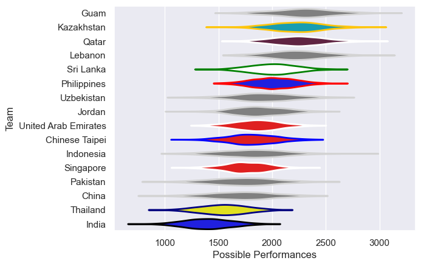

---  
title: "Asia Rugby Championship - D1 2019 Status"  
date: 2025-07-28 6:00:00 -0500  
categories: model review projection  
layout: article  
aside:  
    toc: true  
---
# Current Team Rankings

# Standings

## Current Standings

| Club                 |   Played |   Wins |   Point Differential |   Losing Bonus Points | Try Bonus Points   |   Competition Points |
|:---------------------|---------:|-------:|---------------------:|----------------------:|:-------------------|---------------------:|
| United Arab Emirates |        2 |      2 |                  113 |                     0 |                    |                    8 |
| China                |        2 |      2 |                  110 |                     0 |                    |                    8 |
| Qatar                |        2 |      2 |                   80 |                     0 |                    |                    8 |
| Philippines          |        2 |      2 |                   25 |                     0 |                    |                    8 |
| Lebanon              |        2 |      1 |                   62 |                     1 |                    |                    5 |
| Sri Lanka            |        2 |      1 |                   38 |                     0 |                    |                    4 |
| Pakistan             |        2 |      1 |                   17 |                     0 |                    |                    4 |
| Kazakhstan           |        1 |      1 |                    9 |                     0 |                    |                    4 |
| Singapore            |        2 |      1 |                   -3 |                     0 |                    |                    4 |
| Uzbekistan           |        2 |      1 |                  -17 |                     0 |                    |                    4 |
| India                |        2 |      1 |                  -27 |                     0 |                    |                    4 |
| Chinese Taipei       |        2 |      0 |                  -60 |                     1 |                    |                    1 |
| Thailand             |        1 |      0 |                  -38 |                     0 |                    |                    0 |
| Indonesia            |        2 |      0 |                  -83 |                     0 |                    |                    0 |
| Guam                 |        2 |      0 |                  -84 |                     0 |                    |                    0 |
| Jordan               |        2 |      0 |                 -142 |                     0 |                    |                    0 |

# Completed Match Review

| Model | Percent Correct Predictions | Spread Error |
| ------ | ------ | ------ |
| Club Level | 60.0% | 35.7 |
| Player Level: Lineup | nan% | nan |
| Player Level: Minutes | nan% | nan |

