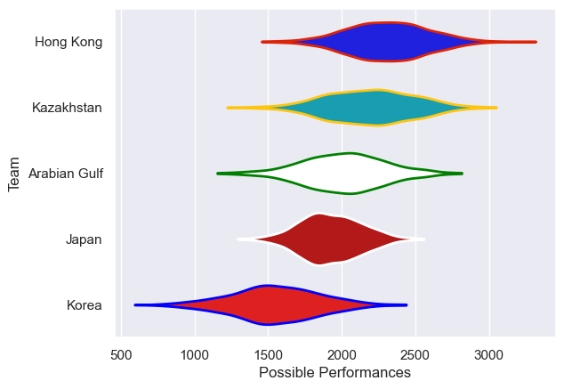

---  
title: "Asia Rugby Championship - Top 3 2008 Status"  
date: 2025-07-28 6:00:00 -0500  
categories: model review projection  
layout: article  
aside:  
    toc: true  
---
# Current Team Rankings

# Standings

## Current Standings

| Club         |   Played |   Wins |   Point Differential |   Losing Bonus Points | Try Bonus Points   |   Competition Points |
|:-------------|---------:|-------:|---------------------:|----------------------:|:-------------------|---------------------:|
| Japan        |        4 |      4 |                  252 |                     0 |                    |                   16 |
| Korea        |        4 |      3 |                   46 |                     0 |                    |                   12 |
| Hong Kong    |        4 |      2 |                  -58 |                     0 |                    |                    8 |
| Kazakhstan   |        4 |      1 |                  -72 |                     1 |                    |                    5 |
| Arabian Gulf |        4 |      0 |                 -168 |                     0 |                    |                    0 |

# Completed Match Review

| Model | Percent Correct Predictions | Spread Error |
| ------ | ------ | ------ |
| Club Level | 30.0% | 51.8 |
| Player Level: Lineup | nan% | nan |
| Player Level: Minutes | nan% | nan |

