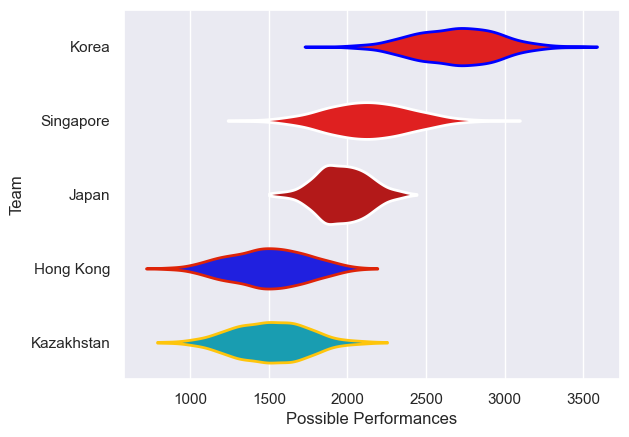

---  
title: "Asia Rugby Championship - Top 3 2009 Status"  
date: 2025-07-28 6:00:00 -0500  
categories: model review projection  
layout: article  
aside:  
    toc: true  
---
# Current Team Rankings

# Standings

## Current Standings

| Club       |   Played |   Wins |   Point Differential |   Losing Bonus Points | Try Bonus Points   |   Competition Points |
|:-----------|---------:|-------:|---------------------:|----------------------:|:-------------------|---------------------:|
| Japan      |        4 |      4 |                  231 |                     0 |                    |                   16 |
| Kazakhstan |        4 |      3 |                  -52 |                     0 |                    |                   12 |
| Korea      |        4 |      2 |                   -7 |                     1 |                    |                    9 |
| Hong Kong  |        4 |      1 |                  -16 |                     1 |                    |                    5 |
| Singapore  |        4 |      0 |                 -156 |                     1 |                    |                    1 |

# Completed Match Review

| Model | Percent Correct Predictions | Spread Error |
| ------ | ------ | ------ |
| Club Level | 50.0% | 53.6 |
| Player Level: Lineup | nan% | nan |
| Player Level: Minutes | nan% | nan |

