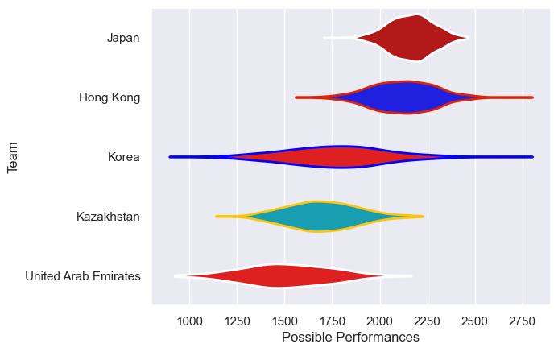

---  
title: "Asia Rugby Championship - Top 3 2012 Status"  
date: 2025-07-28 6:00:00 -0500  
categories: model review projection  
layout: article  
aside:  
    toc: true  
---
# Current Team Rankings

# Standings

## Current Standings

| Club                 |   Played |   Wins |   Point Differential |   Losing Bonus Points | Try Bonus Points   |   Competition Points |
|:---------------------|---------:|-------:|---------------------:|----------------------:|:-------------------|---------------------:|
| Japan                |        4 |      4 |                  301 |                     0 |                    |                   16 |
| Korea                |        4 |      3 |                   54 |                     0 |                    |                   12 |
| Hong Kong            |        4 |      2 |                   61 |                     1 |                    |                    9 |
| United Arab Emirates |        4 |      1 |                 -189 |                     0 |                    |                    4 |
| Kazakhstan           |        4 |      0 |                 -227 |                     0 |                    |                    0 |

# Completed Match Review

| Model | Percent Correct Predictions | Spread Error |
| ------ | ------ | ------ |
| Club Level | 70.0% | 43.4 |
| Player Level: Lineup | nan% | nan |
| Player Level: Minutes | nan% | nan |

