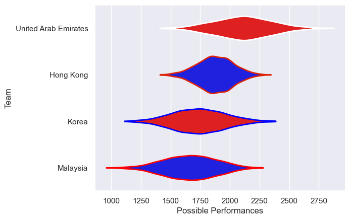

---  
title: "Asia Rugby Championship - Top 3 2024"  
date: 2025-07-29 6:00:00 -0500  
categories: model review projection  
layout: article  
aside:  
    toc: true  
---
# Current Team Rankings

# Standings

## Current Standings

| Club                 |   Played |   Wins |   Point Differential |   Losing Bonus Points | Try Bonus Points   |   Competition Points |
|:---------------------|---------:|-------:|---------------------:|----------------------:|:-------------------|---------------------:|
| Hong Kong            |        2 |      2 |                  124 |                     0 |                    |                    8 |
| United Arab Emirates |        2 |      2 |                   47 |                     0 |                    |                    8 |
| Korea                |        3 |      1 |                  -14 |                     1 |                    |                    5 |
| Malaysia             |        3 |      0 |                 -157 |                     0 |                    |                    0 |

## Projected Remaining Table

| Club                 |   To Play |   Projected Wins |   Projected Differential |   Projected Losing Bonus Points | Projected Try Bonus Points   |   Projected Competition Points |
|:---------------------|----------:|-----------------:|-------------------------:|--------------------------------:|:-----------------------------|-------------------------------:|
| United Arab Emirates |         1 |            0.599 |                    6.235 |                           0.163 |                              |                          2.661 |
| Hong Kong            |         1 |            0.35  |                   -6.235 |                           0.187 |                              |                          1.689 |

## Projected Total Table

| Club                 |   Played |   Wins |   Point Differential |   Losing Bonus Points | Try Bonus Points   |   Competition Points |
|:---------------------|---------:|-------:|---------------------:|----------------------:|:-------------------|---------------------:|
| United Arab Emirates |        3 |  2.599 |               53.235 |                 0.163 |                    |               10.661 |
| Hong Kong            |        3 |  2.35  |              117.765 |                 0.187 |                    |                9.689 |
| Korea                |        3 |  1     |              -14     |                 1     |                    |                5     |
| Malaysia             |        3 |  0     |             -157     |                 0     |                    |                0     |

# Completed Match Review

| Model | Percent Correct Predictions | Spread Error |
| ------ | ------ | ------ |
| Club Level | 100.0% | 31.6 |
| Player Level: Lineup | nan% | nan |
| Player Level: Minutes | nan% | nan |

# Future Predictions

## Week 4

### Hong Kong V United Arab Emirates on 2024/05/31

Average Margin: United Arab Emirates by 6.2

