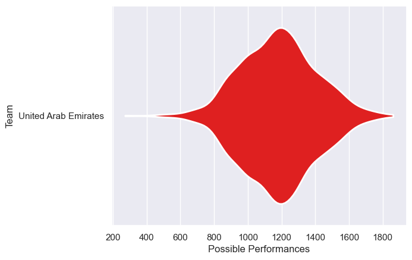
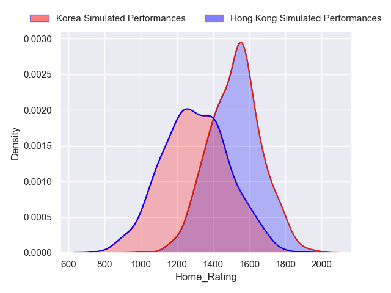
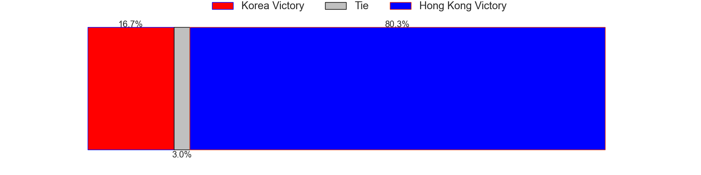
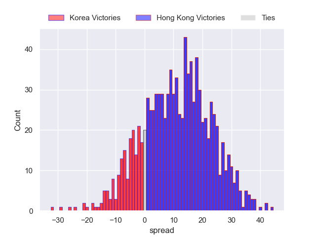

---  
title: "Asia Rugby Championship - Top 3 2024 Status"  
date: 2024-06-21 6:00:00 -0500  
categories: model review projection  
layout: article  
aside:  
    toc: true  
---
# Current Team Rankings

# Standings

## Current Standings

| Club     |   Played |   Wins |   Point Differential |   Losing Bonus Points |   Try Bonus Points |   Competition Points |
|:---------|---------:|-------:|---------------------:|----------------------:|-------------------:|---------------------:|
| Korea    |        1 |      1 |                   50 |                     0 |                nan |                    4 |
| Malaysia |        1 |      0 |                  -50 |                     0 |                nan |                    0 |

## Projected Remaining Table

| Club      |   Matches Remaining |   Wins |   Point Differential |   Losing Bonus Points |   Try Bonus Points |   Competition Points |
|:----------|--------------------:|-------:|---------------------:|----------------------:|-------------------:|---------------------:|
| Hong Kong |                   1 |    0.8 |              10.6555 |                   0.1 |                0.5 |                  3.9 |
| Korea     |                   1 |    0.2 |             -10.6555 |                   0.2 |                0.2 |                  1.1 |

## Projected Total Table

| Club      |   Total Matches |   Wins |   Point Differential |   Losing Bonus Points |   Try Bonus Points |   Competition Points |
|:----------|----------------:|-------:|---------------------:|----------------------:|-------------------:|---------------------:|
| Korea     |               2 |    1.2 |              39.3445 |                   0.2 |                0.2 |                  5.1 |
| Hong Kong |               1 |    0.8 |              10.6555 |                   0.1 |                0.5 |                  3.9 |
| Malaysia  |               1 |    0   |             -50      |                   0   |                0   |                  0   |

# Completed Match Review

| Model | Percent Correct Predictions | Spread Error |
| ------ | ------ | ------ |
| Club Level | 100.0% | 37.0 |
| Player Level: Lineup | nan% | nan |
| Player Level: Minutes | nan% | nan |

# Future Predictions

## Week 2

### Hong Kong V Korea on 2024/06/21

Average Margin: Hong Kong by 10.7

Average Scoreline: 37-26

