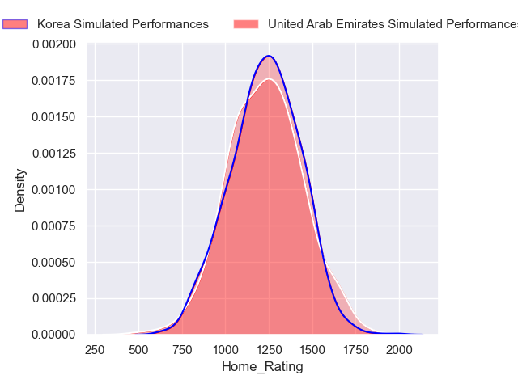
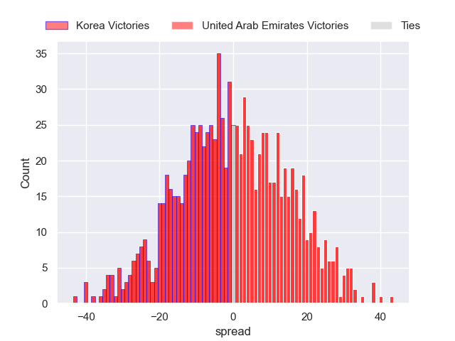

---  
title: "Asia Rugby Championship - Top 3 2024 Status"  
date: 2024-06-03 6:00:00 -0500  
categories: model review projection  
layout: article  
aside:  
    toc: true  
---
# Current Team Rankings

# Standings

## Projected Total Table

| Club                 |   Total Matches |   Wins |   Point Differential |   Losing Bonus Points |   Try Bonus Points |   Competition Points |
|:---------------------|----------------:|-------:|---------------------:|----------------------:|-------------------:|---------------------:|
| Korea                |               1 |    0.5 |            0.0116286 |                   0.2 |                0.4 |                  2.6 |
| United Arab Emirates |               1 |    0.5 |           -0.0116286 |                   0.2 |                0.3 |                  2.4 |

# Future Predictions

## Week 1

### United Arab Emirates V Korea on 2024/06/08

Average Margin: Korea by 0.0

Average Scoreline: 27-27

