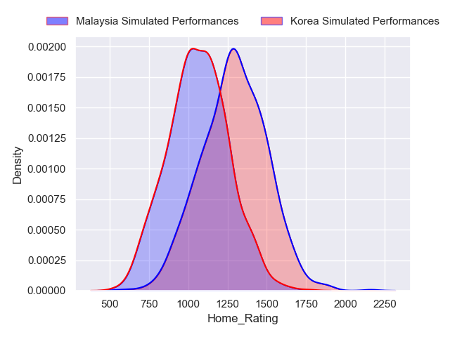
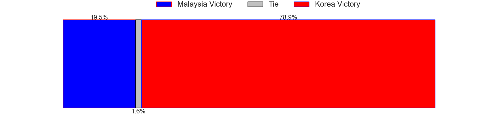
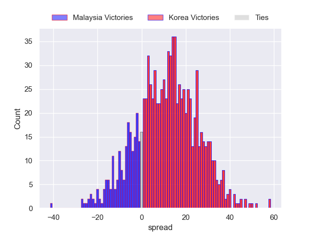

---  
title: "Asia Rugby Championship - Top 3 2024 Status"  
date: 2024-05-27 6:00:00 -0500  
categories: model review projection  
layout: article  
aside:  
    toc: true  
---
# Current Team Rankings

# Standings

## Projected Total Table

| Club     |   Total Matches |   Wins |   Point Differential |   Losing Bonus Points |   Try Bonus Points |   Competition Points |
|:---------|----------------:|-------:|---------------------:|----------------------:|-------------------:|---------------------:|
| Korea    |               1 |    0.8 |              11.3373 |                   0.1 |                0.4 |                  3.7 |
| Malaysia |               1 |    0.2 |             -11.3373 |                   0.2 |                0.2 |                  1.2 |

# Future Predictions

## Week 1

### Korea V Malaysia on 2024/06/01

Average Margin: Korea by 11.3

Average Scoreline: 28-16

