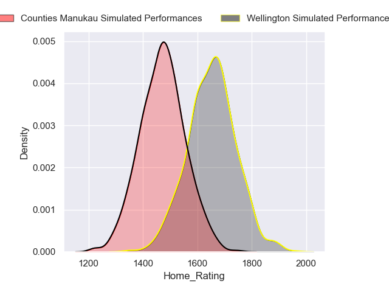
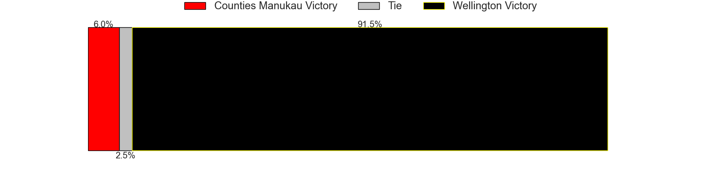
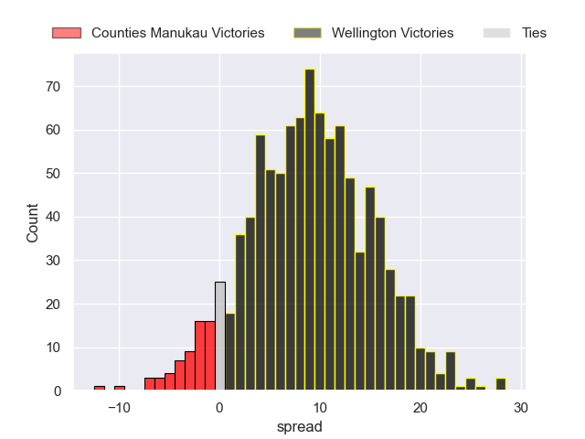
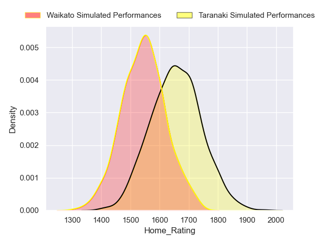
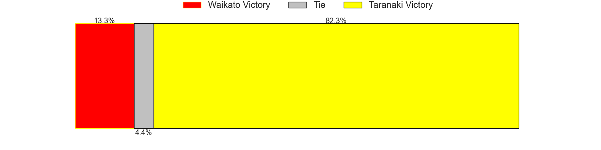
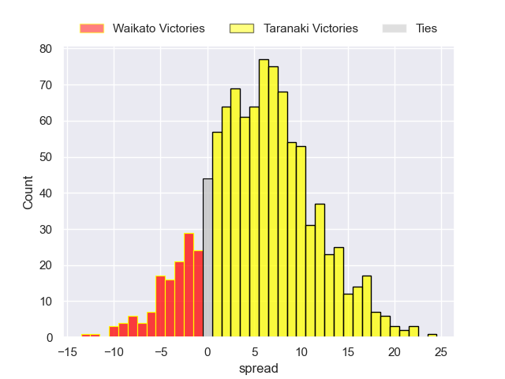
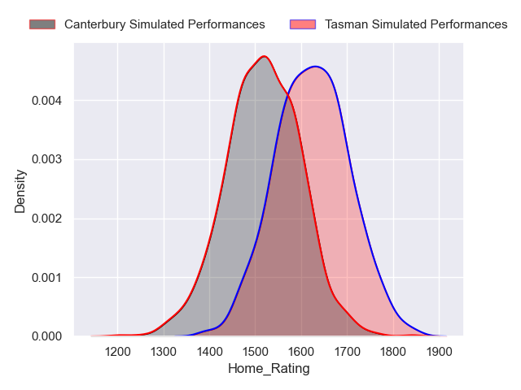
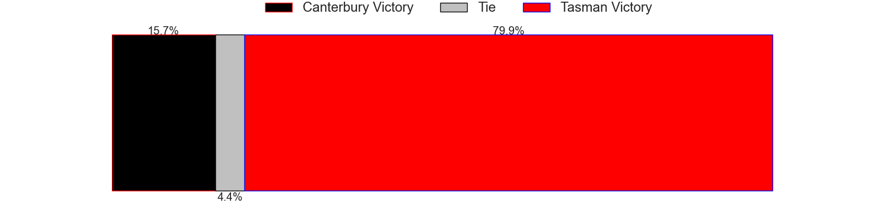
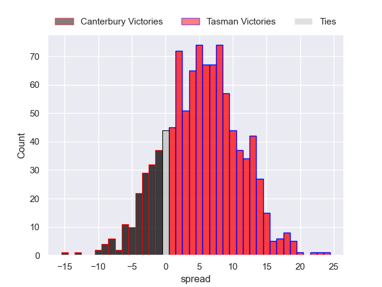

---  
title: "Bunnings NPC 2024 Status"  
date: 2024-10-07 6:00:00 -0500  
categories: model review projection  
layout: article  
aside:  
    toc: true  
---
# Current Team Rankings

# Standings

## Current Standings

| Club             |   Played |   Wins |   Point Differential |   Losing Bonus Points |   Try Bonus Points |   Competition Points |
|:-----------------|---------:|-------:|---------------------:|----------------------:|-------------------:|---------------------:|
| Taranaki         |       10 |      8 |                   86 |                     1 |                nan |                   36 |
| Tasman           |       10 |      8 |                  113 |                     0 |                nan |                   34 |
| Wellington       |       10 |      8 |                   47 |                     0 |                nan |                   33 |
| Bay of Plenty    |       10 |      7 |                  112 |                     2 |                nan |                   32 |
| Canterbury       |       10 |      6 |                  -18 |                     1 |                nan |                   27 |
| Hawke's Bay      |       10 |      6 |                  -41 |                     1 |                nan |                   27 |
| Otago            |       10 |      5 |                  -19 |                     2 |                nan |                   24 |
| Waikato          |       10 |      5 |                   54 |                     2 |                nan |                   23 |
| Counties Manukau |        9 |      4 |                    9 |                     1 |                nan |                   20 |
| Auckland         |       10 |      3 |                  -32 |                     4 |                nan |                   19 |
| North Harbour    |        9 |      3 |                   29 |                     3 |                nan |                   18 |
| Southland        |       10 |      3 |                  -64 |                     1 |                nan |                   14 |
| Northland        |       10 |      2 |                  -79 |                     3 |                nan |                   13 |
| Manawatu         |       10 |      1 |                 -197 |                     1 |                nan |                    7 |

## Projected Remaining Table

| Club             |   Matches Remaining |   Wins |   Point Differential |   Losing Bonus Points |   Try Bonus Points |   Competition Points |
|:-----------------|--------------------:|-------:|---------------------:|----------------------:|-------------------:|---------------------:|
| Wellington       |                   1 |    0.9 |              9.0485  |                   0.1 |                0.5 |                  4.3 |
| Bay of Plenty    |                   1 |    0.9 |              8.0687  |                   0.1 |                0.4 |                  4.1 |
| Taranaki         |                   1 |    0.8 |              5.57766 |                   0.1 |                0.3 |                  3.8 |
| Tasman           |                   1 |    0.8 |              5.30977 |                   0.2 |                0.3 |                  3.7 |
| Canterbury       |                   1 |    0.2 |             -5.30977 |                   0.4 |                0.1 |                  1.3 |
| Waikato          |                   1 |    0.2 |             -5.57766 |                   0.5 |                0.2 |                  1.3 |
| Hawke's Bay      |                   1 |    0.1 |             -8.0687  |                   0.3 |                0.1 |                  0.8 |
| Counties Manukau |                   1 |    0.1 |             -9.0485  |                   0.3 |                0.2 |                  0.8 |

## Projected Total Table

| Club             |   Total Matches |   Wins |   Point Differential |   Losing Bonus Points |   Try Bonus Points |   Competition Points |
|:-----------------|----------------:|-------:|---------------------:|----------------------:|-------------------:|---------------------:|
| Taranaki         |              11 |    8.8 |           91.5777    |                   1.1 |                0.3 |                 39.8 |
| Tasman           |              11 |    8.8 |          118.31      |                   0.2 |                0.3 |                 37.7 |
| Wellington       |              11 |    8.9 |           56.0485    |                   0.1 |                0.5 |                 37.3 |
| Bay of Plenty    |              11 |    7.9 |          120.069     |                   2.1 |                0.4 |                 36.1 |
| Canterbury       |              11 |    6.2 |          -23.3098    |                   1.4 |                0.1 |                 28.3 |
| Hawke's Bay      |              11 |    6.1 |          -49.0687    |                   1.3 |                0.1 |                 27.8 |
| Waikato          |              11 |    5.2 |           48.4223    |                   2.5 |                0.2 |                 24.3 |
| Otago            |              10 |    5   |          -19         |                   2   |                0   |                 24   |
| Counties Manukau |              10 |    4.1 |           -0.0484974 |                   1.3 |                0.2 |                 20.8 |
| Auckland         |              10 |    3   |          -32         |                   4   |                0   |                 19   |
| North Harbour    |               9 |    3   |           29         |                   3   |                0   |                 18   |
| Southland        |              10 |    3   |          -64         |                   1   |                0   |                 14   |
| Northland        |              10 |    2   |          -79         |                   3   |                0   |                 13   |
| Manawatu         |              10 |    1   |         -197         |                   1   |                0   |                  7   |

# Completed Match Review

| Model | Percent Correct Predictions | Spread Error |
| ------ | ------ | ------ |
| Club Level | 72.5% | 12.8 |
| Player Level: Lineup | nan% | nan |
| Player Level: Minutes | nan% | nan |

# Future Predictions

## Week 11

### Wellington V Counties Manukau on 2024/10/11

Average Margin: Wellington by 9.0

Average Scoreline: 38-29

### Bay of Plenty V Hawke's Bay on 2024/10/12

Average Margin: Bay of Plenty by 8.1

Average Scoreline: 34-26

### Taranaki V Waikato on 2024/10/12

Average Margin: Taranaki by 5.6

Average Scoreline: 30-24

### Tasman V Canterbury on 2024/10/13

Average Margin: Tasman by 5.3

Average Scoreline: 28-22

