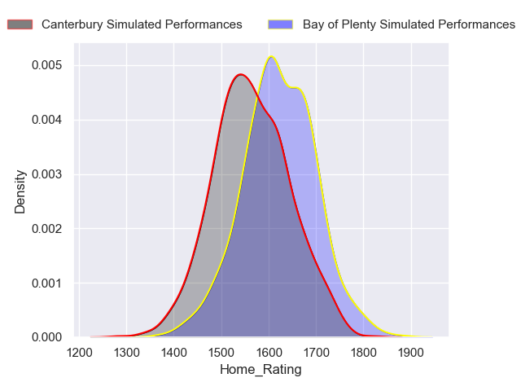
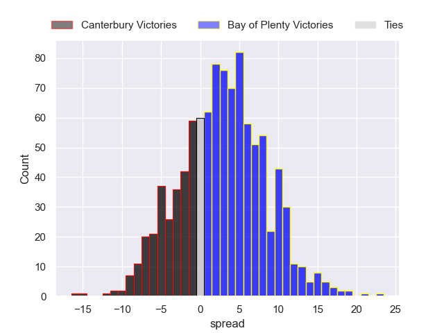
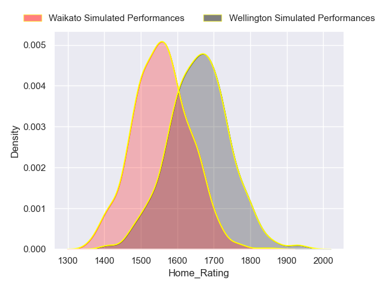
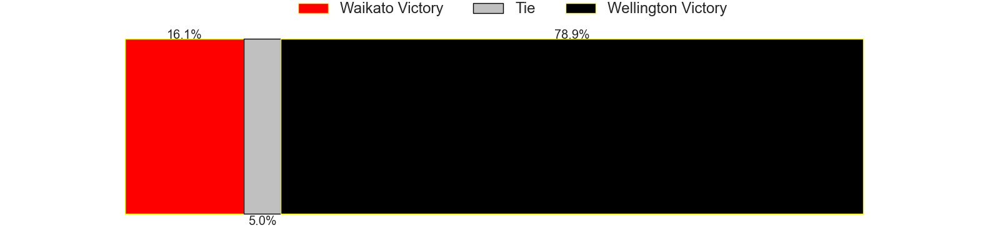
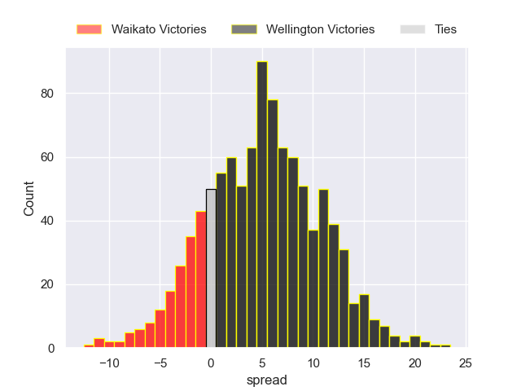

---  
title: "Bunnings NPC 2024 Status"  
date: 2024-10-14 6:00:00 -0500  
categories: model review projection  
layout: article  
aside:  
    toc: true  
---
# Current Team Rankings

# Standings

## Current Standings

| Club             |   Played |   Wins |   Point Differential |   Losing Bonus Points |   Try Bonus Points |   Competition Points |
|:-----------------|---------:|-------:|---------------------:|----------------------:|-------------------:|---------------------:|
| Wellington       |       11 |      9 |                   62 |                     0 |                nan |                   38 |
| Taranaki         |       11 |      8 |                   85 |                     2 |                nan |                   37 |
| Bay of Plenty    |       11 |      8 |                  114 |                     2 |                nan |                   36 |
| Tasman           |       11 |      8 |                   65 |                     0 |                nan |                   34 |
| Canterbury       |       11 |      7 |                   30 |                     1 |                nan |                   32 |
| Hawke's Bay      |       11 |      6 |                  -43 |                     2 |                nan |                   28 |
| Waikato          |       11 |      6 |                   55 |                     2 |                nan |                   27 |
| Otago            |       10 |      5 |                  -19 |                     2 |                nan |                   24 |
| Counties Manukau |       10 |      4 |                   -6 |                     1 |                nan |                   20 |
| Auckland         |       10 |      3 |                  -32 |                     4 |                nan |                   19 |
| North Harbour    |        9 |      3 |                   29 |                     3 |                nan |                   18 |
| Southland        |       10 |      3 |                  -64 |                     1 |                nan |                   14 |
| Northland        |       10 |      2 |                  -79 |                     3 |                nan |                   13 |
| Manawatu         |       10 |      1 |                 -197 |                     1 |                nan |                    7 |

## Projected Remaining Table

| Club          |   Matches Remaining |   Wins |   Point Differential |   Losing Bonus Points |   Try Bonus Points |   Competition Points |
|:--------------|--------------------:|-------:|---------------------:|----------------------:|-------------------:|---------------------:|
| Wellington    |                   1 |    0.8 |              5.14045 |                   0.2 |                0.4 |                  3.9 |
| Bay of Plenty |                   1 |    0.7 |              2.89899 |                   0.3 |                0.3 |                  3.4 |
| Canterbury    |                   1 |    0.3 |             -2.89899 |                   0.5 |                0.4 |                  2   |
| Waikato       |                   1 |    0.2 |             -5.14045 |                   0.5 |                0.4 |                  1.6 |

## Projected Total Table

| Club             |   Total Matches |   Wins |   Point Differential |   Losing Bonus Points |   Try Bonus Points |   Competition Points |
|:-----------------|----------------:|-------:|---------------------:|----------------------:|-------------------:|---------------------:|
| Wellington       |              12 |    9.8 |              67.1404 |                   0.2 |                0.4 |                 41.9 |
| Bay of Plenty    |              12 |    8.7 |             116.899  |                   2.3 |                0.3 |                 39.4 |
| Taranaki         |              11 |    8   |              85      |                   2   |                0   |                 37   |
| Tasman           |              11 |    8   |              65      |                   0   |                0   |                 34   |
| Canterbury       |              12 |    7.3 |              27.101  |                   1.5 |                0.4 |                 34   |
| Waikato          |              12 |    6.2 |              49.8596 |                   2.5 |                0.4 |                 28.6 |
| Hawke's Bay      |              11 |    6   |             -43      |                   2   |                0   |                 28   |
| Otago            |              10 |    5   |             -19      |                   2   |                0   |                 24   |
| Counties Manukau |              10 |    4   |              -6      |                   1   |                0   |                 20   |
| Auckland         |              10 |    3   |             -32      |                   4   |                0   |                 19   |
| North Harbour    |               9 |    3   |              29      |                   3   |                0   |                 18   |
| Southland        |              10 |    3   |             -64      |                   1   |                0   |                 14   |
| Northland        |              10 |    2   |             -79      |                   3   |                0   |                 13   |
| Manawatu         |              10 |    1   |            -197      |                   1   |                0   |                  7   |

# Completed Match Review

| Model | Percent Correct Predictions | Spread Error |
| ------ | ------ | ------ |
| Club Level | 71.2% | 13.1 |
| Player Level: Lineup | nan% | nan |
| Player Level: Minutes | nan% | nan |

# Future Predictions

## Week 12

### Bay of Plenty V Canterbury on 2024/10/19

Average Margin: Bay of Plenty by 2.9

Average Scoreline: 31-28

### Wellington V Waikato on 2024/10/19

Average Margin: Wellington by 5.1

Average Scoreline: 27-22

