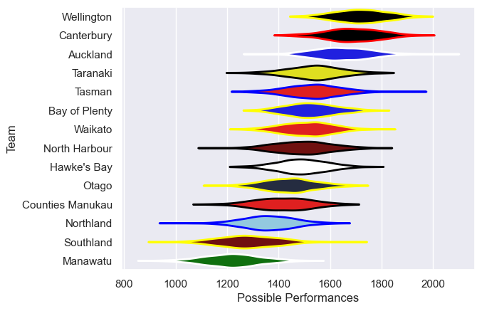

---  
title: "Bunnings Warehouse NPC 2023 Status"  
date: 2023-10-20 6:00:00 -0500  
categories: model review projection  
layout: article  
aside:  
    toc: true  
---
# Current Team Rankings

# Standings

## Current Standings

| Club             |   Played |   Wins |   Point Differential |   Losing Bonus Points |   Try Bonus Points |   Competition Points |
|:-----------------|---------:|-------:|---------------------:|----------------------:|-------------------:|---------------------:|
| Wellington       |       11 |     10 |                  155 |                     1 |                  7 |                   48 |
| Taranaki         |       11 |      8 |                   99 |                     2 |                  9 |                   43 |
| Canterbury       |       11 |      7 |                   86 |                     4 |                 10 |                   42 |
| Hawke's Bay      |       11 |      8 |                   50 |                     1 |                  6 |                   39 |
| Bay of Plenty    |       11 |      7 |                   34 |                     1 |                  7 |                   36 |
| Auckland         |       11 |      6 |                   43 |                     3 |                  8 |                   35 |
| Waikato          |       11 |      5 |                   25 |                     3 |                  8 |                   31 |
| Tasman           |       11 |      6 |                    8 |                     2 |                  5 |                   31 |
| Counties Manukau |       10 |      4 |                  -36 |                     1 |                  7 |                   24 |
| North Harbour    |       10 |      4 |                  -23 |                     3 |                  3 |                   22 |
| Otago            |       10 |      3 |                  -81 |                     2 |                  4 |                   18 |
| Northland        |       10 |      2 |                  -39 |                     3 |                  4 |                   17 |
| Manawatu         |       10 |      2 |                 -225 |                     0 |                  4 |                   12 |
| Southland        |       10 |      1 |                  -96 |                     1 |                  2 |                    9 |

## Projected Remaining Table

| Club        |   Matches Remaining |   Wins |   Point Differential |   Losing Bonus Points |   Try Bonus Points |   Competition Points |
|:------------|--------------------:|-------:|---------------------:|----------------------:|-------------------:|---------------------:|
| Taranaki    |                   1 |    0.9 |                  6.6 |                   0.1 |                0.8 |                  4.4 |
| Hawke's Bay |                   1 |    0.1 |                 -6.6 |                   0.4 |                0.1 |                  1   |

## Projected Total Table

| Club             |   Total Matches |   Wins |   Point Differential |   Losing Bonus Points |   Try Bonus Points |   Competition Points |
|:-----------------|----------------:|-------:|---------------------:|----------------------:|-------------------:|---------------------:|
| Wellington       |              11 |   10   |                155   |                   1   |                7   |                 48   |
| Taranaki         |              12 |    8.9 |                105.6 |                   2.1 |                9.8 |                 47.4 |
| Canterbury       |              11 |    7   |                 86   |                   4   |               10   |                 42   |
| Hawke's Bay      |              12 |    8.1 |                 43.4 |                   1.4 |                6.1 |                 40   |
| Bay of Plenty    |              11 |    7   |                 34   |                   1   |                7   |                 36   |
| Auckland         |              11 |    6   |                 43   |                   3   |                8   |                 35   |
| Waikato          |              11 |    5   |                 25   |                   3   |                8   |                 31   |
| Tasman           |              11 |    6   |                  8   |                   2   |                5   |                 31   |
| Counties Manukau |              10 |    4   |                -36   |                   1   |                7   |                 24   |
| North Harbour    |              10 |    4   |                -23   |                   3   |                3   |                 22   |
| Otago            |              10 |    3   |                -81   |                   2   |                4   |                 18   |
| Northland        |              10 |    2   |                -39   |                   3   |                4   |                 17   |
| Manawatu         |              10 |    2   |               -225   |                   0   |                4   |                 12   |
| Southland        |              10 |    1   |                -96   |                   1   |                2   |                  9   |

# Completed Match Review

| Model | Percent Correct Predictions | Spread Error |
| ------ | ------ | ------ |
| Club Level | 71.6% | 12.2 |
| Player Level: Lineup | 70.3% | 11.8 |
| Player Level: Minutes | 66.2% | 11.9 |

# Future Predictions

## Week 12

### Taranaki V Hawke's Bay on 2023/10/20

Average Margin: Taranaki by 6.9

