---  
title: "Bunnings Warehouse NPC 2023 Status"  
date: 2023-08-13 6:00:00 -0500  
categories: model review projection  
layout: article  
aside:  
    toc: true  
---
# Current Team Rankings

# Standings

## Current Standings

| Club             |   Played |   Wins |   Point Differential |   Losing Bonus Points |   Try Bonus Points |   Competition Points |
|:-----------------|---------:|-------:|---------------------:|----------------------:|-------------------:|---------------------:|
| Taranaki         |        3 |      3 |                   32 |                     0 |                  3 |                   15 |
| Canterbury       |        2 |      2 |                   36 |                     0 |                  2 |                   10 |
| Tasman           |        2 |      2 |                   24 |                     0 |                  1 |                    9 |
| Wellington       |        2 |      2 |                   39 |                     0 |                  0 |                    8 |
| Hawke's Bay      |        2 |      2 |                    3 |                     0 |                  0 |                    8 |
| Waikato          |        2 |      1 |                    4 |                     1 |                  1 |                    6 |
| Bay of Plenty    |        2 |      1 |                    2 |                     1 |                  0 |                    5 |
| Auckland         |        2 |      1 |                  -10 |                     0 |                  1 |                    5 |
| North Harbour    |        2 |      0 |                   -6 |                     2 |                  0 |                    2 |
| Southland        |        2 |      0 |                   -8 |                     0 |                  0 |                    2 |
| Counties Manukau |        2 |      0 |                   -9 |                     1 |                  1 |                    2 |
| Northland        |        3 |      0 |                  -47 |                     0 |                  0 |                    2 |
| Manawatu         |        2 |      0 |                  -25 |                     0 |                  0 |                    0 |
| Otago            |        2 |      0 |                  -35 |                     0 |                  0 |                    0 |

## Projected Remaining Table

| Club             |   Matches Remaining |   Wins |   Point Differential |   Losing Bonus Points |   Try Bonus Points |   Competition Points |
|:-----------------|--------------------:|-------:|---------------------:|----------------------:|-------------------:|---------------------:|
| Canterbury       |                   8 |    7.1 |                109   |                   0.7 |                7   |                 36.2 |
| Wellington       |                   8 |    6.5 |                 81.8 |                   1   |                6.4 |                 33.5 |
| Bay of Plenty    |                   8 |    5.7 |                 41.6 |                   1.5 |                5.5 |                 29.9 |
| North Harbour    |                   8 |    5.5 |                 44.3 |                   1.3 |                5.4 |                 28.8 |
| Hawke's Bay      |                   8 |    5.2 |                 33.5 |                   1.4 |                5   |                 27.2 |
| Auckland         |                   8 |    5.1 |                 36.9 |                   1.6 |                4.9 |                 26.8 |
| Tasman           |                   8 |    4.3 |                 15.6 |                   1.6 |                4.2 |                 22.9 |
| Waikato          |                   8 |    4.1 |                 10.3 |                   2.2 |                4   |                 22.7 |
| Otago            |                   8 |    3.6 |                 -9   |                   1.6 |                3.5 |                 19.6 |
| Taranaki         |                   7 |    2.5 |                -24.4 |                   2.1 |                2.3 |                 14.5 |
| Counties Manukau |                   8 |    2.2 |                -57.1 |                   1.3 |                2.1 |                 12.2 |
| Northland        |                   7 |    1.2 |                -61.1 |                   1.7 |                1.1 |                  7.5 |
| Southland        |                   8 |    1   |               -101.4 |                   1.6 |                1   |                  6.7 |
| Manawatu         |                   8 |    1   |               -120.6 |                   1.1 |                1   |                  6   |

## Projected Total Table

| Club             |   Total Matches |   Wins |   Point Differential |   Losing Bonus Points |   Try Bonus Points |   Competition Points |
|:-----------------|----------------:|-------:|---------------------:|----------------------:|-------------------:|---------------------:|
| Canterbury       |              10 |    9.1 |                145   |                   0.7 |                9   |                 46.2 |
| Wellington       |              10 |    8.5 |                120.8 |                   1   |                6.4 |                 41.5 |
| Hawke's Bay      |              10 |    7.2 |                 36.5 |                   1.4 |                5   |                 35.2 |
| Bay of Plenty    |              10 |    6.7 |                 43.6 |                   2.5 |                5.5 |                 34.9 |
| Tasman           |              10 |    6.3 |                 39.6 |                   1.6 |                5.2 |                 31.9 |
| Auckland         |              10 |    6.1 |                 26.9 |                   1.6 |                5.9 |                 31.8 |
| North Harbour    |              10 |    5.5 |                 38.3 |                   3.3 |                5.4 |                 30.8 |
| Taranaki         |              10 |    5.5 |                  7.6 |                   2.1 |                5.3 |                 29.5 |
| Waikato          |              10 |    5.1 |                 14.3 |                   3.2 |                5   |                 28.7 |
| Otago            |              10 |    3.6 |                -44   |                   1.6 |                3.5 |                 19.6 |
| Counties Manukau |              10 |    2.2 |                -66.1 |                   2.3 |                3.1 |                 14.2 |
| Northland        |              10 |    1.2 |               -108.1 |                   1.7 |                1.1 |                  9.5 |
| Southland        |              10 |    1   |               -109.4 |                   1.6 |                1   |                  8.7 |
| Manawatu         |              10 |    1   |               -145.6 |                   1.1 |                1   |                  6   |

# Completed Match Review

| Model | Percent Correct Predictions | Spread Error |
| ------ | ------ | ------ |
| Club Level | 73.3% | 8.2 |
| Player Level: Lineup | 60.0% | 11.8 |
| Player Level: Minutes | 53.3% | 12.1 |

# Future Predictions

## Week 4

### Hawke's Bay V Waikato on 2023/08/16

Average Margin: Hawke's Bay by 2.1

### Counties Manukau V Bay of Plenty on 2023/08/18

Average Margin: Bay of Plenty by 7.9

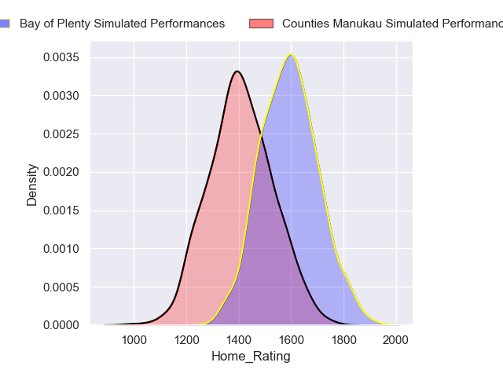
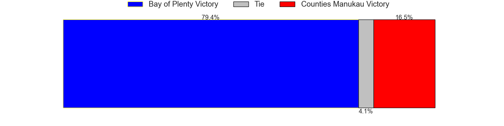
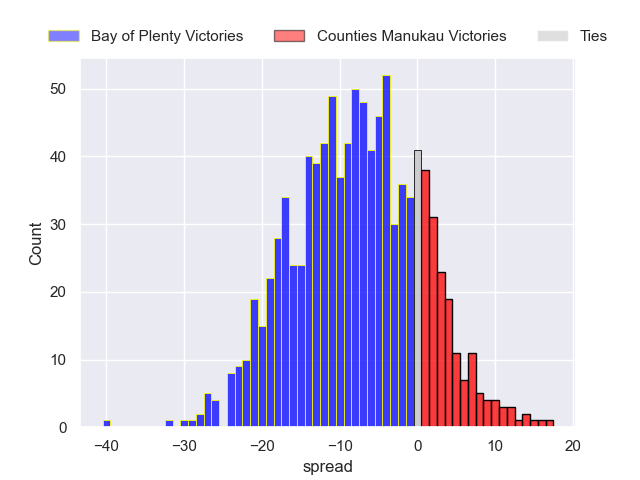

### Northland V Tasman on 2023/08/19

Average Margin: Tasman by 7.9

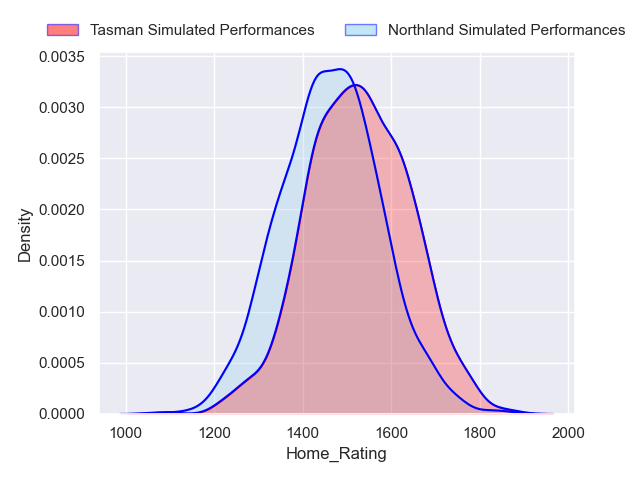
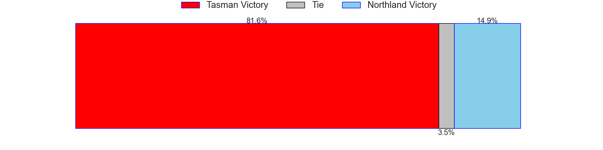
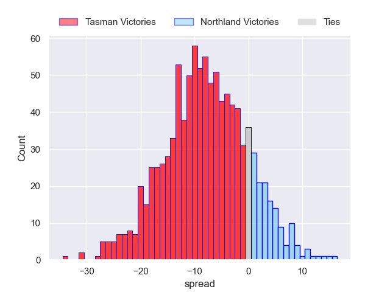

### Wellington V Southland on 2023/08/19

Average Margin: Wellington by 25.4

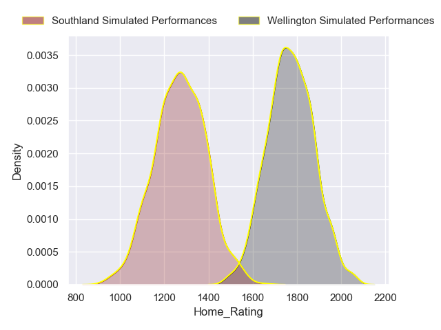

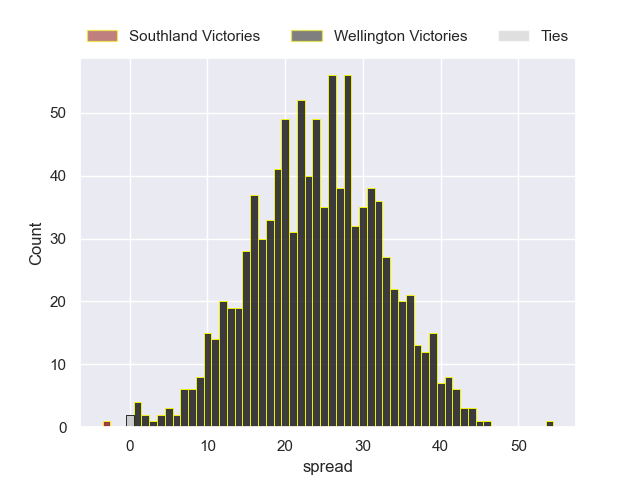

### North Harbour V Auckland on 2023/08/19

Average Margin: North Harbour by 6.1

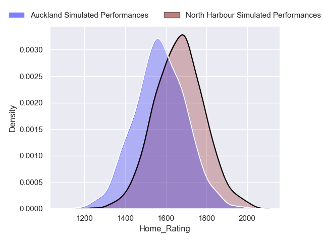
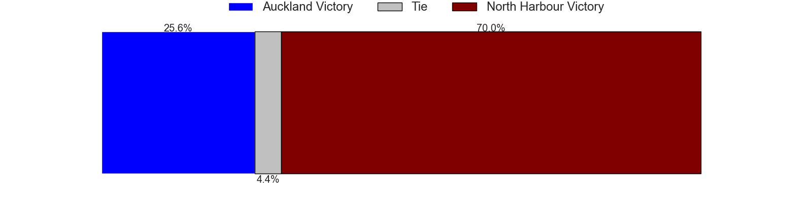
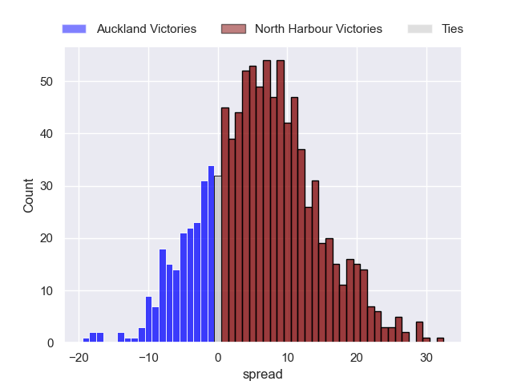

### Canterbury V Manawatu on 2023/08/19

Average Margin: Canterbury by 29.5

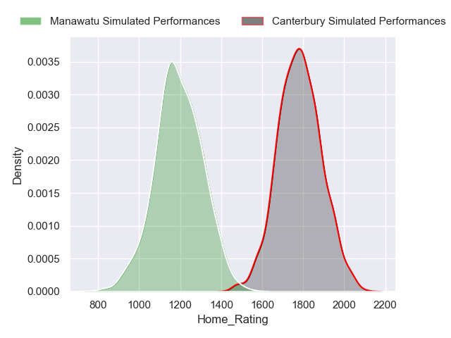
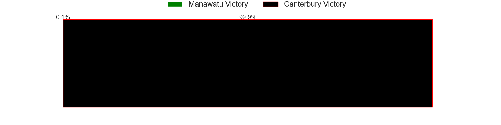
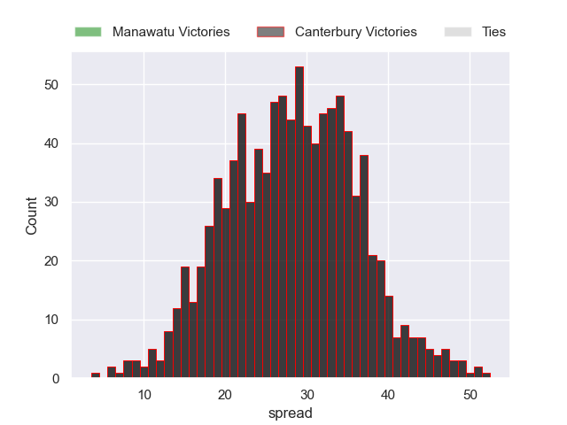

### Waikato V Taranaki on 2023/08/20

Average Margin: Waikato by 6.8

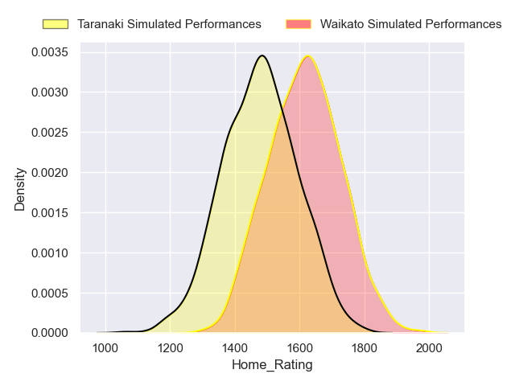
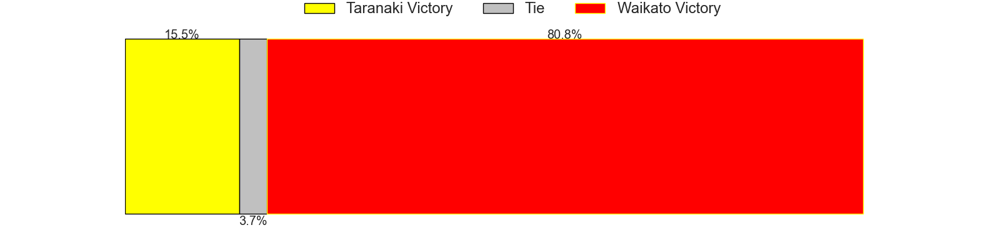
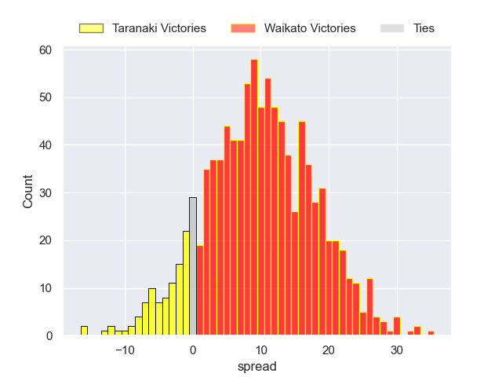

### Hawke's Bay V Otago on 2023/08/20

Average Margin: Hawke's Bay by 8.6

## Week 5

### Wellington V Tasman on 2023/08/23

Average Margin: Wellington by 11.5

### Manawatu V Northland on 2023/08/25

Average Margin: Northland by 2.7

### Auckland V Hawke's Bay on 2023/08/26

Average Margin: Auckland by 3.5

### Taranaki V Bay of Plenty on 2023/08/26

Average Margin: Bay of Plenty by 1.4

### Otago V Southland on 2023/08/26

Average Margin: Otago by 12.1

### Tasman V North Harbour on 2023/08/27

Average Margin: Tasman by 1.9

### Waikato V Counties Manukau on 2023/08/27

Average Margin: Waikato by 13.5

### Canterbury V Wellington on 2023/08/27

Average Margin: Canterbury by 4.0

## Week 6

### Auckland V Manawatu on 2023/08/30

Average Margin: Auckland by 20.2

### Northland V Hawke's Bay on 2023/09/01

Average Margin: Hawke's Bay by 7.4

### Canterbury V Taranaki on 2023/09/02

Average Margin: Canterbury by 14.5

### North Harbour V Waikato on 2023/09/02

Average Margin: North Harbour by 5.0

### Wellington V Counties Manukau on 2023/09/02

Average Margin: Wellington by 20.6

### Bay of Plenty V Otago on 2023/09/02

Average Margin: Bay of Plenty by 10.6

### Tasman V Manawatu on 2023/09/03

Average Margin: Tasman by 21.0

### Southland V Auckland on 2023/09/03

Average Margin: Auckland by 9.4

## Week 7

### North Harbour V Otago on 2023/09/06

Average Margin: North Harbour by 10.9

### Waikato V Wellington on 2023/09/08

Average Margin: Wellington by 4.4

### Auckland V Canterbury on 2023/09/09

Average Margin: Canterbury by 5.6

### Counties Manukau V Southland on 2023/09/09

Average Margin: Counties Manukau by 7.8

### Hawke's Bay V Bay of Plenty on 2023/09/09

Average Margin: Hawke's Bay by 1.1

### Otago V Northland on 2023/09/10

Average Margin: Otago by 9.4

### Taranaki V Tasman on 2023/09/10

Average Margin: Tasman by 0.0

### Manawatu V North Harbour on 2023/09/10

Average Margin: North Harbour by 16.2

## Week 8

### Counties Manukau V Canterbury on 2023/09/13

Average Margin: Canterbury by 14.0

### Hawke's Bay V Manawatu on 2023/09/15

Average Margin: Hawke's Bay by 20.2

### Auckland V Waikato on 2023/09/16

Average Margin: Auckland by 2.7

### North Harbour V Northland on 2023/09/16

Average Margin: North Harbour by 16.3

### Otago V Taranaki on 2023/09/16

Average Margin: Otago by 1.2

### Bay of Plenty V Wellington on 2023/09/17

Average Margin: Wellington by 3.0

### Canterbury V Southland on 2023/09/17

Average Margin: Canterbury by 25.5

### Tasman V Counties Manukau on 2023/09/17

Average Margin: Tasman by 13.0

## Week 9

### Northland V Bay of Plenty on 2023/09/22

Average Margin: Bay of Plenty by 9.2

### Counties Manukau V Manawatu on 2023/09/23

Average Margin: Counties Manukau by 11.0

### Taranaki V Auckland on 2023/09/23

Average Margin: Taranaki by 0.9

### Southland V Hawke's Bay on 2023/09/23

Average Margin: Hawke's Bay by 9.8

### Canterbury V Tasman on 2023/09/23

Average Margin: Canterbury by 11.6

### Wellington V North Harbour on 2023/09/24

Average Margin: Wellington by 9.6

### Waikato V Otago on 2023/09/24

Average Margin: Waikato by 9.1

## Week 10

### Southland V Bay of Plenty on 2023/09/27

Average Margin: Bay of Plenty by 12.3

### Auckland V Northland on 2023/09/29

Average Margin: Auckland by 14.2

### Waikato V Canterbury on 2023/09/30

Average Margin: Canterbury by 4.8

### Wellington V Hawke's Bay on 2023/09/30

Average Margin: Wellington by 11.8

### Taranaki V North Harbour on 2023/09/30

Average Margin: North Harbour by 1.8

### Bay of Plenty V Tasman on 2023/10/01

Average Margin: Bay of Plenty by 4.7

### Otago V Counties Manukau on 2023/10/01

Average Margin: Otago by 7.4

### Manawatu V Southland on 2023/10/01

Average Margin: Southland by 0.4

