---  
title: "Bunnings Warehouse NPC 2023 Status"  
date: 2023-08-09 6:00:00 -0500  
categories: model review projection  
layout: article  
aside:  
    toc: true  
---
# Current Team Rankings

# Standings

## Current Standings

| Club             |   Played |   Wins |   Point Differential |   Losing Bonus Points |   Try Bonus Points |   Competition Points |
|:-----------------|---------:|-------:|---------------------:|----------------------:|-------------------:|---------------------:|
| Taranaki         |        2 |      2 |                   23 |                     0 |                  2 |                   10 |
| Canterbury       |        1 |      1 |                   32 |                     0 |                  1 |                    5 |
| Waikato          |        1 |      1 |                    8 |                     0 |                  1 |                    5 |
| Auckland         |        1 |      1 |                    2 |                     0 |                  1 |                    5 |
| Wellington       |        1 |      1 |                   16 |                     0 |                  0 |                    4 |
| Tasman           |        1 |      1 |                   12 |                     0 |                  0 |                    4 |
| Hawke's Bay      |        1 |      1 |                    2 |                     0 |                  0 |                    4 |
| Bay of Plenty    |        1 |      0 |                   -2 |                     1 |                  0 |                    1 |
| North Harbour    |        1 |      0 |                   -2 |                     1 |                  0 |                    1 |
| Counties Manukau |        1 |      0 |                   -8 |                     0 |                  1 |                    1 |
| Southland        |        1 |      0 |                   -8 |                     0 |                  0 |                    0 |
| Otago            |        1 |      0 |                  -12 |                     0 |                  0 |                    0 |
| Manawatu         |        1 |      0 |                  -16 |                     0 |                  0 |                    0 |
| Northland        |        2 |      0 |                  -47 |                     0 |                  0 |                    0 |

## Projected Remaining Table

| Club             |   Matches Remaining |   Wins |   Point Differential |   Losing Bonus Points |   Try Bonus Points |   Competition Points |
|:-----------------|--------------------:|-------:|---------------------:|----------------------:|-------------------:|---------------------:|
| Canterbury       |                   9 |    7.6 |                108.4 |                   1.1 |                7.4 |                 38.8 |
| Wellington       |                   9 |    6.9 |                 77   |                   1.4 |                6.7 |                 35.7 |
| Bay of Plenty    |                   9 |    6.7 |                 54   |                   1.6 |                6.5 |                 35.1 |
| North Harbour    |                   9 |    6.1 |                 48   |                   1.7 |                5.9 |                 32.1 |
| Auckland         |                   9 |    6   |                 51.4 |                   1.8 |                5.8 |                 31.7 |
| Hawke's Bay      |                   9 |    6   |                 44.7 |                   1.6 |                5.9 |                 31.6 |
| Tasman           |                   9 |    4.5 |                  6.8 |                   1.9 |                4.3 |                 24.3 |
| Otago            |                   9 |    4.3 |                  0.5 |                   1.9 |                4.1 |                 23.1 |
| Waikato          |                   9 |    4.2 |                 -1.2 |                   2.4 |                4   |                 23.1 |
| Taranaki         |                   8 |    3.2 |                -20   |                   2.2 |                3   |                 17.9 |
| Counties Manukau |                   9 |    2.3 |                -69.6 |                   1.5 |                2.1 |                 12.7 |
| Northland        |                   8 |    1.7 |                -62.6 |                   1.9 |                1.6 |                 10.5 |
| Southland        |                   9 |    1.2 |               -114   |                   1.7 |                1.2 |                  7.8 |
| Manawatu         |                   9 |    1.2 |               -124   |                   1.4 |                1.2 |                  7.5 |

## Projected Total Table

| Club             |   Total Matches |   Wins |   Point Differential |   Losing Bonus Points |   Try Bonus Points |   Competition Points |
|:-----------------|----------------:|-------:|---------------------:|----------------------:|-------------------:|---------------------:|
| Canterbury       |              10 |    8.6 |                140.4 |                   1.1 |                8.4 |                 43.8 |
| Wellington       |              10 |    7.9 |                 93   |                   1.4 |                6.7 |                 39.7 |
| Auckland         |              10 |    7   |                 53.4 |                   1.8 |                6.8 |                 36.7 |
| Bay of Plenty    |              10 |    6.7 |                 52   |                   2.6 |                6.5 |                 36.1 |
| Hawke's Bay      |              10 |    7   |                 46.7 |                   1.6 |                5.9 |                 35.6 |
| North Harbour    |              10 |    6.1 |                 46   |                   2.7 |                5.9 |                 33.1 |
| Tasman           |              10 |    5.5 |                 18.8 |                   1.9 |                4.3 |                 28.3 |
| Waikato          |              10 |    5.2 |                  6.8 |                   2.4 |                5   |                 28.1 |
| Taranaki         |              10 |    5.2 |                  3   |                   2.2 |                5   |                 27.9 |
| Otago            |              10 |    4.3 |                -11.5 |                   1.9 |                4.1 |                 23.1 |
| Counties Manukau |              10 |    2.3 |                -77.6 |                   1.5 |                3.1 |                 13.7 |
| Northland        |              10 |    1.7 |               -109.6 |                   1.9 |                1.6 |                 10.5 |
| Southland        |              10 |    1.2 |               -122   |                   1.7 |                1.2 |                  7.8 |
| Manawatu         |              10 |    1.2 |               -140   |                   1.4 |                1.2 |                  7.5 |

# Completed Match Review

| Model | Percent Correct Predictions | Spread Error |
| ------ | ------ | ------ |
| Club Level | 75.0% | 9.0 |
| Player Level: Lineup | 75.0% | 10.3 |
| Player Level: Minutes | 75.0% | 9.9 |

# Future Predictions

## Week 3

### Counties Manukau V Hawke's Bay on 2023/08/11

Average Margin: Hawke's Bay by 7.6

### Bay of Plenty V Waikato on 2023/08/12

Average Margin: Bay of Plenty by 6.0

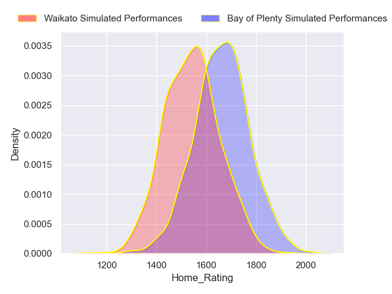
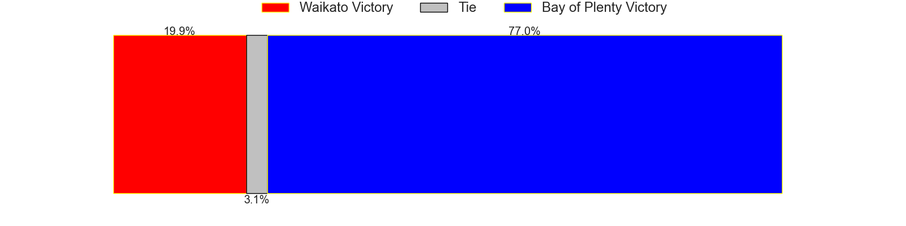
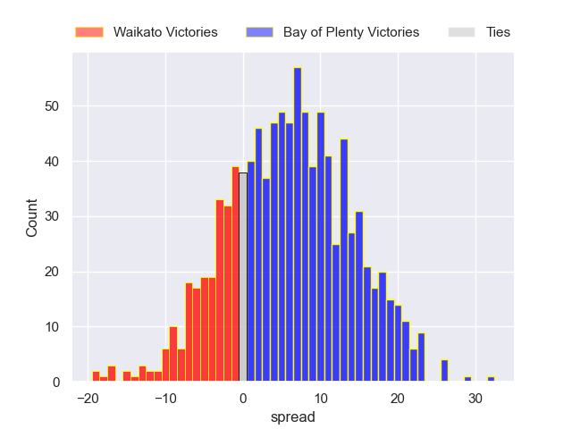

### Otago V Wellington on 2023/08/12

Average Margin: Wellington by 6.1

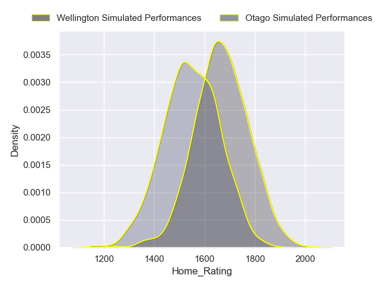
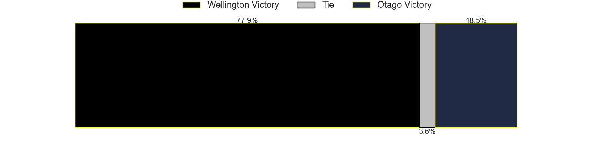
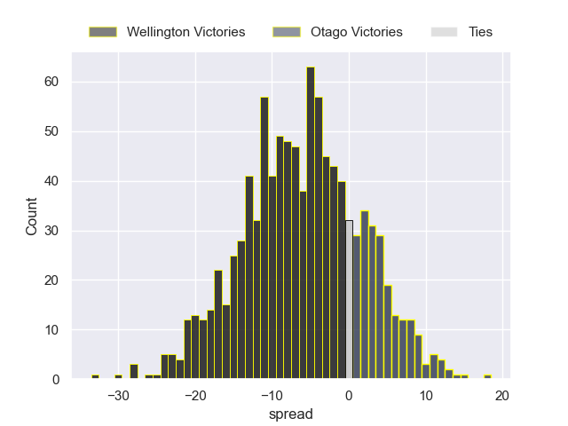

### Tasman V Auckland on 2023/08/12

Average Margin: Tasman by 0.8

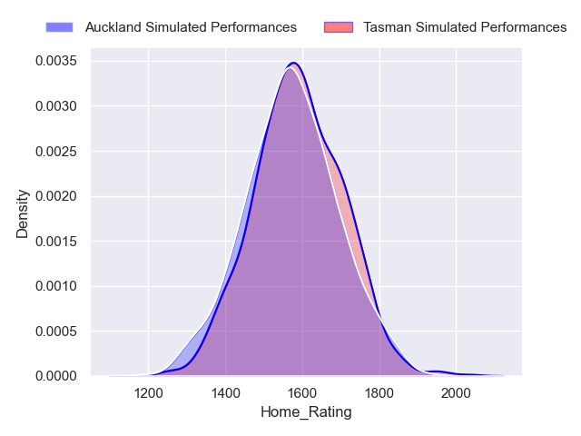

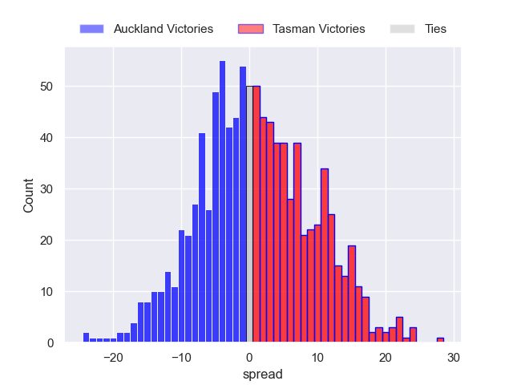

### Manawatu V Taranaki on 2023/08/13

Average Margin: Taranaki by 9.9

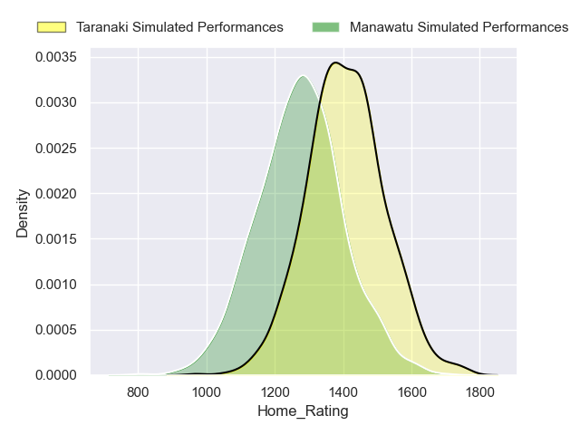
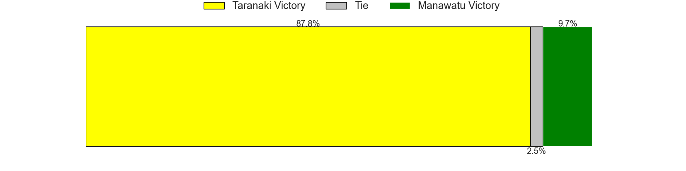
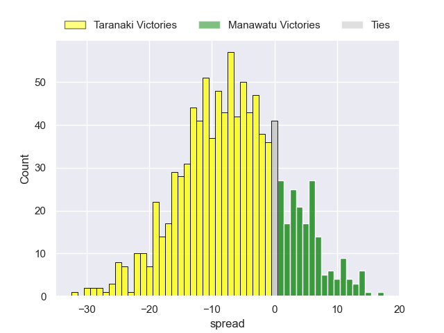

### Southland V Northland on 2023/08/13

Average Margin: Northland by 1.1

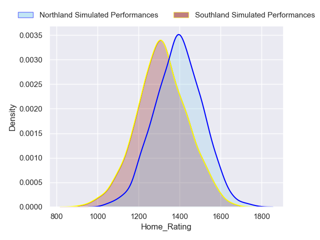
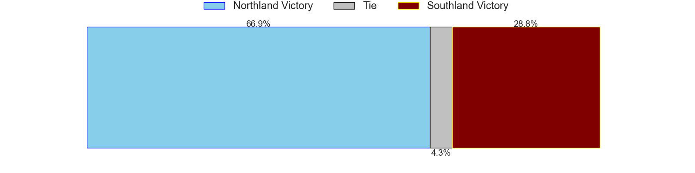
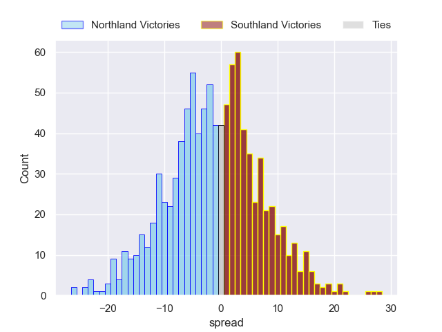

### North Harbour V Canterbury on 2023/08/13

Average Margin: Canterbury by 1.7

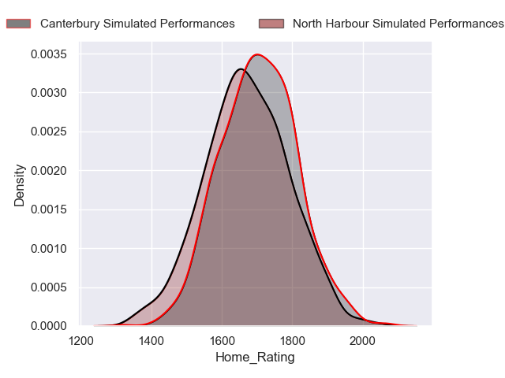

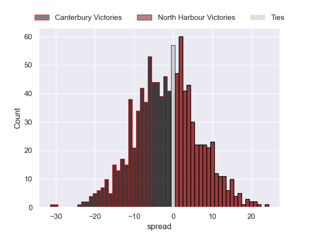

## Week 4

### Hawke's Bay V Waikato on 2023/08/16

Average Margin: Hawke's Bay by 3.7

### Counties Manukau V Bay of Plenty on 2023/08/18

Average Margin: Bay of Plenty by 9.7

### Wellington V Southland on 2023/08/19

Average Margin: Wellington by 25.3

### Canterbury V Manawatu on 2023/08/19

Average Margin: Canterbury by 28.1

### North Harbour V Auckland on 2023/08/19

Average Margin: North Harbour by 4.7

### Northland V Tasman on 2023/08/19

Average Margin: Tasman by 6.4

### Waikato V Taranaki on 2023/08/20

Average Margin: Waikato by 6.9

### Hawke's Bay V Otago on 2023/08/20

Average Margin: Hawke's Bay by 7.7

## Week 5

### Wellington V Tasman on 2023/08/23

Average Margin: Wellington by 10.9

### Manawatu V Northland on 2023/08/25

Average Margin: Northland by 2.5

### Otago V Southland on 2023/08/26

Average Margin: Otago by 15.0

### Taranaki V Bay of Plenty on 2023/08/26

Average Margin: Bay of Plenty by 2.4

### Auckland V Hawke's Bay on 2023/08/26

Average Margin: Auckland by 4.7

### Tasman V North Harbour on 2023/08/27

Average Margin: North Harbour by 0.7

### Canterbury V Wellington on 2023/08/27

Average Margin: Canterbury by 4.9

### Waikato V Counties Manukau on 2023/08/27

Average Margin: Waikato by 13.8

## Week 6

### Auckland V Manawatu on 2023/08/30

Average Margin: Auckland by 21.2

### Northland V Hawke's Bay on 2023/09/01

Average Margin: Hawke's Bay by 7.5

### Bay of Plenty V Otago on 2023/09/02

Average Margin: Bay of Plenty by 9.1

### Canterbury V Taranaki on 2023/09/02

Average Margin: Canterbury by 14.3

### North Harbour V Waikato on 2023/09/02

Average Margin: North Harbour by 6.4

### Wellington V Counties Manukau on 2023/09/02

Average Margin: Wellington by 19.8

### Southland V Auckland on 2023/09/03

Average Margin: Auckland by 12.9

### Tasman V Manawatu on 2023/09/03

Average Margin: Tasman by 18.4

## Week 7

### North Harbour V Otago on 2023/09/06

Average Margin: North Harbour by 9.5

### Waikato V Wellington on 2023/09/08

Average Margin: Wellington by 3.1

### Counties Manukau V Southland on 2023/09/09

Average Margin: Counties Manukau by 7.7

### Hawke's Bay V Bay of Plenty on 2023/09/09

Average Margin: Hawke's Bay by 1.2

### Auckland V Canterbury on 2023/09/09

Average Margin: Canterbury by 3.2

### Manawatu V North Harbour on 2023/09/10

Average Margin: North Harbour by 16.0

### Taranaki V Tasman on 2023/09/10

Average Margin: Taranaki by 0.9

### Otago V Northland on 2023/09/10

Average Margin: Otago by 10.7

## Week 8

### Counties Manukau V Canterbury on 2023/09/13

Average Margin: Canterbury by 14.2

### Hawke's Bay V Manawatu on 2023/09/15

Average Margin: Hawke's Bay by 20.1

### North Harbour V Northland on 2023/09/16

Average Margin: North Harbour by 17.0

### Otago V Taranaki on 2023/09/16

Average Margin: Otago by 3.6

### Auckland V Waikato on 2023/09/16

Average Margin: Auckland by 4.7

### Bay of Plenty V Wellington on 2023/09/17

Average Margin: Wellington by 1.0

### Canterbury V Southland on 2023/09/17

Average Margin: Canterbury by 25.8

### Tasman V Counties Manukau on 2023/09/17

Average Margin: Tasman by 12.3

## Week 9

### Northland V Bay of Plenty on 2023/09/22

Average Margin: Bay of Plenty by 9.6

### Counties Manukau V Manawatu on 2023/09/23

Average Margin: Counties Manukau by 9.6

### Southland V Hawke's Bay on 2023/09/23

Average Margin: Hawke's Bay by 11.6

### Taranaki V Auckland on 2023/09/23

Average Margin: Auckland by 1.5

### Canterbury V Tasman on 2023/09/23

Average Margin: Canterbury by 12.2

### Waikato V Otago on 2023/09/24

Average Margin: Waikato by 6.5

### Wellington V North Harbour on 2023/09/24

Average Margin: Wellington by 6.6

## Week 10

### Southland V Bay of Plenty on 2023/09/27

Average Margin: Bay of Plenty by 13.6

### Auckland V Northland on 2023/09/29

Average Margin: Auckland by 15.5

### Waikato V Canterbury on 2023/09/30

Average Margin: Canterbury by 4.6

### Wellington V Hawke's Bay on 2023/09/30

Average Margin: Wellington by 9.6

### Taranaki V North Harbour on 2023/09/30

Average Margin: North Harbour by 2.5

### Manawatu V Southland on 2023/10/01

Average Margin: Manawatu by 1.4

### Otago V Counties Manukau on 2023/10/01

Average Margin: Otago by 10.0

### Bay of Plenty V Tasman on 2023/10/01

Average Margin: Bay of Plenty by 6.3

