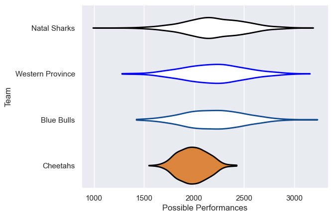

---  
title: "Currie Cup 2006"  
date: 2025-07-29 6:00:00 -0500  
categories: model review projection  
layout: article  
aside:  
    toc: true  
---
# Current Team Rankings

# Standings

## Current Standings

| Club             |   Played |   Wins |   Point Differential |   Losing Bonus Points | Try Bonus Points   |   Competition Points |
|:-----------------|---------:|-------:|---------------------:|----------------------:|:-------------------|---------------------:|
| Cheetahs         |        2 |      1 |                   16 |                     0 |                    |                    6 |
| Blue Bulls       |        2 |      1 |                   15 |                     0 |                    |                    6 |
| Western Province |        1 |      0 |                  -15 |                     0 |                    |                    0 |
| Natal Sharks     |        1 |      0 |                  -16 |                     0 |                    |                    0 |

# Completed Match Review

| Model | Percent Correct Predictions | Spread Error |
| ------ | ------ | ------ |
| Club Level | 33.3% | 11.4 |
| Player Level: Lineup | nan% | nan |
| Player Level: Minutes | nan% | nan |

